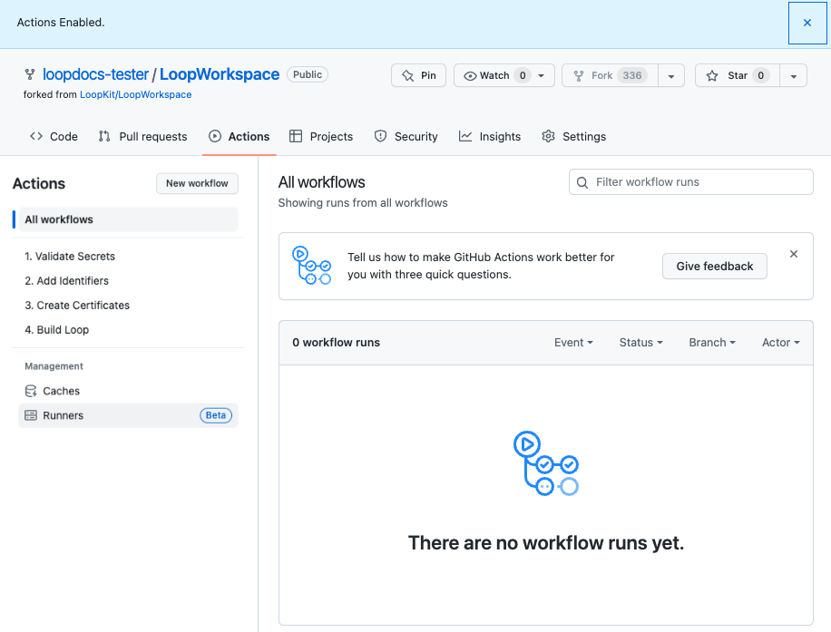

## First Use of Actions Tab

Near the top middle of your <code>LoopWorkspace</code> &nbsp;fork&nbsp; is an <code>Actions</code> tab. This section provides detailed directions to enable <code>Actions</code>.

Click on the `Actions` tab of your <code>LoopWorkspace</code> repository.

* Your first time, a message appears saying `Workflows aren't being run on this forked repository` as shown in the graphic below
* Tap on the green button that says: `I understand my workflows, go ahead and enable them`

    {width="700"}
    {align="center"}

The `workflows` are now displayed on the left side as shown in the graphic below. (Dismiss the `Actions Enabled` message using the `X` near the upper right side if it appears).

{width="700"}
{align="center"}

## Validate <code>Secrets</code>

??? abstract "Section Summary (click to open/close)"
    This step validates most of your six <code>Secrets</code> and provides error messages if it detects an issue with one or more.

    1. Click on the "Actions" tab of your LoopWorkspace repository and enable workflows if needed
    1. On the left side, select `1. Validate Secrets`.
    1. On the right side, click "Run Workflow", and tap the green `Run workflow` button.
    1. Wait, and within a minute or two you should see a green checkmark indicating the workflow succeeded.
    1. The workflow will check if the required <code>Secrets</code> are added and that they are correctly formatted. If errors are detected, please check the run log for details.

    [:material-skip-forward:](#add-identifiers) To skip the detailed instructions, click on [<code>Add Identifiers</code>](#add-identifiers)

Near the top middle of your <code>LoopWorkspace</code> &nbsp;fork, click on the <code>Actions</code> tab.

* [:material-skip-backward:](#first-use-of-actions-tab)If you have never used <code>Actions</code> on this repository before, and need instructions (in addition to what *GitHub* shows), please back up to [First use of Actions Tab](#first-use-of-actions-tab).

Refer to the graphic below for the numbered steps:

1. Click on the `Actions` tab of your <code>LoopWorkspace</code> repository
1. On the left side, click on 1. <code>Validate Secrets</code>
1. On the right side, click `Run Workflow` to show a dropdown menu
    * You will see your default branch (typically this is `main`)
    * You can select a different branch, but typically, you run the default
1. Tap the green button that says `Run workflow`.

    {width="700"}
    {align="center"}

The `Validate Secrets` &nbsp;Action&nbsp; should succeed or fail in a few minutes. Do not continue to the next step until this one succeeds.

!!! tip "Hit Refresh"
    After you tap the green Run workflow button, *GitHub* can be slow to update.

    * Refresh the browser if you are unsure if the action started
    * Do not start a new action until the first one completes

* If you see the green check (:octicons-check-circle-fill-16:{: .passed })  continue to the next section
* If you see the red `X` (:octicons-x-circle-fill-16:{: .failed }):
    * [Examine Annotation](bb-errors.md#examine-annotation){: target="_blank" } tells how to view the file needed to diagnose your problem.
    * [Action: Validate Secrets Errors](bb-errors.md#action-validate-secrets-errors){: target="_blank" } tells you what to search for in the file
    * Resolve the error and repeat the Action: [Validate Secrets](#validate-secrets)

## <code>Add Identifiers</code>

!!! warning "Update to Version 3.4"
    The name and identifier for "`Small Status Widget`" was renamed to "`Loop Widget Extension`". If you previously built, you will need to run the Add Identifiers as directed on the [update page](bb-update.md#update-from-32x-to-34){: target="_blank" } to add the renamed Identifier and Create Certificates for it.

    If you previously built the `dev` branch, you already have this identifier.

??? abstract "Section Summary (click to open/close)"
    1. Click on the "Actions" tab of your LoopWorkspace repository.
    1. On the left side, select "2. Add Identifiers".
    1. On the right side, click "Run Workflow", and tap the green `Run workflow` button.
    1. Wait, and within a minute or two you should see a green checkmark indicating the workflow succeeded.

    [:material-skip-forward:](prepare-app.md#configure-identifiers-for-loop){: target="_blank" } To skip the detailed instructions, click on [Configure Identifiers for Loop](prepare-app.md#configure-identifiers-for-loop){: target="_blank" }.

Refer to the graphic below for the numbered steps:

1. Click on the `Actions` tab of your <code>LoopWorkspace</code> repository
1. On the left side, click on 2. <code>Add Identifiers</code>
1. On the right side, click `Run Workflow` to show a dropdown menu
    * You will see your default branch (typically this is `main`)
    * You can select a different branch, but typically, you run the default
1. Tap the green button that says `Run workflow`.

    {width="700"}
    {align="center"}

!!! tip "Be Patient"
    * Refresh the browser if you are unsure if the action started
    * Do not start a new action until the first one completes

The `Add Identifiers` &nbsp;Action&nbsp; should succeed or fail in a few minutes. Do not continue to the next step until this one succeeds.

* If you see the green check (:octicons-check-circle-fill-16:{: .passed })  continue to the next section
* If you see the red `X` (:octicons-x-circle-fill-16:{: .failed }):
    * [Examine Annotation](bb-errors.md#examine-annotation){: target="_blank" } tells how to view the file needed to diagnose your problem.
    * [Action: Add Identifiers Errors](bb-errors.md#action-add-identifiers-errors){: target="_blank" } tells you what to search for in the file
    * Resolve the error and repeat the Action: [Add Identifiers](#add-identifiers)

## Next Step

The next step is to [Prepare the App](prepare-app.md).
