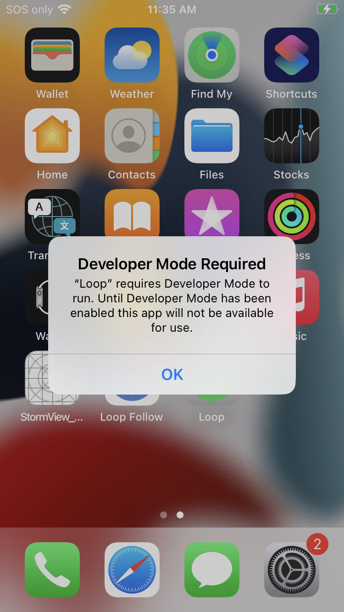
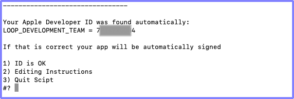
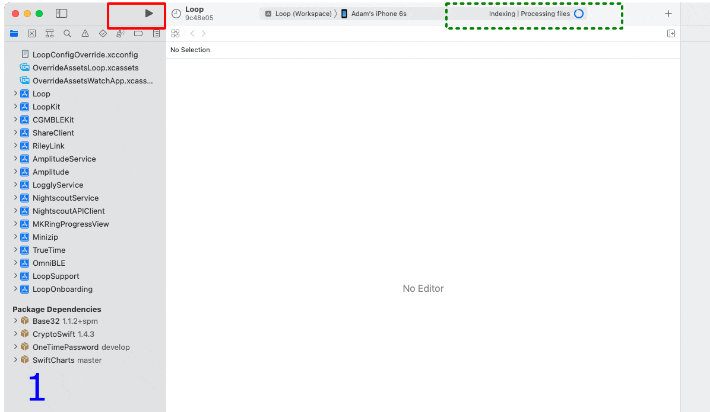
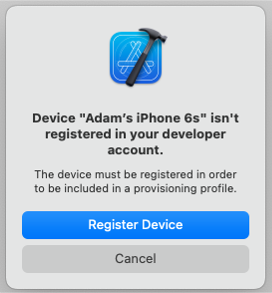
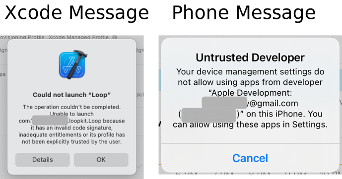

## Summary

!!! info "Time Estimate"
    - 60-80 minutes for first time builders
    - 10-15 minutes for repeat builders

!!! abstract "Summary"
    You will:

    * Run the Build Select Script to download Loop code
    * Prepare to build the Loop app
    * Press the Xcode Build Button to build Loop
    * Watch in awe as you build your very own Loop app

!!! question "FAQs"
    * **Why does Xcode show a colorful spinning icon and not respond to me?** Unfortunately, sometimes Xcode gets confused and you need to force quit the application. See [Xcode Not Responding](../build/build_errors.md#xcode-not-responding) for instructions.
    * Many more FAQs for building Loop are in-line with the steps that trigger the questions.

## Build Video

The Loop and Learn team prepared this [YouTube video](https://youtu.be/gddhljzsNkM) showing how to build Loop 2.2.x including the steps required to update if you previously built. The steps are different now. The video may be worth watching, but once you've reviewed it, work through the new build process described on this page.

## GitHub Build Loop

If you previously used [GitHub Build](../gh-actions/gh-overview.md) to install Loop on this phone, you must make sure that automatically install is **disabled** in [TestFlight](../gh-actions/gh-deploy.md#install-testflight), or you will not be able to install on that phone with Xcode.

## Developer Mode

If you are running iOS 15 or watchOS 8 and earlier, you do not have developer mode and can skip ahead to [Download Loop](#download-loop).

New with iOS 16 and watchOS 9, you must enable Developer Mode to run or build Loop. (This is true for any app created by Xcode directly on your device.) If you want to know more, click on this [Apple Link about Developer Mode](https://developer.apple.com/documentation/xcode/enabling-developer-mode-on-a-device).

**Loop will not run until you enable Developer Mode for iOS 16.**

### Prepare your Phone and Watch

* If you are running Loop and update to iOS 16 and watchOS 9; Loop will no longer run until you enable Developer Mode and you will see a message similar to the next graphic

* If you are building to a new Apple Watch - you must first build the app with Xcode before the developer mode will be available.

    {width="300"}
    {align="center"}

* If your device uses iOS 16 (and watchOS 9); you must enable Developer Mode to build an app on that device using Xcode or it will show up as an "Unavailable Device" under Xcode

    {width="450"}
    {align="center"}


#### Developer Mode on iOS 16 Device

To determine if Developer Mode is enabled, go into your phone settings, choose Privacy & Security, scroll to the bottom of the screen and tap on the Developer Mode row and examine the Developer Mode slider.

* If Developer Mode is enabled, the slider will be green and no further action is required
* If Developer Mode is not enabled, the slider will be blank
    * Move the slider so it is green
    * Reboot the device when asked
    * After the reboot, you will be asked if you want to turn on Developer mode
    * Tap on the `Turn On` option

#### Developer Mode on watchOS 9 Device

!!! warning "Build, Enable, Build"
    Reports from users indicate that when you are building to a new Apple Watch - you must first build the app with Xcode before the developer mode will be available. So plan to build with Watch paired, and then enable Developer Mode and build again.

This must be configured on the watch itself (not the watch app on the iPhone). To determine if Developer Mode is enabled, look at the watch face icons and find the Settings icon. Tap on it and scroll to and tap the Privacy & Security icon. Then scroll to the bottom and tap on Developer Mode.

* If Developer Mode is enabled, the slider will be green and no further action is required
* If Developer Mode is not enabled, the slider will be blank
    * Move the slider so it is green
    * Reboot the device when asked
    * After the reboot, if you are asked if you want to turn on Developer mode
    * Tap on the `Turn On` option

## Download Loop

This page has the detailed steps to run the Build Select Script to download the Loop code, prepare your computer and build Loop.

### Open Terminal

Go to the Finder app, click on Applications, then open the Utilities folder.  Locate the Terminal app and double-click Terminal to open a terminal window. The terminal window is very plain looking when you open it. That is normal.

#### Ensure a Year

!!! danger "Rebuild / Update on Same Computer?"
    If you used this same computer to build Loop previously and you did not delete provisioning profiles - you will not get a full year with this build.

    If you missed doing the [Updating: Delete Provisioning Profiles](updating.md#delete-provisioning-profiles), do that step now and return to this page.

    or more experienced folks may want to just paste this command into their terminal:

    ``` { .sh .copy title="Copy and Paste to remove Provisioning Profiles" }
    rm ~/Library/MobileDevice/Provisioning\ Profiles/*.mobileprovision
    ```

### Build Select Script

!!! info "Loop 3.2 Release"
    The release of Loop 3.2 makes building even easier. The same build script is used. It always points to the latest version (main branch).

    The LoopWorkspace target pops up automatically
    
    * Wait for Xcode to finish preparing
    * Choose your phone and hit build

    Updated graphics will be updated later.

* With the release of Loop 3, the build process is different and simpler
    * Please read each step as if you are a new builder
    * Don't assume you know what you are doing
    * [FreeAPS](https://www.loopandlearn.org/freeapsdoc) is no longer supported by the Build Select Script
    * [Loop 3 with Patches](https://www.loopandlearn.org/github-lnl-patches) is provided instead

These instructions show each step needed to download Loop using the Build-Select script.

!!! note "Optional"
    The Build Select Script can also be used to build a companion app, called Loop Follow, and a fork of Loop, which has selected patches added. Follow these links to different websites for more information about those options.
    
    For those used to seeing FreeAPS here, it has been removed from the Build Select Script.
    
    Consider using Loop 3 as designed. If you need Libre or want the CustomTypeOne patches, those are provided in the Loop with Patches selection in the Build Select Script.
 
     * Information about [Loop Follow](https://github.com/jonfawcett/LoopFollow#readme)
     * Information about [Loop with Patches](https://www.loopandlearn.org/build-select/)
        * Warning, the Loop with Patches is updated **after** the main Loop is released. Typically it is updated within a day, but don't assume. Check that link for updates.
 
     You do not need to know about these options to build Loop.

Copy the line below that starts with `/bin/bash` by hovering the mouse near the bottom right side of the text and clicking the copy icon (should say `Copy to Clipboard` when you hover over it). When you click the icon, a message that says `Copied to Clipboard` will appear on your screen.

``` { .bash .copy title="Copy and Paste to start the BuildLoop.sh script" }
/bin/bash -c "$(curl -fsSL \
  https://raw.githubusercontent.com/loopnlearn/LoopBuildScripts/main/BuildLoop.sh)"
```

Paste the line of text into Terminal. Be sure to click anywhere in the terminal before trying to paste. (Ways to paste: ++command+"V"++ ; or ++control++ click and select from menu or `Edit`-`Paste` at top of Mac screen.)

Read the screen (shown below).  Type `1` and return if you understand the warning and agree.

* Please read what is on the screen as you progress.
* Adjust font size as directed if you have difficulty seeing the directions.

{width="700"}
{align="center"}

Next you will see an introduction to the Build-Select script.  Please read this.  To build Loop, you will select the Build Loop option by typing 1 and return.

{width="700"}
{align="center"}

Next you are asked which version of Loop you would like to build. Type 1 and return to build Loop (as shown in the graphic below) or 2 for the fork of Loop with added Libre CGM options and CustomTypeOne patches.

{width="700"}
{align="center"}

### XCode Errors with Build-Select

!!! warning "WARNINGS"

    If you see errors like these . . .

    * `xcrun: error: invalid active developer path (/Library/Developer/CommandLineTools), missing xcrun at: /Library/Developer/CommandLineTools/usr/bin/xcrun`
    * `xcode-select: Failed to locate 'git', requesting installation of command line developer tools`
    * `xcode-select: error: tool 'xed' requires Xcode`

    You missed one of these steps:

    * [Install Xcode](step8.md)
    * [Xcode command line tools](step9.md#command-line-tools)

### Wait for Download to Complete

This download can take from 3 minutes to 30 minutes depending on your download speed.  You can leave the room and return later to check on progress. When you read the words in the terminal, as the script runs, you may see terminology you do not understand - don't worry - you do not need to understand enumeration or submodule or cloning.  You only need to review the display to look for any error messages. 

The next graphic shows terminal messages for the beginning of a successful download.

{width="700"}
{align="center"}

When the download completes, the "Check for successful download" message is displayed as shown in the graphic below. You will need to scroll up in the terminal window to look through all the messages output to the terminal from the beginning of the download. (Your messages that start with "Submodule path" may differ.)

{width="700"}
{align="center"}

If you do not find the word error in your terminal window, continue with [Download was Successful](#download-was-successful).

If you see the word "error" in your terminal window:

* Read the error message
* Try to figure out the problem
* If you need help, reach out to your favorite [Loop Social Media](../intro/loopdocs-how-to.md#how-to-find-help) site
* Tap any key other than 1, followed by return to cancel

### Download was Successful

If there are no errors, type 1 in the terminal window to continue. At this point you choose how to sign the targets, so first an explanation.

## Sign Targets

!!! question "What does Sign Targets Mean?"
    "Sign Targets" in Xcode identifies who built the app. You cannot deploy an app to a phone if you do not sign each target associated with that app.

!!! tip "Experienced Builders"
    This replaces several of the steps that used to be required to build Loop.

The first time you use the script, you will be asked how you want to sign the targets. If you have previously run the script and configured your computer to have a permanent file that contains your Apple Developer ID, this question will not be shown. Skip ahead to [Review LoopConfigOverride.xcconfig](#review-loopconfigoverridexcconfig).

The next question, as shown in graphic below, is whether you will (1) Sign Automatically or (2) Sign Manually.

* If you are building with a paid developers account, choose option 1, and continue on this page
* If you are building with a Free option or plan to build to a simulator on your computer, choose option 2 and click on [Build Free Loop](build-free-loop.md) to move to the page with those instructions

{width="700"}
{align="center"}

### Paid Developer Account

Continue with this page only if you have a paid developer account.

* You need to switch to the [Loop Free Build](build-free-loop.md) page for a free account.

### Create Permanent LoopConfigOverride.xcconfig

The following graphics show the terminal display after selecting option 1 to use Apple Developer ID.

* Graphic below:
    - User is presented with instructions for getting Team ID from the Membership page
        - After review, the user hits return

{width="700"}
{align="center"}

* Graphic below:
    - The instructions remain on the screen for reference
    - The developer.apple.com web page (not shown) opened automatically in the browser after user hit return
        - User obtains ID
    - User enters ID in terminal and then hits return

{width="700"}
{align="center"}

After hitting return, the user can verify the entry.

### Review LoopConfigOverride.xcconfig

!!! note "Use Your Team ID"
    The ID, 0123456789, shown in the graphic below is for illustration purposes only. Your terminal display shows your Apple Developer ID (the Team ID on the Membership page).

If you previously built with this computer using the script, you already have the file configured. The review step is the same each time.

* Graphic below:
    - The developer ID stored in the permanent file is displayed for review
    - After review, hit return to continue and [Plug in Your Phone](#plug-in-your-phone)
    - OR - to modify the ID in the file, see [Problem with the ID?](#problem-with-the-id)

{width="700"}
{align="center"}

#### Problem with the ID?

If there is a problem with the ID that is stored on your computer, you can modify it before continuing.  The instructions, shown in the terminal message, are repeated here:

To edit the LoopConfigOverride.xcconfig file with a different developer ID:

1. Open finder, navigate to Downloads/BuildLoop
1. Locate and double click on LoopConfigOverride.xcconfig
    * This will open that file in Xcode
1. Edit in Xcode and save file

You can now return to the terminal and hit return for the next step.

## Build Loop

### Plug in Your Phone

Refer to the graphic below. The messages in the terminal instruct you to:

* Unlock your phone
* Plug Phone into the computer
    * (Optional) If you have an Apple Watch that has never had Loop on it
        * Make sure watch is paired, unlocked and on your wrist
    * If you have never "Trusted" this computer with these device(s), do so now
        * A screen will pop up on your phone (and watch) asking if you trust the computer
        * Select "Trust"
        * After trusting phone and watch, phone should remain plugged in, but watch does not need to stay in proximity of the phone
* Now you are ready to hit return in the terminal window

{width="700"}
{align="center"}

The next action of the script is to 

* Open a browser window displaying this section of LoopDocs
* Open Xcode

The final script message informs you that you can close the terminal window.

* Wait until you've successfully built the app before closing the terminal


### Initial Xcode Screens

!!! warning "watchOS Simulators"
    Yes, watchOS simulators are required to build Loop. If Xcode asks if you want to download them - say yes. It's slow but you cannot build Loop without the simulator.

    *   Tap on [New with Xcode 14](../build/build_errors.md#new-with-xcode-14) for more information

First confirm your phone is selected. Refer to the GIF below (warning, GIF not updated to show LoopWorkspace is selected by default) and follow the directions:

* Frame 1:  Xcode screen opened by the script after a fresh download
    * **Fresh Download? Wait for indexing to begin**
        * If you see messages about fetching symbols or resolving packages, please wait until you see the Indexing message as shown in the GIF below just to the left of the dashed-blue rectangle
    * **With Loop 3.2.x and newer**, you do not need to select Loop (Workspace) - it is now the default and shows up as LoopWorkspace
        * The graphics still show the old selection process
    * The red rectangle indicates where you used to change Loop to Loop (Workspace), it now defaults to LoopWorkspace
    * The red x in the dashed-blue rectangle region indicates you need to fix a problem before building
* Frame 2: Not needed as of Loop 3.2.x: Inset shows the action needed to select Loop (Workspace)
* Frame 3: This error does not happen with Xcode 14.1 or newer versions. There's a red x in the dashed-blue rectangle region

{width="750"}
{align="center"}

### Start Build

If there is a red x in the dashed-blue rectange region on your Xcode screen you need to click over to the build errors link listed below.

* If your screen is similar to the figure below, perform the fix for [Couldn't Get Revision for Package Dependency](build_errors.md#couldnt-get-revision-for-package-dependency)
* If you have a different error, search the [Build Error](build_errors.md) page

{width="750"}
{align="center"}

#### First Time

The first time you build, there will be steps that will not be required for subsequent builds. These are clearly marked in the intructions with the word **First-Time**. Do not get confused when you are asked to enter your password multiple times, see [Codesign / Keychain Access](#codesign--keychain-access). Be sure to enter your Mac login password and select Always Allow.

#### All Builds

Refer to the GIF below:

* Frame 1: Package Dependency resolved (no red x)
    * Xcode is Indexing as seen in dashed-green rectangle region
        * Indexing makes searching faster; it does not need to complete before building
    * Click the "Play" button highlighted by red rectangle to start the build
    * **First-Time for this Phone:** A Device isn't registered screen appears, as shown in the graphic below the GIF
        * This happens for any phone not registered to the selected Developer ID
        * You must be connected to the internet so the device can be registered
        * Click register and then the build will continue (as shown in the GIF)
* Frame 2: Build has started
    * Xcode is Building as seen in dashed-green rectangle region
    * **First-Time on This Computer:** 
        * Follow the [Always Allow Instructions](#codesign-keychain-access) the first time this Developer ID is used on this computer
        * Never hit Deny
* Frame 3: Build succeeded
    * App is running as seen in dashed-green rectangle region
    * If your phone locked during the build process, you will see a message to unlock your phone, as shown in the graphic below the GIF
        * Simply unlock your phone and Xcode does the rest
        * If you tapped on `Cancel Running`, just hit the build button again
    * **First-Time for this Phone:** You may also see a "Could Not Launch Loop" message
        * Follow the [Update Settings for Developer](#update-settings-for-developer)

{width="750"}
{align="center"}

{width="200"}
{width="300"}

If the app opened on your phone, the next two sections for first-time builders are not needed.  Skip ahead to [Successful Build](#successful-build).

If you got red error messages, skip ahead to [Build Failed?](#build-failed)

#### Codesign / Keychain Access

!!! abstract "First Time Using Developer ID on Computer"

    During your first build with a given Developer ID on your computer, you will see a codesign/keychain access prompt, as shown in the graphic below. Enter the same password you use to log in to the mac, select "Always Allow" and then do it again each time you are asked.

    {width="350"}
    {align="center"}

    It is normal for this prompt to come up repeatedly even after you enter the correct password (once for each target Loop needs to sign).

    In frustration, people think the prompt must be broken because it keeps reappearing and press deny or cancel. **Don't press deny.** Keep entering your computer password and pressing the "Always Allow" button as many times as it takes. The build will then continue.

    **FYI:** _codesign is for code sign - nothing to do with design._

#### Update Settings for Developer

!!! abstract "First Time Building on a New Device?"

    If this is the first time you have installed an app on your iPhone using a free account, you will see warnings in both Xcode and on your phone after a successful build and install on your phone.

    Don't worry, dismiss the messages and do this extra step on the phone. These instructions are valid for iOS 15:

    * Open Phone Settings
    * Select General
    * Select VPN & Device Management
    * Under the Developer App section, tap on icon
    * Tap on Trust
    * You should now be able to open the app

    {width="400"}

    {width="200"}

### Build Failed?

No red error messages? Skip ahead to [Successful Build](#successful-build).

!!! bug "Red Errors"
    If you get a message that your build failed and see **RED ERROR** messages:

    * Go to the [Build Errors](build_errors.md) page to find the steps to fix your build error
    * (Optional) Follow the [Clear the Error Message](#clear-the-error-message) process
    * Return to [Start Build](#start-build) to try again

!!! question "FAQ: But what about those yellow or purple warnings that remain in Xcode? Should I worry about them?"

    If you see yellow or purple warnings after your build is done...those are not an issue. Don't try to resolve them or fret about them. They mean nothing to the successful use of your Loop app.

    {width="600"}
    {align="center"}


#### Clear the Error Message

Once you've resolved a build error and start the build process again, Xcode will continue to show a red indicator on the top line from the previous failure.  If you don't like seeing that, clean the build folder to clear the error.  Otherwise, as long as the steps of the build are showing across the top line, Xcode is still working on the build.  When the build succeeds, the red circle will disappear.

!!! abstract "Clean Build Folder"

    * In Xcode menu, select Product, then Clean Build Folder
    * Wait for cleaning to complete: you'll see a "Clean Finished" message

### Successful Build

After you see the Loop app open on your phone, you can unplug your phone and acknowledge the Xcode message: `Lost connection to the debugger on . . .`.  The square icon next to the play button goes away as soon as you unplug your phone from Xcode.

The Loop app on your phone closes (but does not quit) when you unplug the phone. Open the Loop app on your phone just to be sure.

!!! success "Congratulations!"
    
    


If you plan to build again on a backup phone, or want to try a customization, easiest for you to leave Xcode open. Otherwise, you can quit out of Xcode now.

## Protect that App

!!! danger "Protect Against Deletion"
    Prevent your Loop app from being deleted accidentally.

    If you, or a child, deletes the app from the home screen, it is gone - you have to rebuild and reenter all settings and start a new pod or add back in your Medtronic pump.

    The steps vary depending on iOS. With iOS 15 and 16, it is under Screen Time, Content & Privacy Restrictions, iTunes & App Store Purchases, Deleting Apps. Choose Don't Allow. If those steps don't help, do an internet search like this, where you use your current phone iOS version number:

    * "turn off app deletion iOS ##"
    * "iOS ## prevent app deletion"

    Follow the instructions to prevent deletion of what is now a critical medical app.

## IMPORTANT SAFETY REMINDER

* **STAY IN OPEN LOOP UNTIL YOU UNDERSTAND THE SYSTEM**
* Do NOT skip the Set Up and Operate material; at least skim it.
* Keep reviewing LoopDocs - some material will be more impactful once you have the app in your hands.
* Ask [questions](../intro/loopdocs-how-to.md#how-to-find-help) if you are confused.
* Learn to use the [LoopDocs search feature](../intro/loopdocs-how-to.md#website-search)

### New to Loop 3

If this is your first build with Loop 3, head to the Set Up tab starting here: [Loop 3 Overview](../loop-3/loop-3-overview.md).

!!! tip "Pro Tip: Read Along in LoopDocs as you Onboard"
    One of the goals for Loop 3 is to make the app robust even if you don't read the documentation, but a lot of questions may be resolved if you read along in LoopDocs as you onboard.

    All those mentors who answer questions are volunteers.

Even if you don't read all the pages under the Set Up tab now, these links are important.

* New Looper: [Onboarding](../loop-3/onboarding.md)
* Building Loop 3 over Loop 2.2.x or FreeAPS: [Experienced Looper Onboarding](../loop-3/onboarding.md#experienced-loopers)

!!! info "Add a Calendar Reminder"

    - It is good practice to add a reminder to your calendar when the app will expire
    - Be sure to add an alert to that reminder so you have enough time to do all the [Loop Updating](updating.md) steps to build the app again before it expires
    - Even better, practice building every 3 to 6 months so you don't forget and keep that expiration date far in the future

## Optional Steps

### Code Customizations

**New Loop users**: Customizations are not a required part of any Loop build. As you gain experience using your Loop app, you may want to customize some of the features. First time builders are encouraged to build with the standard, default code. You can always update your Loop app to add customizations at a later time, using the same download. Subsequent build time is much faster than the initial build for a given download.

!!! tip "Pro Tip"
    With a fresh download of code, it's always best to build without customization to ensure the build works without errors.

To add custom configurations to your Loop or Loop Apple Watch apps, follow the step-by-step instructions on the [Code Customizations](code_customization.md) page and then build the app again.


### Apple Watch

**Existing Apple Watch users**: Please update your watchOS prior to building the Loop app. The minimum iOS for Loop 3 is iOS 15.1, which means watchOS 8.1. When running iOS 16.x, you will need a watchOS of 9.x.

**New Apple Watch users**: If you have an Apple watch and want to use it with Loop, first pair the watch with the iPhone before continuing to the next steps.  If you get a new watch after building the Loop app, you'll need to redo your Loop build.

For more information, please see [Operate: Apple Watch](../operation/features/watch.md)

### Build Again with this Download

Follow the [Find My Downloaded Loop Code](code_customization.md#find-my-downloaded-loop-code) instructions if you later wish to build with this same dowload. Plug in an unlocked phone and start at the [Start Build](#start-build) section of this page. You may need to select the phone you just plugged in. Everything else should be ready for you the start the build process.

!!! warning "Don't use a really old download"
    Do not use a really old download.

    Check the date of your download against the latest [Current Release](..//version/releases.md#current-release) date and decide whether to get a fresh download instead.

