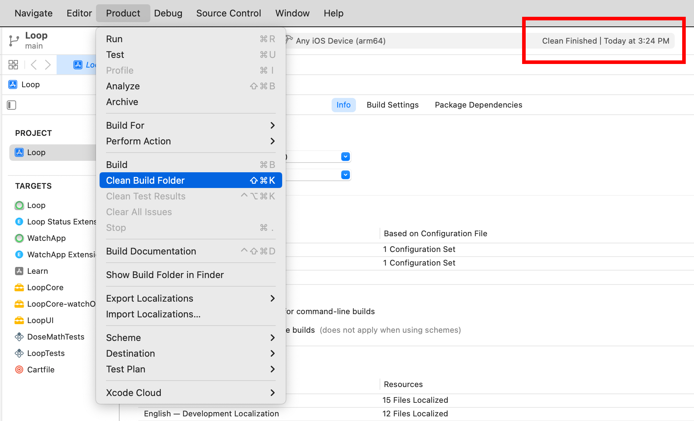
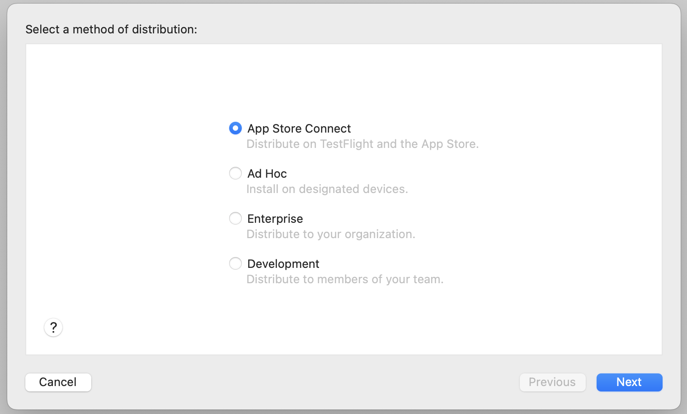
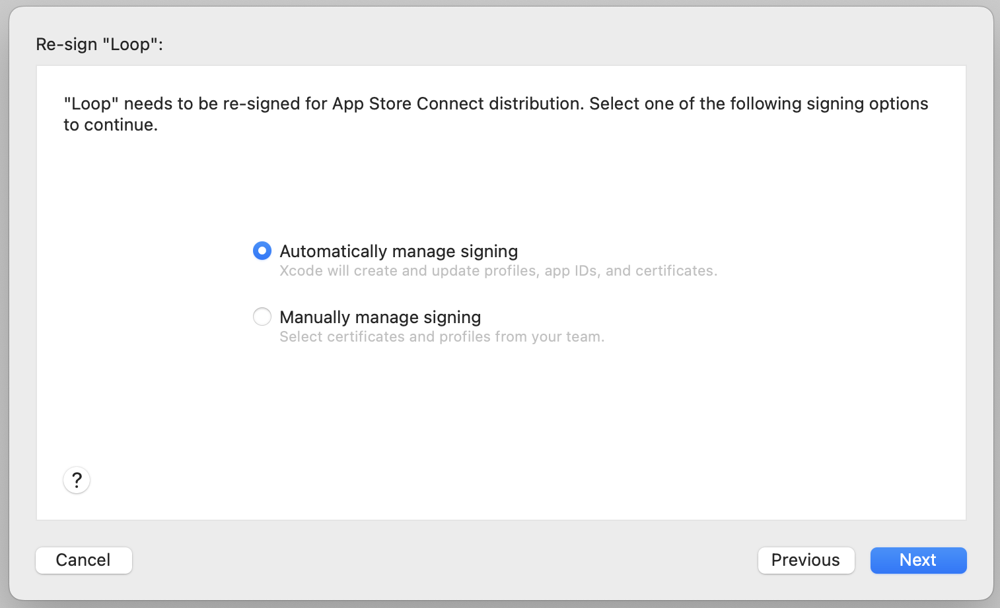
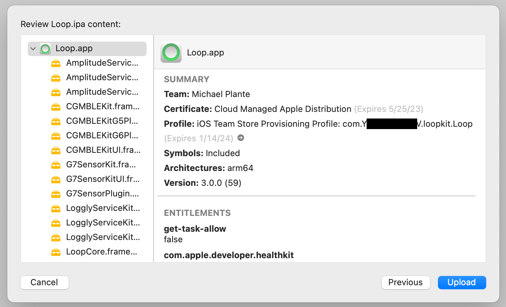
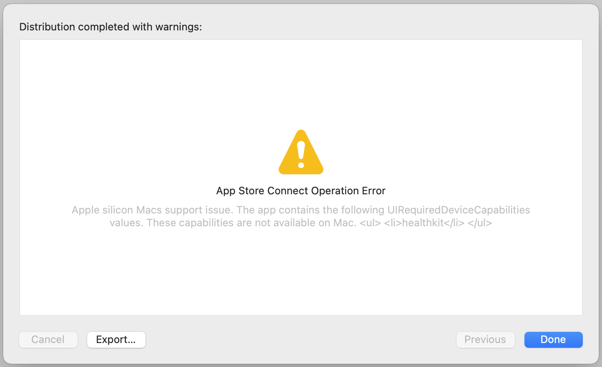

## Prepare TestFlight from Xcode

## Introduction

While the [Browser Build](../gh-actions/gh-overview.md) method of building Loop requires you to install it via TestFlight, you can also use TestFlight to install Loop via Xcode. This is useful if you want to [add customizations](../build/code_customization.md) to your build, which can be more difficult with the browser method.

This guide can also be followed to install other apps like Loop Follow, Loop Caregiver, xDrip4iOS via TestFlight.

Some useful features of using TestFlight to install Loop:
* You don't need to plug your phone into your computer. You could even update Loop on your kid's phone while they're away at college.
* Reinstalling Loop on the fly is quick and easy from your phone, even if you accidentally deleted the app or need to install Loop on a brand new phone.

Since apps built with TestFlight expire after 90 days, it's reccommended you also setup a build using the [browser](../build/browser.md) method even if you don't plan on using it, just so you have it as a backup in case your TestFlight expires and you can't get to your Mac in time to rebuild or if an urgent update to Loop is released you could use the browser method to update to it quickly from your phone.

## Build to TestFlight via Xcode

### Initial Steps

Before creating or uploading to a TestFlight, use the [Mac Build](../build/overview.md) guide to [sign your targets](../build/build-free-loop.md/#select-signing-capabilities-tab) and build Loop to a [simulator phone](../build/build-free-loop.md/#build-to-a-simulator) in Xcode. This checks to ensure the app you upload to your TestFlight will work as expected.

### Archive the Project

Change the build target to **Loop (Workspace) > Any iOS Device (arm64)** like the image below.

{width="700"}
    {align="center"}

Now go to the top menu and choose **Product > Clean Build Folder**. Once it's done, it should say "Clean Finished".

{width="700"}
    {align="center"}

Go back to the top menu and choose **Product > Archive**. This will build Loop into a file rather than a phone or simulator. It should take about the same amount of time as building to a phone or simulator does.

### Upload the Archive

Once the archive finishes building, it should automatically open the **Archives** window. If you want to open this window without re-archiving, click the following in the top menu: **Xcode > Window > Organizer**.

{width="700"}
    {align="center"}

Select the archive and click **Distribute App**. If you've archived the project before, be sure to select the archive you intend to upload - most likely the one with the most recent **Creation Date**. 

On the next screen, **App Store Connect** is selected by default. Click **Next**.

{width="700"}
    {align="center"}

On the next screen, **Upload** is selected by default. Click **Next**.

{width="700"}
    {align="center"}

If you have already created a TestFlight for Loop via Xcode or the GitHub Build method, this step will automatically be skipped.
If this is the first time you're creating a TestFlight for Loop, enter the following on the next screen and click **Next**:
* **Name:** Enter a name that nobody has used that nobody else has used before. Most people just use "Loop" followed by their initials, so James Kirk would use "LoopJK". If he gets an error that the name is already taken, he might try something like "LoopJTK" or "Loop_JTK_1701".
* **SKU:** This can be anything, but it can't be the same SKU that you've used for a different app that you've created a TestFlight for. Ideally, just leave it as the autofilled bundle id.
* **Primary Language:** Set this to "English".
* **Bundle Identifier:** This should already be autofilled. If it's not, it should be "com.YOUR_TEAM_ID.loopkit.Loop". Make sure you replace YOUR_TEAM_ID with your actual TEAM ID, which you can find at [developer.apple.com/account](https://developer.apple.com/account).

{width="700"}
    {align="center"}

On the next screen, leave everything checked and click **Next**.

{width="700"}
    {align="center"}

On the next screen, leave it set to **Automatically manage signing** and click **Next**.

{width="700"}
    {align="center"}

On the next screen, click **Upload**.

{width="700"}
    {align="center"}

Wait until uploading is finished. Don't be alarmed if you see the following screen, just click **Done**.

{width="700"}
    {align="center"}

### Deploy App

Now that it's uploaded to TestFlight, it will take a little bit before it finishes processing and becomes available for installation on your iPhone. You can check [appstoreconnect.apple.com/apps](https://appstoreconnect.apple.com/apps) to find it's progress by clicking **Test Flight** and then **iOS** under **Builds** in the upper left. Once it no longer says "Processing" and instead says "Ready to Submit" next to the build's number, it should be available and ready to install on your iPhone.

{width="700"}
    {align="center"}

To install Loop from TestFlight onto your iPhone, follow the instructions on the [GitHub Deploy](https://loopkit.github.io/loopdocs/gh-actions/gh-deploy/) page.

### Update App

Apps installed via TestFlight are only valid for a maximum of 90 days, so you must upload a new build to TestFlight at leasty every 90 days.

To update, simply repeat all the steps on this page.
