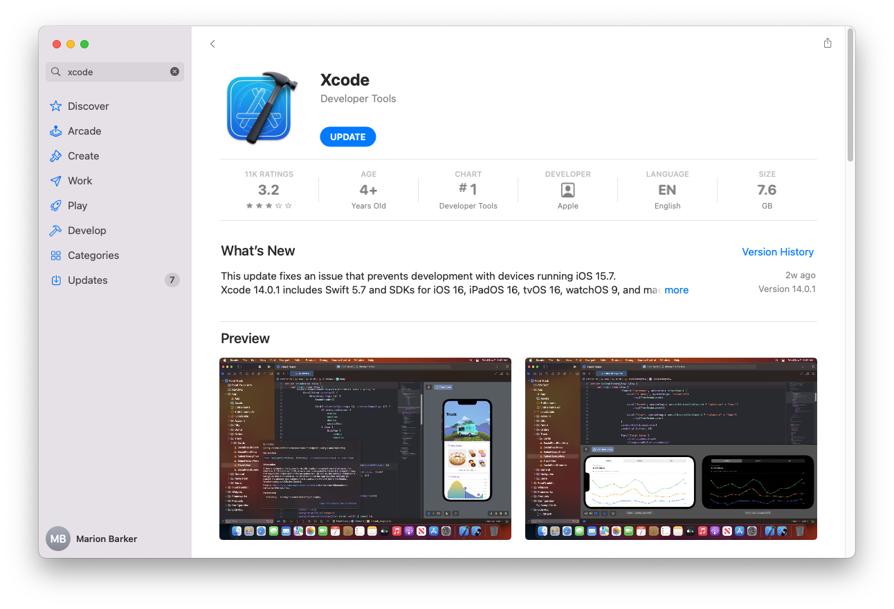
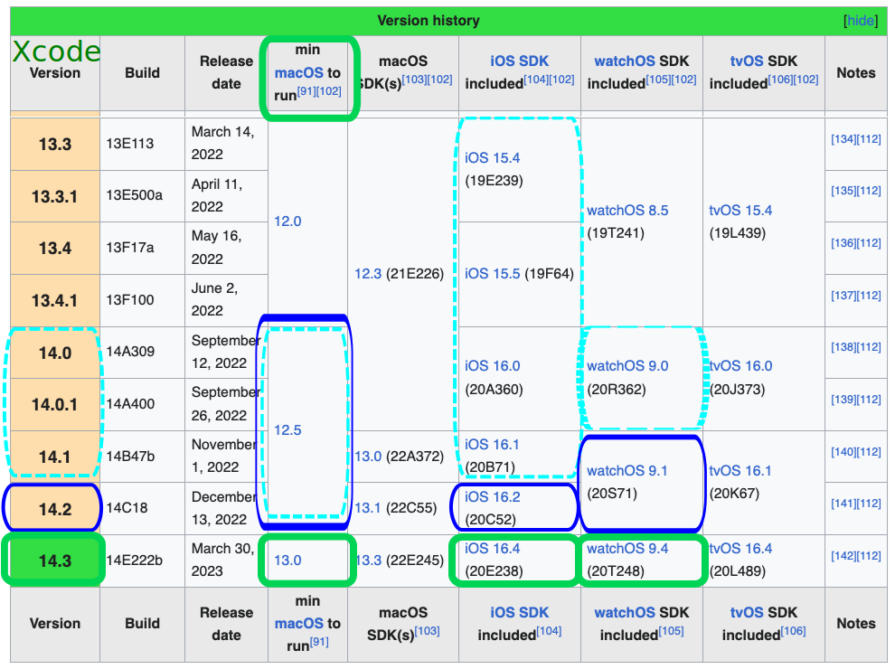

## Install Required Xcode Version

!!! info "Time Estimate"
    - 45 minutes to 2 hours, depending on internet connection...but you don't need to babysit the download.
    - 0 minutes if you decide to use the [Build with Browser](../browser/bb-overview.md) method to build Loop

!!! abstract "Summary"
    - Check iPhone iOS version
        - The iOS version determines minimum Xcode version
        - The minimum Xcode version determines minimum macOS version
        - If necessary, update [macOS](computer.md#check-your-macos-version) first and then return to this step
    - Download (or update) Xcode from your computer's App Store application

!!! question "FAQs"
    - **"Why isn't my Xcode installing?"**  
    The two most common reasons are:
        1. Lack of internet connection, or
        2. Not enough space on your hard drive
            - Xcode is a large download, and needs at least 50GB of space to properly unpack and install itself
            - If you do not have enough space on your hard drive, you will have installation failures
            - [Check the Space Available](computer.md#check-the-space-available)
            - Although the download takes a long time, the good news is you can walk away once the download starts. If your laptop goes to sleep when you close the lid or when the screen saver starts, disable the screen saver and leave the laptop open.
            - After Xcode has finished downloading (looks like the progress bar is almost completed), it takes a long time to unpack and install, be patient
    - **"Can I install Xcode on an external drive?"**
    Unfortunately, no. Xcode needs to be on the Mac hard drive. But other things--like photos and documents--can be moved to an external drive to make room for macOS and Xcode updates.

## What is Xcode?

Xcode is a free application for Apple computers. You will use Xcode to turn the "raw" Loop source code into an iOS application and install it onto your iPhone. 
Which version of Xcode you install on your computer depends on the iOS version you have on the iPhone you are going to be installing Loop on **and** the [macOS](computer.md#check-your-macos-version) version you have on your computer. 

Because of the complexity of these dependencies, **please read this entire page.**

Or - look into [Build with Browser](../browser/bb-overview.md){: target="_blank" } - no Mac computer required, no need to worry about versions for Mac OS or Xcode - all done for you on GitHub (some configuration required).

## Which version of Xcode do I need?

First, choose a version of Xcode appropriate for your iOS device. Then, determine the minimum [macOS](computer.md#check-your-macos-version) version required for that Xcode version. Update to at least that minimum macOS version. Then follow the instructions to download and install Xcode (or update an existing installation):

- Open the App Store on your computer and search for "Xcode"
- If the version number you need is bigger than what is shown in the App Store, you need to first update your [macOS](computer.md#check-your-macos-version)
    - Do not rely on the version number in this graphic

{width="750"}
{align="center"}

## Version Relationship Overview

Have you turned off automatic updates on your iOS device?

!!! info "Loop and iOS Updates"

    **Please Read**: [Turn Off Automatic Updates](phone.md#turn-off-automatic-updates){: target="_blank" }

Before manually accepting an iOS update, be sure you have compatible versions of Xcode and MacOS.  

!!! info "Minimum Xcode Version"

    The **minimum** version of Xcode you need depends on the iOS version you have on your phone.

    **Please Read**: [Minimum Version List](#how-do-all-the-minimum-versions-relate-to-each-other)

!!! warning "Can't find the required Xcode version"
    - If your computer is not running the required minimum macOS, the App Store won't show the required minimum Xcode version
    - You must use iOS to determine which Xcode, which determines which macOS
    - Update your computer to at least that minimum macOS first

    Don't be the person who posts for help saying, "I'm trying to update my Loop app but am getting errors." When asked what Xcode version they have and if they've updated, they respond, "I don't have any Xcode updates available in the App Store, so I must be running the most current version."

    Actually, they forgot to check for [macOS](computer.md#check-your-macos-version) updates and therefore cannot see the needed Xcode update yet.

### After Update - Reboot

After any update of [macOS](computer.md#check-your-macos-version) or Xcode, it is always a good idea to reboot your computer.

## How do all the minimum versions relate to each other?

### Compatible Versions

The current release of&nbsp;_<span translate="no">Loop</span>_&nbsp; requires Xcode version 15 or higher regardless of the iOS on the phone. This requires macOS 13.5 or higher.

* If your phone is iOS 17.4 or newer, you must have macOS 14.0 or higher.
* If your phone is iOS 18.0 or newer, you must have macOS 14.5 or higher.
* As an alternative, use [Build with Browser](../browser/bb-overview.md){: target="_blank" }, which supports iOS 15, 16, 17 and 18.

When this page was last updated, macOS 14.6 and Xcode 15.4 were tested to successfully build the app for phones with iOS 15 through iOS 18.0.

The table below lists the **minimum** requirements to build the current release of&nbsp;<span translate="no">Loop 3.4.1</span>. If your macOS or Xcode version is higher, you can build with *Mac*.

Find your phone iOS in the table below. If your iOS is not listed, e.g., 17.6.1, choose the first row that is less than your iOS.

| iOS Version | minimum Xcode | minimum macOS | 
|:---:|:---:|:---:|
| 18.0 | 15.4 | 14.5 |
| 17.5 | 15.4 | 14.0 |
| 17.4 | 15.3 | 14.0 |
| 15.1 to<br>17.0 | 15.0 | 13.5 |

### Wikipedia Chart for Apple Versions

This graphic (copied from Wikipedia and last updated March 2023) is not updated with every iOS update - use it as a map to read the minimum requirements.  Every attempt will be made to update the words in the [Minimum Version List](#how-do-all-the-minimum-versions-relate-to-each-other) promptly - that's much easier than updating a graphic.

Follow this link to [Wikipedia](https://en.wikipedia.org/wiki/Xcode){: target="_blank" } and scroll down to the current version of this figure - the graphic shown below is a map of how to read the current version of this figure at Wikipedia.

{width="750"}
{align="center"}

## What happens if you try using too old of Xcode?

It isn't some catastrophic failure if you try to build with an outdated Xcode without realizing it. If the build fails, nothing happens to your phone (or Loop on your phone if you are rebuilding).  Nothing is copied from the computer to the phone until after you see the Build Succeeded message. You'll see a pretty obvious error message during your Loop build. Check [Oh dear! Build errors?](build-errors.md).

Some error messages that have shown up in earlier updates:

```
Package.resolved file corrupted or malformed
```

This is for trying to select an iOS 17 phone when building with Xcode 14:

```
Could not locate device support files
```

This is for building code with Xcode 14 instead of Xcode 15:

```
Loop Widget errors like:
Command SwiftCompile failed with a nonzero exit code
Cannot infer contextual base in reference to member 'widget'
```

## Next Step: Xcode Settings

Now you are ready to set up [Xcode Settings](xcode-settings.md).
