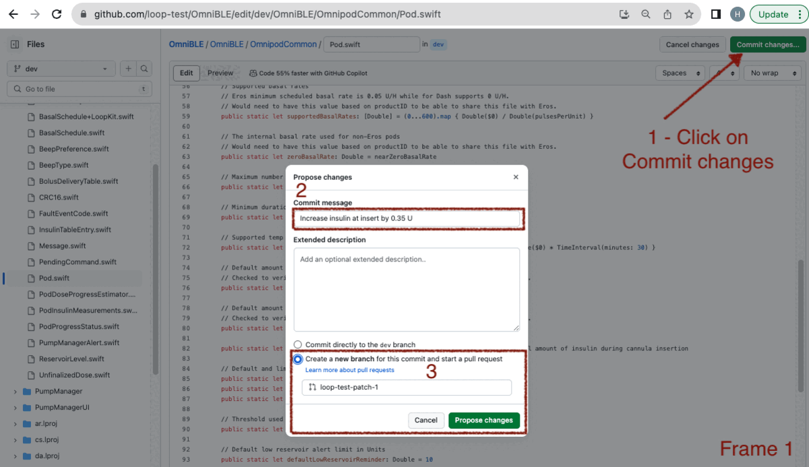
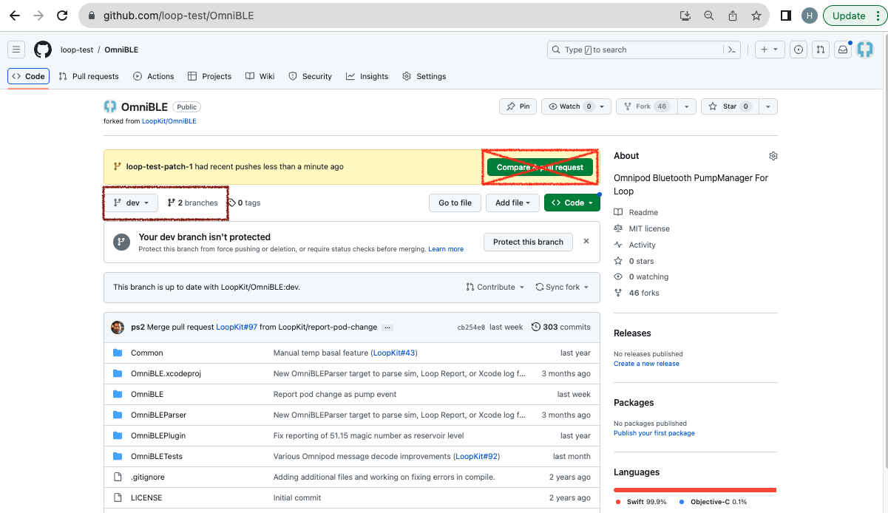
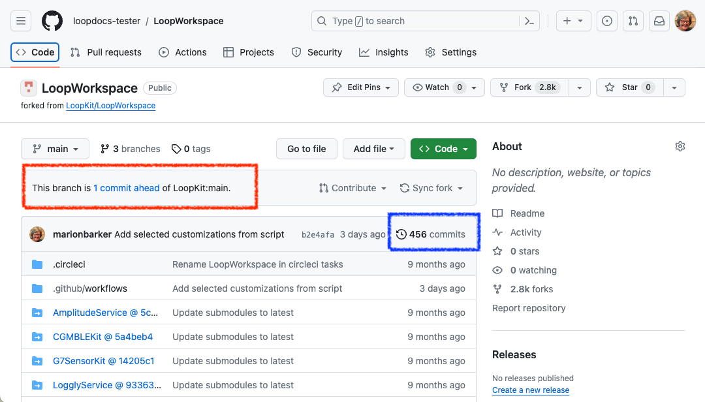
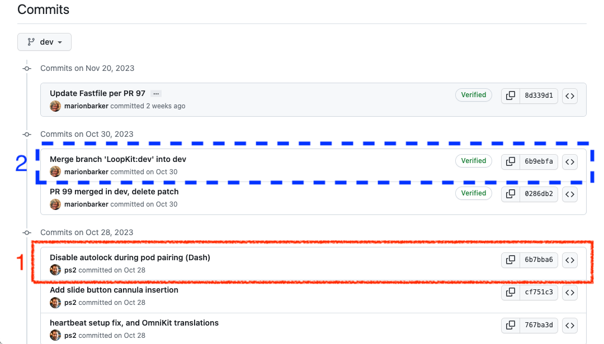

## Hot Topics

!!! tip "Pro Tip"
    The method on this page allows you to create a set of personalized customizations that you can use in addition to the [Loop and Learn: Prepared Customizations](https://www.loopandlearn.org/custom-code#prepared-custom-list){: target="_blank" }. You can use (and re-use) your customizations with either Browser Build or *Mac* builds so you don't have to repeat the customization with every update.

    * If you are building with *Mac* method, you can use the same lines prepared for Build with Browser method and simply paste them in your terminal at the&nbsp;<span translate="no">LoopWorkspace</span>&nbsp;folder to customize your code
    * You can often use the same customization for several releases
    * If a customization that you prepared for an older release says "does not apply" when you use it, you'll need to prepare a new one

!!! warning "Modules vs Submodule"
    This page has instructions to set up your own <code>fork</code> for the Modules, otherwise known as submodules, associated with&nbsp;<span translate="no">LoopWorkspace</span>&nbsp;that are needed for a selected customization.

    Each Module has its own *GitHub* <code>repository</code>;and you will be working with your <code>fork</code> of that Module at https://github.com/username/Module, where username is your username.

!!! question "What is a SHA-1?"
    SHA-1 means Secure Hash Algorithm 1; which is used to generate an alphanumeric code.

    Each time you save a change to your&nbsp;<span translate="no">GitHub repository</span>, a unique SHA-1 is created. That identifier is used to tell *GitHub* a specific change that you want applied. These work for any compatible <code>fork</code> taken from the original&nbsp;<span translate="no">GitHub repository</span>.
    
### Do Not Make a Pull Request to LoopKit GitHub Username

!!! important "Ignore&nbsp;<span translate="no">Compare & pull request</span>&nbsp;Prompts"
    Please do not click on boxes that *GitHub* might show you that ask if you want to**&nbsp;<span translate="no">Compare & pull request</span>**.
    
    This would be an attempt to merge changes from your <code>fork</code> back to the original version that everyone uses. These changes are for you only. Ignore those prompts.

## Overview

!!! info "Time Estimate"
    * About half an hour to an hour per Module
        * Typically 1 or 2 Modules
    * Ten minutes to add patch lines to your build_loop.yml file
    * One minute to start the build
    * An hour before the build shows up on your phone in *TestFlight*

!!! abstract "Summary"
    * Prepare Customization (One Time):
        * Once you have prepared a given customization, you can use it again with each update
        * If there is an update (new release) and the customization is no longer valid - you will get a clear error message
            * Just follow the steps on this page again to replace the customization that did not work
        * If there is an update (new release) and the customization applies with no errors, then you do NOT need to create an update
        * It is a good idea to test each customization as soon as you install the new build on your phone
    * LoopDocs: Decide on Modules to modify using the [LoopDocs: Code Customization](../version/code-custom-edits.md){: target="_blank" } page
        * You only need to create your own customization if what you want is not provided at [Loop and Learn: Customization List](https://www.loopandlearn.org/custom-code#custom-list){: target="_blank" }
    * *GitHub* (each Module):
        1. `Fork` the Module (if needed) - this is your <code>fork</code> where you will make changes
        1. Sync the Module (if needed)
        1. Make the desired modification(s) using the pencil tool
        1. Save your changes
        1. Prepare lines needed for each customization and save
    * <span translate="no">GitHub (LoopWorkspace)</span> - using your <code>fork</code> where you will make changes
        1. You will use the pencil tool to edit build_loop.yml
        1. Add customization lines to the file
        1. Save your changes
        1. Action 4: Build Loop
    * Phone: Install with *TestFlight*

!!! question "FAQs"
    - **Do I need a Mac computer?** No. This can be done on any browser.
    - **Should I build without customizations first?** Yes. Make sure the build process works without customizations. You don't need to install the build on your phone, just make sure it builds without errors before you start modifying.

## How to Customize Build with Browser

You do this using any browser on a computer or laptop. (Phone is not recommended - screen is too small.)

There is some background information at the bottom of this page starting at&nbsp;[<span translate="no">LoopWorkspace</span>](#loopworkspace)&nbsp;if you want to know what you are doing. Otherwise, just follow the steps like a cookbook.

## Decide Which Modules You Want to Modify

Decide which [LoopDocs: Code Customization](../version/code-custom-edits.md){: target="_blank" } changes you want to make. Each customization lists a Module name.

* DASH Pods: Use OmniBLE
* Eros Pods: Use OmniKit
* Other Modules are Loop and LoopKit
    * Do not get confused later: LoopKit is both a username and a Module name
    * Refer to the [Module Table](#module-table) when directed

## Outline of What Happens in the Module

!!! warning "Review Only"
    Review this section so you know what to expect. The actual steps will come later, starting with [Create your <code>Fork</code> for Selected Module](#create-your-fork-for-selected-module) or [Edit Module in Browser](#edit-module-in-browser).

In the next sections, the exact process for making changes will be documented. But the steps may feel confusing. This section tries to explain what you will be doing once you start editing with a given Module.

1. Make a <code>fork</code> if you don't have one
1. Change the line(s) of code desired for your customization(s)
1. Save the change(s) using descriptive comments
1. Repeat until done with this Module

Later, you will use information from your <code>fork</code> to create your customizations. (Suggestion - use same file as your Secrets, or at least keep the customization file in the same folder). Details are found at the [Prepare the Customizations](#prepare-the-customizations) section.

### Error Committing Your Changes

What should you do if you see the message:

* `There was an error committing your changes: File could not be edited`

This is fairly rare, but it can happen. A user got this error when editing a file using GitHub:

{width="600"}
{align="center"}

The solution was to make sure the email address in their GitHub profile was correct. See [GitHub Discussions](https://github.com/orgs/community/discussions/62507){: target="_blank" } for more information.

## Create your `Fork` for Selected Module

Choose your link:

* [New `Fork`](#new-fork): if you do not have a <code>fork</code> of this Module
* [Code Updates](#code-updates): if you are returning after a new release
* [Existing `Fork` for Module](#existing-fork-for-module): if you have a <code>fork</code> but need guidance on whether it is the right <code>fork</code>

### Code Updates

!!! warning "New Release"
    If you have previously used this process for a prior release, use the same Modules you already copied.

    You can often reuse customizations that you created earlier even with a new release. Attempt to use your existing patches before creating new ones.

    If a customization did not work, then

    1. Go to your <code>fork</code> of each Module
    2. Sync that Module to get the most recent version

    Skip ahead to [Edit Module in Browser](#edit-module-in-browser).

### New `Fork`

If you want a modification that uses a particular Module, you must make a <code>fork</code> of that module to your account in *GitHub*. You will repeat the `Fork` and Modify steps for each module.

1. Log into your *GitHub* account
1. Click the URL in the [Module Table](#module-table)
1. This opens a new browser tab at the URL of the module you need to <code>fork</code>
1. Click on&nbsp;<span translate="no">Fork</span>, your <code>fork</code> will show up in the browser

#### Module Table

This table lists all the modules referred to on the Code Customization page linked above:

| Module | `Fork` From |
| --- | --- |
| <span translate="no">Loop</span> | [<span translate="no">https://github.com/LoopKit/Loop</span>](https://github.com/LoopKit/Loop){: target="_blank" } |
| <span translate="no">LoopKit</span> | [<span translate="no">https://github.com/LoopKit/LoopKit</span>](https://github.com/LoopKit/LoopKit){: target="_blank" } |
| <span translate="no">OmniBLE (for DASH)</span> | [<span translate="no">https://github.com/LoopKit/OmniBLE</span>](https://github.com/LoopKit/OmniBLE){: target="_blank" } |
| <span translate="no">OmniKit (for Eros)</span> | [<span translate="no">https://github.com/LoopKit/OmniKit</span>](https://github.com/LoopKit/OmniKit){: target="_blank" } |

Remember - you can only have a single <code>fork</code> of a given&nbsp;<span translate="no">GitHub repository</span>. If you already have a <code>fork</code>, you don't need another one; but it must be a linked to the URL listed the [Module Table](#module-table).

!!! question "I already have a <code>fork</code>"
    Go to [Existing `Fork` for Module](#existing-fork-for-module) and follow the directions.

#### Default Table

When you&nbsp;"<span translate="no">fork a repository"</span>, the default&nbsp;<span translate="no">branch</span>&nbsp;is the one that should be `forked`.

| username/Repository | Default |
| --- | --- |
| <span translate="no">LoopKit/Loop</span> | <span translate="no">dev</span> |
| <span translate="no">LoopKit/LoopKit</span> | <span translate="no">dev</span> |
| <span translate="no">LoopKit/OmniBLE</span> | <span translate="no">dev</span> |
| <span translate="no">LoopKit/OmniKit</span> | <span translate="no">main</span> |

## Edit Module in Browser

Open your browser to your https://github.com/username/Module URL. Be sure to sync your <code>fork</code> if it shows it is behind the&nbsp;<span translate="no">LoopKit repository</span>.

Navigate to the file you need to modify (using the instructions to find the lines from the [LoopDocs: Customization Page](../version/code-custom-edits.md#instructions-for-finding-the-lines))

!!! tip "Pro Tip"
    Look at the files you want to change - if more than one change is desired for a single file - do them at the same time.

This section provides the steps to make a single customization for the Module. If you need more than one, just repeat the process and make additional&nbsp;"<span translate="no">"patch" branches</span>.

### Example GIF

The GIF showing the creation of one customization is shown below. Please review the 4 frames of the GIF, read the detailed instructions below and then review the GIF again. In case you are concerned by the&nbsp;"<span translate="no">Pull Request</span>&nbsp;shown here; this is to your own <code>fork</code>, not back to the original.

{width="750"}
{align="center"}

### Detailed Instructions

You will be using the "pencil" tool in the browser display for your <code>fork</code>.

!!! question "Are there detailed instructions?"
    For more information about editing with *GitHub*:

    * [*GitHub* Docs: Editing Files](https://docs.github.com/en/repositories/working-with-files/managing-files/editing-files){: target="_blank" }

The bullets below go with Frame 1 of the [GIF](#example-gif) above:

* Once you make the change to a given file, click on&nbsp;"<span translate="no">Commit changes</span>" (upper right)
* Click in the&nbsp;"<span translate="no">Commit message</span>"&nbsp;box and replace the default&nbsp;"<span translate="no">Update filename</span>"&nbsp;with a comment about what the customization does
* Click on the second option near the bottom&nbsp;"<span translate="no">Create a new branch for this commit"</span>
    * **Note: when you do the&nbsp;<span translate="no">LoopWorkspace</span>&nbsp;modifications, you will not choose this option**
* Click on the&nbsp;"<span translate="no">Propose changes</span>"&nbsp;button
* As soon as you do this, a new&nbsp;"<span translate="no">branch</span>"&nbsp;is automatically created with a name like username-patch-#, where the number increments each time

The bullets below go with Frame 2 of the [GIF](#example-gif) above:

* You will be shown a screen where you create a pull request to your own <code>fork</code> (this does not go back to the original)
* First review the changes (shown at the bottom) and then click on the&nbsp;"<span translate="no">Create pull request</span>"&nbsp;button

Between Frame 2 and 3 of the GIF, your display will look similar to the graphic below:

{width="750"}
{align="center"}

You see there an opportunity to&nbsp;<span translate="no">"Compare & pull request"</span>

* Do **not** click on that
    * This would be an attempt to merge changes from your <code>fork</code> back to the original

The&nbsp;<span translate="no">branches</span>&nbsp;selection is highlighted with a brown rectangle in the graphic above. 

* You can use the drop-down menu or click on the word&nbsp;<span translate="no">branches</span>.
* Choose the&nbsp;<span translate="no">branch</span>&nbsp;you just created, i.e., username-patch-#.

Your screen should now look like Frame 3 of the [GIF](#example-gif) above:

* Click on the Clock icon to the right

Now your display should look like Frame 4 of the [GIF](#example-gif) above:

* The top line is the last thing saved (your customization)
* You need to record the very long alphanumeric number associated with this
* There is a copy icon to the right - click on it and save it in your text file along with a comment about the customization and record which module you used for the customization

For example:

```
# OmniBLE: Increase insulin at insert by 0.35 U
SHA-1 = 5e9f4f407ff5544663f496d2e3a5ed8aa4f32a68
```

Warning - that is not a valid SHA-1 for this change. Do not try to copy it and use it. You must make your own personalized changes.

Later on, you will create the actual command needed to insert into build_loop.yml so you can add this customization when your build the app.

Repeat this process until you've done all your customizations for this Module and then move on to the next Module.

## Prepare the Customizations

Once you prepare the commands, then you will edit the build_loop.yml file of your <code>fork</code> of&nbsp;<span translate="no">LoopWorkspace</span>.

!!! warning "Ensure your <code>fork</code> is from&nbsp;<span translate="no">LoopKit/LoopWorkspace</span>"
    If your&nbsp;<span translate="no">LoopWorkspace fork</span>&nbsp;did not come from&nbsp;<span translate="no">LoopKit/LoopWorkspace</span>, then delete your existing <code>fork</code> and make a new one. See [Already Have&nbsp;<span translate="no">LoopWorkspace</span>?](gh-first-time.md#already-haveloopworkspace).

    * Do not use any other location to create your <code>fork</code>
    * You may have used a different location for Loop 3.2.2
    * This is **not** supported for Loop 3.2.3 or later

For each customization you want to include, create a pair of lines consisting of the comment (must start with a #) followed by the&nbsp;`curl`&nbsp;statement pointing to the SHA-1 that has the customization.

### Prepare customization lines

Save the customization lines in your text file for later use in the build_loop.yml file.

```  { .sh .copy title="Customization Template:" }
# Module: File: code customization description
curl https://github.com/username/Module/commit/SHA-1.patch | git apply -v --directory=Module
```

where:

* `curl`&nbsp;means copy from URL
* username is your *GitHub* username
* Module is where you made the customization (Module is in multiple places)
* SHA-1 is the full identifier for the desired change; there is a copy button to make this easy
* adding&nbsp;`.patch`&nbsp;after the SHA-1 informs *GitHub* to format that code change so it can be applied to your <code>fork</code>
* the final&nbsp;<code> --directory=Module</code>&nbsp;is critical to apply the customization to the correct Module

To view the exact code change associated with that patch, open a browser at the URL of&nbsp;`https://github.com/username/Module/commit/SHA-1`.

## Update&nbsp;<span translate="no">LoopWorkspace</span>

The final step is to update your&nbsp;<span translate="no">LoopWorkspace fork</span>&nbsp;to apply these customizations by adding those customization lines into the build_loop.yml file.

Return to your&nbsp;<span translate="no">GitHub fork for LoopWorkspace</span>&nbsp;and make sure to sync it if needed.

* Find the folder .github/workflows and click on it
* Find the file build_loop.yml and click on it
* Click on the pencil (so you can edit this file)
* If you are building version 3.4
    * Skip ahead to [Add Personal Customizations to build_loop.yml](#add-personal-customizations-to-build_loopyml)
* If you are building from an older version of main (version 3.2.3 or earlier), this is left here for your convenience - it will be removed over the next few months - please update soon
    * Locate line 31, which is just above the words:
        * `# Patch Fastlane Match to not print tables`
    * Paste the contents of the block below so it comes before that section
    * In the next section - you will need to modify the line number where you do the edits


``` { .text .copy title="Paste into build_loop.yml" }
      # Customize Loop: Download and apply patches
      - name: Customize Loop
        run: |

          # For each patch, edit comment line (keep the #) then update curl (and remove the #)

          # Submodule Loop patches:
          # Loop: Filename: customization details
          #curl https://github.com/username/Loop/commit/SHA-1.patch | git apply -v --directory=Loop
          
          # Submodule LoopKit patches:
          # LoopKit: Filename: customization details
          #curl https://github.com/username/LoopKit/commit/SHA-1.patch | git apply -v --directory=LoopKit
          
          # Submodule xxxxx patches: Follow prototype above


```

### Add Personal Customizations to build_loop.yml

Open the text file in which you saved the customization lines.

For a given submodule, paste the comment curl lines that you prepared in [Prepare customization lines](#prepare-customization-lines) similar to the examples, near line 239, that are commented out and provided as an example. The best place to paste these is at the end of the `# Customize Loop: Download and apply patches` section and before the `# Patch Fastlane Match to not print tables` line.

The indenting needs to match, so tab or (shift-tab) to line up the columns.

It is best to leave a blank line between customizations.

**Once you are done with all the edits for build_loop.yml you will commit the changes to your <code>fork</code> directly.**

* Once you have finished the edits for build_loop.yml
* Click on&nbsp;<span translate="no">Commit changes</span> (upper right)
* Click in the larger box below&nbsp;<span translate="no">"Update build_loop.yml"</span>&nbsp;and summarize the customizations you added
* Click on the option to&nbsp;<span translate="no">"Commit directly to your branch"</span>
    * **NOTE: for&nbsp;<span translate="no">LoopWorkspace fork</span>&nbsp;- commit directly to your default branch**
* Click on&nbsp;<span translate="no">Commit changes</span>
* You can make as many changes to build_loop.yml in your <code>fork</code> as you want

When you are ready, it's time to build with your customizations.

## Build with Customizations

At the top of the display, click on&nbsp;<span translate="no">Actions</span>.

* Click on&nbsp;<span translate="no">Action 4: Build Loop</span>
    * Click on Run workflow on the right side
    * Then click on the green Run Workflow button

Wait about 2 minutes before walking away to make sure there are no errors. If you get an error, then look for the first "did not apply" error message and fix the customization right before that line.

In about 1 hour, your customized app will be available for installation on your phone via *TestFlight*.

### Customization and SHA-1

When you commit your customization to your `branch` of your `fork`, there is a new SHA-1 associated with that step. The SHA-1 for a given branch, typically `main` or `dev` identifies to a mentor exactly which version of code you used for your build.

The SHA-1 for customized code will not be recognized by a developer or mentor. If you are having a problem and need to ask for help you need to identify what the SHA-1 was before you added your customizations.

If you are on `main` branch and it is up-to-date, this is less of an issue. If you are on `dev` branch, that can require some investigation.

### Ask for Help to Identify Your Base Version

The easy method is to provide a mentor with your GitHub username and they can figure out the base version you are using aside from customization. They can also identify the customizations you added.

### Identify Your Base Version

If you want to do this yourself, this section explains the steps.

* Step 1: In your customized `LoopWorkspace fork`: tap on <code>Code</code> at upper left
    * If your `fork` is behind the `LoopKit` `repository`, consider updating your `fork`
        * Typically this can be done without changing your customization
    * Because you added customizations, your `fork` will be ahead of the `LoopKit` `repository`
    * An example is shown for the `main` branch in the graphic below - it is one <code>commit</code> ahead of <code>LoopKit</code> as indicated by the message highlighted by the red rectangle<br><br>

    {width="600"}
    {align="center"}

* Step 2: Click on the clock symbol, highlighted by blue rectangle in the previous graphic, to view the <code>commit</code> history - the history is presented in reverse chronological order
* Step 3: Look at the <code>commit</code> descriptions for your `fork`; several examples are shown below
    * The last <code>commit</code> made by the developers that is included in your `fork` is the one a mentor will recognize
    * The first example is for `main` with one customization
        * The row highlighted in red is the one a mentor will recognize
        * The 7-digit alpha-numeric identifier for the <code>commit</code> is highlighted in the blue rectangle
        * If you click on the copy icon beside it, the full SHA-1 is captured in your paste buffer but the first 7 characters are sufficient to identify your base version (before customization) to a mentor<br><br>

        {width="600"}
        {align="center"}

    * The second example is for `dev` where the `fork` was synched both before and after customizations were applied
        * Red rectangle labeled 1 is the commit a mentor will recognize
        * Blue dashed rectangle labeled 2 is what GitHub adds when the user successfully syncs the <code>repository</code> - note that the SHA-1 here is specific to this repo and does not help a mentor identify the base version of your build
        * The row above the red rectangle is a customization made prior to the sync
        * The top row (above the blue rectangle) is a customizaiton made after the sync

        {width="600"}
        {align="center"}


## Special Cases

### Existing `Fork` for Module

What if you already have a <code>fork</code> of one of the modules?

**Your existing <code>fork</code> is from a username other than LoopKit**

* If you know this is a <code>fork</code> you do not care about, you can delete the <code>repository</code>.
* If you care about this <code>fork</code>, you are probably experienced enough to know how to solve the issue.

Instructions to delete a <code>repository</code> are found at&nbsp;[*GitHub* Docs](https://docs.github.com/en/repositories/creating-and-managing-repositories/deleting-a-repository){: target="_blank" }

Once deleted, go to [Create Your `Fork` for Selected Module](#create-your-fork-for-selected-module).

## Background Information

### <span translate="no">LoopWorkspace</span>

The&nbsp;<span translate="no">LoopWorkspace repository</span>&nbsp;is the umbrella organization holding all the pieces needed to build the *Loop* app. It provides a list of pointers to a specific version for each of the Modules used in the workspace.

* <span translate="no">commit</span>: a specific change to the code identified by the SHA-1; the most recent one indicates the most recent version of the code
* <span translate="no">workspace</span>: a grouping of several repositories (Modules) into a complete package
* <span translate="no">LoopWorkspace</span>: includes a list of the specific SHA-1 for each Module needed for the app

You are telling *GitHub* to apply specific customizations when it builds your app for you. It extracts from *GitHub* all the code needed, applies your specific customizations and then starts the build.
