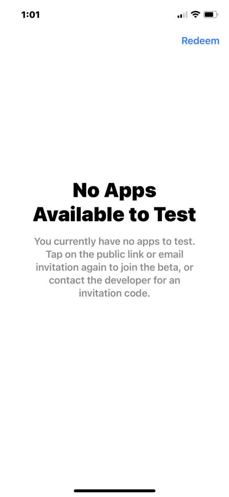
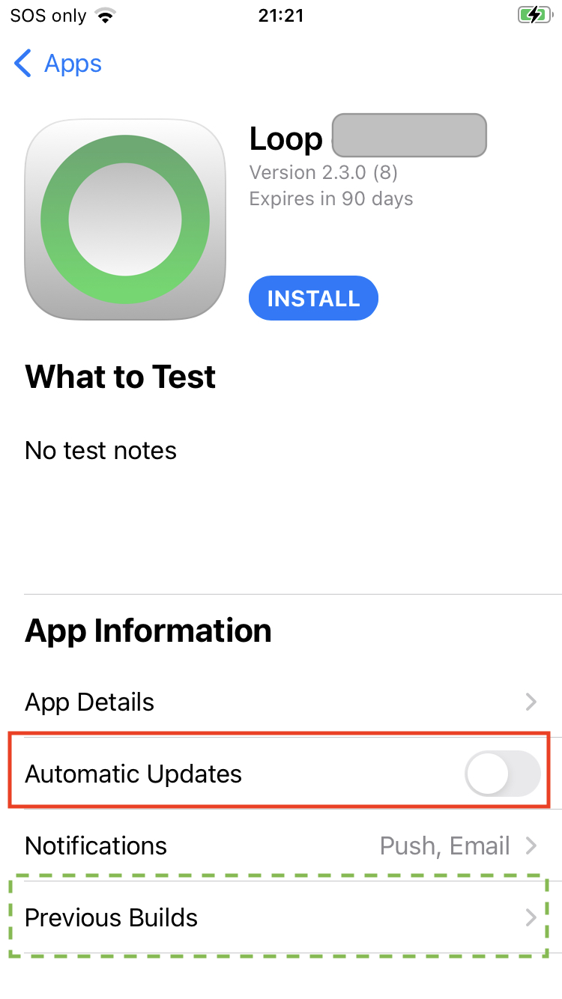

## General Installation Information

This is only available with&nbsp;Loop 3.

**You must build *Loop* every 90 days when you use this method.**

After [building *Loop* using a browser](../gh-actions/gh-first-time.md#build-loop), you are ready to install on as many phones as you and your family members need.

* If you later need to add an adult family member to your list, refer to [Set Up Users and Access (TestFlight)](../gh-actions/gh-first-time.md#set-up-users-and-access-testflight).

* Children (under 13 in US, varies by country) cannot use *TestFlight* with their ID. When you use&nbsp;[*TestFlight* for a Child](#testflight-for-a-child), you will need to use your ID on their phone (not the whole phone - just the Media & Purchase portion), so send the *TestFlight* invitation to the email associated with your ID.

## Install *TestFlight*

If you already have the *TestFlight* app installed on your phone, skip ahead to [Install App with *TestFlight*](#install-app-with-testflight).

To install *TestFlight*, refer to the GIF below:

* On the phone, open the App Store and Search for *TestFlight*
* Install or Download to that phone *TestFlight*
    * Hint: On child's phone, do this while logged in as yourself for Media & Purchase
    * Logging in as an adult is explained in [*TestFlight* for a Child](gh-deploy.md#testflight-for-a-child)

{width="300"}
{align="center"}

## Install App with *TestFlight*

Once you get an email that the *TestFlight* processing completed, you can install the app on your phone. Note this can be half-hour to an hour after the build displays the green check mark on your browser.

The first time you use *TestFlight* on any phone associated with a given email, you must `Redeem` the code sent to that email inviting you to test the app. The GIF below is for someone who has never used *TestFlight*.

* Initial screen indicates there are no Apps available to test, tap on Redeem
* Enter your code and tap redeem to enter it
* Click on OK to acknowledge
* Click on Install

{width="300"}
{align="center"}

If you already have the *Loop* app on the phone, you'll see the warning about possible loss of data. Don't worry, all your settings remain. Go ahead with the installation.

### Subsequent Times on Phone

* Open *TestFlight* and find the name you used for your *Loop* app in the [Create *Loop* App in App Store Connect](../gh-actions/gh-first-time.md#create-loop-app-in-app-store-connect) step
* Tap on Install
    * If you already have *Loop* installed on this phone, you will be warned that the app already exists on your phone and that you might lose the app's data.
    * Click Install again (your pump connection and all your data will be fine)
* Choose Open
* Make sure the *Loop* app is operating as expected
* If you are building *Loop* 3.x over *Loop* 2.x, you will be required to go through [Onboarding](../loop-3/onboarding.md)

{width="300"}
{align="center"}

## Automatic Update, Build, Install

Automatic features will be available when version 3.4.0 is released and are available now in 3.3.0 (when&nbsp;dev is the default branch). The instructions on the [Configure to Use Browser](gh-first-time.md) page will, unless you make a change, automatically take the following actions for 3.4.0:

* Update the version of your&nbsp;fork&nbsp;within a week of the change
* Build the app at least once a month and upload to *TestFlight*

It is already true that, unless you make a change, the default setting will:

* Install each new build on phone from *TestFlight*

### Recommendation

Recommended settings for 3.4.0 (when it is released) and later:

* Allow automatic update of your&nbsp;fork
* Allow automatic build and upload to *TestFlight*
* [Disable automatic installation](#disable-automatic-install-from-testflight) on phone from *TestFlight*

If you are running the development code, you may prefer to turn off the automatic update, but keep the automatic build. To read more about modifying automatic update and build options, please read [Modify Automatic Building](gh-update.md#modify-automatic-building).

## Disable Automatic Install from *TestFlight*

Once the app is installed one time, you can adjust whether it is automatically installed when updated versions are available. We recommend you disable automatic installation so you can choose when to switch to a newer build, which in some cases, may be a newer version.

Go back to the *TestFlight* app on your phone and tap on your app name in the list to see an expanded screen similar to the graphic below. The row to enable or disable automatic updates is highlighted in the graphic, which shows the feature disabled. This is recommended for all users.

* If you leave automatic update enabled (default), then whenever a new build is created and uploaded to *TestFlight* , it will be installed immediately.
* WARNING: If you switch between Building with Browser and Mac-Xcode, you must disable automatic update or Xcode will not be able to install to your phone.

{width="300"}
{align="center"}

When you are ready to install, just open the *TestFlight* app and click Install to get the most recent build and then click Open when it completes the installation. All your settings and connections to CGM and Pump are maintained.

If you tap on the bottom row that says `Previous Builds`, you can view and choose an older build (as long as it has not expired).

## *TestFlight* for a Child

The adult (Apple Developer Account owner) can log into Media & Purchase (see steps below) without affecting the child *Apple* ID associated with a phone (and thus their health records used by *Loop*). After the adult installs or updates the app using *TestFlight*, they probably should reverse those steps to remove their credentials from Media & Purchase.

Media & Purchase affects access to the App Store, Books, Music and Podcasts.

On the Child phone:

* Tap on Settings
* At the very top of Settings, tap on the Name of the phone, for example, `my kids phone`
* *Apple* ID Screen appears
    * Tap on Media & Purchases
    * Tap on Sign Out, and confirm
    * Sometimes the phone requires a reboot before you can sign in with a different ID
* Sign in with the adult (Apple Developer Account owner) *Apple* ID and password
* Install or Update the app from *TestFlight* on child phone
* Repeat the process to sign out the adult and (if needed) sign back in the child

## Change the App Store Connect Name

Suppose you really don't like the name you picked initially for the *Loop* app that shows up in the *TestFlight* app.

You can change it.

Open this link: [App Store Connect Apps](https://appstoreconnect.apple.com/apps) and log in as needed.

* Click on your app name.
* Click on App Information on the left side (make browser wider if you don't see this).
* Modify the Name under Localizable Information and click on the Save button (upper left)
* If you chose a name that is in use, you'll see the warning screen - try again

