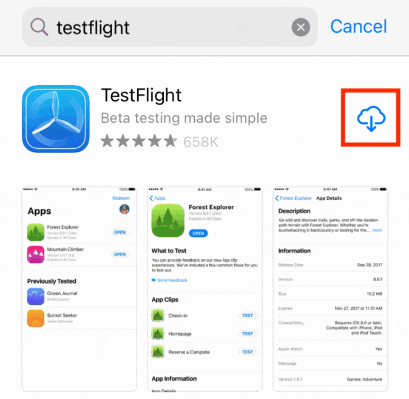
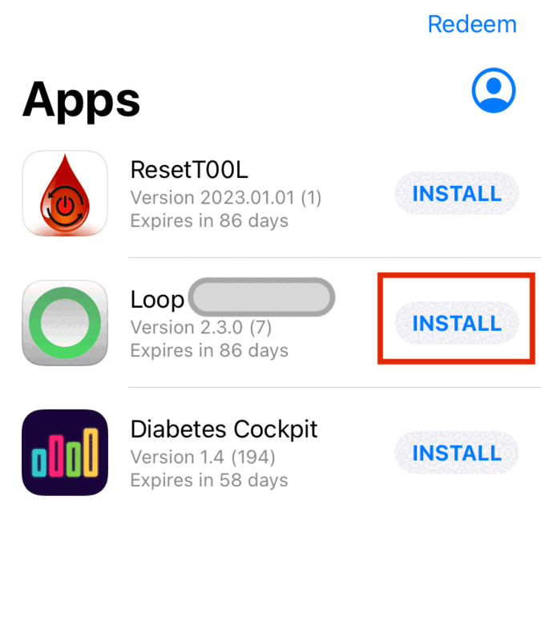

## General Installation Information

This is only available with Loop 3 and Loop development branches.

**You must build Loop every 90 days when you use this method.**

After [building Loop using a browser](../gh-actions/gh-first-time.md#build-loop), you are ready to install on as many phones as you and your family members need.

* If you later need to add an adult family member to your list, refer to [Set Up Users and Access (TestFlight)](../gh-actions/gh-first-time.md#set-up-users-and-access-testflight).

* Children (under 13 in US, varies by country) cannot use *TestFlight* with their ID. If you plan to [Install *TestFlight* Loop for Child](#install-testflight-loop-for-child), you will need to use your ID on their phone (not the whole phone - just the Media & Purchase portion), so send the *TestFlight* invitation to the email associated with your ID.

## Install *TestFlight*

If you already have the *TestFlight* app installed on your phone, skip ahead to [Install Loop with *TestFlight*](#install-loop-with-testflight).

In order to install Loop, the *TestFlight* app must be installed on the phone:

* Open the App Store and Search for *TestFlight* (see GIF below)
* Choose *TestFlight* and Install or Download to that phone
    * Hint: On child's phone, do this while logged in as yourself for Media & Purchase
    * Logging in as an adult is explained in [Install Loop for Child](gh-deploy.md#install-testflight-loop-for-child)

{width="300"}
{align="center"}

## Install Loop with *TestFlight*

Once the *GitHub* Build completes (either green check mark on *GitHub* or you got an email), you can install Loop on your phone.

**Loop 3 requires iOS 15.1 or higher**

### First Time on Phone

The first time you use *TestFlight* on any phone associated with a given email, you must `Redeem` the code sent to that email inviting you to test the app. The GIF below is for someone who has never used *TestFlight*.

* Initial screen indicates there are no Apps available to test, tap on Redeem
* Enter your code and tap redeem to enter it
* Click on OK to acknowledge
* Click on Install

{width="300"}
{align="center"}

If you already have the Loop app on the phone, you'll see the warning shown in the next GIF. Go ahead with the installation.

### Subsequent Times on Phone

* Open *TestFlight* and find the name you used for your Loop app in the [Create Loop App in App Store Connect](../gh-actions/gh-first-time.md#create-loop-app-in-app-store-connect) step
* Tap on Install
    * If you already have Loop installed on this phone, you will be warned that the app already exists on your phone and that you might lose the app's data.
    * Click Install again (your pump connection and all your data will be fine)
* Choose Open
* Make sure the Loop app is operating as expected
* If you are building Loop 3.x over Loop 2.x, you will be required to go through [Onboarding](../loop-3/onboarding.md)

{width="300"}
{align="center"}

## *TestFlight* Automatic Updates

Go back to the *TestFlight* app on your phone and tap on your Loop app name in the list to see an expanded screen similar to the graphic below. The row to enable or disable automatic updates is highlighted in the graphic. For this example, this feature is disabled.

* You should choose the option you prefer
* If you leave automatic update enabled (default), then whenever you issue the Actions: Build Loop command on from *GitHub* on your LoopWorkspace fork, the new build will be installed on that phone as soon as the build completes.
* WARNING: If you later want to build using Xcode, you must first disable automatic update or Xcode will not be able to install to your phone.

{width="300"}
{align="center"}

If you tap on the bottom row that says `Previous Builds`, you can view and choose an older build (as long as it has not expired).

## Install *TestFlight* Loop for Child

The adult (Apple Developer Account owner) can log into Media & Purchase (see steps below) without affecting the child *Apple* ID associated with a phone (and thus their health records used by Loop). After the adult installs or updates Loop using *TestFlight*, they probably should reverse those steps to remove their credentials from Media & Purchase.

Media & Purchase affects access to the App Store, Books, Music and Podcasts.

On the Looper's phone:

* Tap on Settings
* At the very top of Settings, tap on the Name of the phone, for example, `my kids phone`
* *Apple* ID Screen appears
    * Tap on Media & Purchases
    * Tap on Sign Out, and confirm
    * Reboot the phone
* After phone reboots, repeat the process and sign in with the adult (Apple Developer Account owner) *Apple* ID and password
* Install or Update Loop from *TestFlight* on child's phone
* Repeat the process to sign out the adult and (if needed) sign back in the child

## Change the App Store Connect Name

Suppose you really don't like the name you picked initially for the Loop app that shows up in the *TestFlight* app.

You can change it.

Open this link: [App Store Connect Apps](https://appstoreconnect.apple.com/apps) and log in as needed.

* Click on your app name.
* Click on App Information on the left side (make browser wider if you don't see this).
* Modify the Name under Localizable Information and click on the Save button (upper left)
* If you chose a name that is in use, you'll see the warning screen - try again

