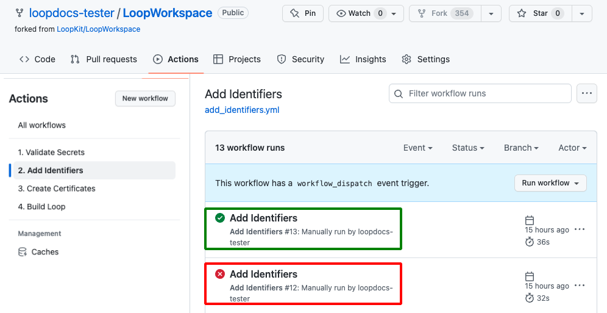

## GitHub Build Method Errors

This method is fairly new so there are not many error screens captured.

There is a separate section for each step in the process.

1. [Examine the Error](#examine-the-error)
1. [Action: Add Identifiers Errors](#action-add-identifiers-errors)
1. [Action: Create Certificates Errors](#action-create-certificates-errors)
1. [Action: Build Loop Errors](#action-build-loop-errors) before successful build
1. [Repeat Build Loop Errors](#repeat-build-loop-errors) after successful build

If you discover a new error, please reach out to help us update the documentation.

## Examine the Error

It doesn't matter which action you are running; after the action completes, you will either see a green check mark for success or a red x mark for failure. The graphic below shows an example for the Add Identifiers action.

{width="700"}
{align="center"}

If you click on the action name, it opens a secondary screen as shown below.

{width="500"}
{align="center"}

Click on the top link to view the highlighted display for that failure as shown in the graphic below. 

* See if you can find your error message on this page
* The display will show it highlighted in red font as seen below
* If you need more help, download the log file - see inset in graphic below
    * Tap on the gear icon
    * Select `Download log archive`
    * Post the downloaded zip file on zulipchat along with what you've tried so far

{width="700"}
{align="center"}

## Action: Add Identifiers Errors

Use the [Examine the Error](#examine-the-error) instructions to find your error message.

There are two errors that we are familiar with at this point. Look for text matching what is listed below and view what has caused this error to be seen.

### Authentication credentials are missing or invalid

If you see:

* Authentication credentials are missing or invalid. - Provide a properly configured and signed bearer token, and make sure that it has not expired. Learn more about Generating Tokens for API Requests https://developer.apple.com/go/?id=api-generating-tokens

This can be caused by an error in the value (or spelling) of one of these keys:

* FASTLANE_KEY_ID
* FASTLANE_ISSUER_ID
* FASTLANE_KEY
* GH_PAT

### Invalid curve name

If you see:

* invalid curve name

This was caused by an error in the format of the value entered for the FASTLANE_KEY.

Make sure you copy in a text editor from the first hyphen to the last hyphen.

## Action: Create Certificates Errors

Use the [Examine the Error](#examine-the-error) instructions to find your error message.

place holder

## Action: Build Loop Errors

Use [Examine the Error](#examine-the-error)

* Download the log archive file and unzip it
* Open the `1_build.txt` file
* Search for the phrase below

For each Build Loop Error section below, copy the phrase into the search function of your test editor. If you find it, solve that error. If not, move on to the next one.

### Could not find an app on App Store Connect

Copy the words on the line below and paste it into the search function for your text editor.

`Could not find an app on App Store Connect`

If that phrase is found, then:

* Make sure you completed the [Create Loop App in App Store Connect](gh-first-time.md#create-loop-app-in-app-store-connect) Step
    * Once you've resolved that step, run these Actions again:
        * Create Certificates
        * Build Loop

* This can also be caused if you correctly created the Loop App but entered an incorrect value for the TEAMID.
    * If you have the incorrect TEAMID, check this link: [Certificates, Identifiers & Profiles](https://developer.apple.com/account/resources/identifiers/list) for entries with the incorrect TEAMID embedded
    * For example, if your TEAMID is 0123456789, but you entered 000123, you may see both of these in your identifiers list
        * com.0123456789.loopkit.Loop
        * com.000123.loopkit.Loop
    * Delete the "bogus" identifier version, fix your TEAMID and rerun all three steps:
        * Add Identifier
        * Create Certificates
        * Build Loop

### Error: Provisioning Profile

Copy the words on the line below and paste it into the search function for your text editor.

`error: Provisioning profile "match AppStore com`

If that phrase is found one, or more times, it means you missed associating your Loop App Group with one or more identifiers.

For example, you might see:

* `error: Provisioning profile "match AppStore com.***.loopkit.Loop.SmallStatusWidget`
* `error: Provisioning profile "match AppStore com.***.loopkit.Loop.statuswidget`
* `error: Provisioning profile "match AppStore com.***.loopkit.Loop.Loop-Intent-Extension`

Return to [Add App Group to Other Identifiers](https://loopkit.github.io/loopdocs/gh-actions/gh-first-time/#add-app-group-to-other-identifiers) and fix the missing items.

You must create certificates again before you can build:

* Action: Create Certificates
* Action: Build Loop

## Repeat Build Loop Errors

This section is only for people who have successfully built using GitHub Build Actions.

Use the [Examine the Error](#examine-the-error) instructions to find your error message.

### Could not install WWDR certificate

Assuming you have successfully built using the GitHub method before:

* If the details show this message, "Could not install WWDR certificate", make sure your developer account is in good standing and that there are no agreements that need to be accepted
* Sometimes this is a sign that Apple did not respond to a request, this failure happens in the first few minutes
    * Repeat the build and it should be fine the next time

{width="500"}
{align="center"}
