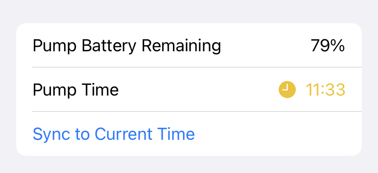

## Pump Settings

To bring up the Pump Settings display, tap on the pump icon in the Heads Up Display ([HUD](displays-v3.md#heads-up-display)) or your connected pump in the Loop [Settings](settings.md) screen.

## Medtronic Status and Commands

Medtronic status and commands are found in the Pump Settings screen shown in the graphic below. The bottom section with Pump ID, Firware Version and Region is configured at the time the pump is connected to Loop. You cannot edit those lines.

{width="300"}
{align="center"}

### Suspend Delivery

Tapping on the `Suspend Delivery` row will suspend all insulin delivery: basals, temp basals, and boluses in progress. When you press `Suspend Delivery`, the label changes to `Suspending` while Loop is communicating with the pump. When the label changes to `Resume Delivery`, all insulin delivery is stopped until the user resumes using the HUD Status Row, the Pump Settings screen or on the pump itself.

As long as the spinning icon is spinning, Loop is trying to execute the Suspend or Resume command. If it fails to complete, a modal alert will appear that says "Error Suspending" or "Failed to Resume Insulin Delivery" which you must acknowledge. You must then repeat the command to try again. Make sure your RileyLink device is powered on and close to the phone and pump.

When the phone is in portrait mode, so the HUD is visible:

* The user is alerted that pump is suspended by the HUD [Pump Status Icon](displays-v3.md#pump-status-icon).

{width="150"}
{align="center"}

* The [HUD Status Row](displays-v3.md#hud-status-row) message can be tapped to resume delivery.

{width="300"}
{align="center"}

You can still suspend and resume insulin on the pump itself.  It may take until the next Loop cycle (typically less than 5 minutes), but Loop will detect that the pump is suspended or basal is resumed and the HUD Status Row will update.

If you request a manual bolus with Loop while the pump is suspended, Loop resumes basal delivery as well. No automated boluses are initiated while suspended, only manual ones.

### Insulin Type

You select [insulin type](add-pump.md#insulin-type) when connecting to a new Medtronic pump.

If you install Loop 3 over Loop 2 with the pump already configured, be sure to set the Insulin Type on the pump settings screen. If no insulin type is set, you will get red loops.

Use this row if you switch to a different type of insulin.

* The model used by Loop for all the rapid insulin brands are the same, but it's a good idea to record if you change brands - some people notice differences
* If you switch between rapid and ultra-rapid insulin, you need to let Loop know so it will use the appropriate model

### Pump Battery Type

The type of battery used in the Medtronic pump affects how Loop interprets the [battery level for the pump](../operation/features/battery.md#medtronic-pump-battery).

### Preferred Data Source

Leave the Preferred Data Source set to on Event History.

### Use MySentry

The `Use My Sentry` row only shows up on pumps that support it.

Using the MySentry feature on some Medtronic pumps when using an OrangeLink causes the batteries to die quickly.  This option allows you to turn off MySentry within the Loop app.

{width="300"}
{align="center"}

### Devices

This allows access to the [RileyLink](../loop-3/rileylink.md) screen for each connected RileyLink compatible device.

### Pump Battery Remaining

Loop uses the Pump Battery Type to estimate Pump Battery Remaining. For information about the method, review [MDT Pump Battery](../operation/features/battery.md).

### Pump Time

Loop keeps the pump time up to date with the phone time automatically. As shown in the graphic in the next section, Loop allows differences in time zone. The user can decide when and if to modify the pump time zone, if different from the phone time zone. If the Pump Time shows as yellow, then the time zones do not match.

### Change Time Zone

During normal operation, Loop automatically keeps phone time and pump time aligned. In the case of time zone or daylight savings time changes, Loop allows the differences to persist until the user chooses to `Change Time Zone`. Please review [Time Zone](displays-v3.md#time-zone) for more details.

When the time zone for the pump and phone are not the same, you will notice a small clock symbol in the upper right of the pump status icon.

{width="150"}

Navigate to the Pump Settings screen. Right below the Pump Battery Remaining and Pump Time rows, there is a new row `Sync to Current Time`. When you tap that row, the time for the Medtronic pump is updated to the current Loop phone time.

{width="300"}
{center}

### Delete Pump

If you want to switch to a different pump you must first delete this one:

* Deselect your RileyLink compatible device
    * Move the slider(s) so it is no longer green
* Tap on `Delete Pump`
* Acknowledge you really mean it when asked by tapping `Delete Pump` again
* Add a new pump

For more information, follow this link: [Change Pump Type](add-pump.md#change-pump-type).

