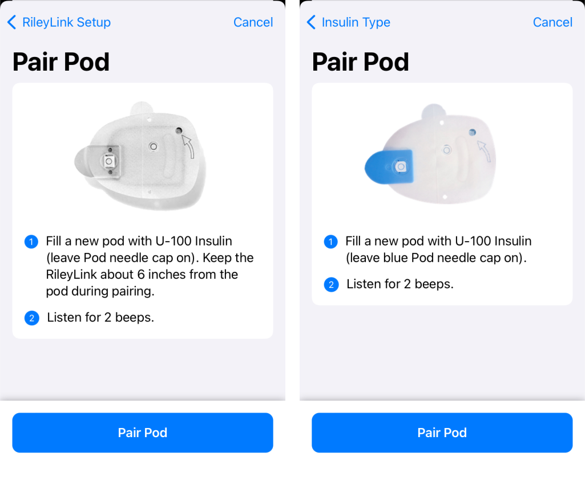
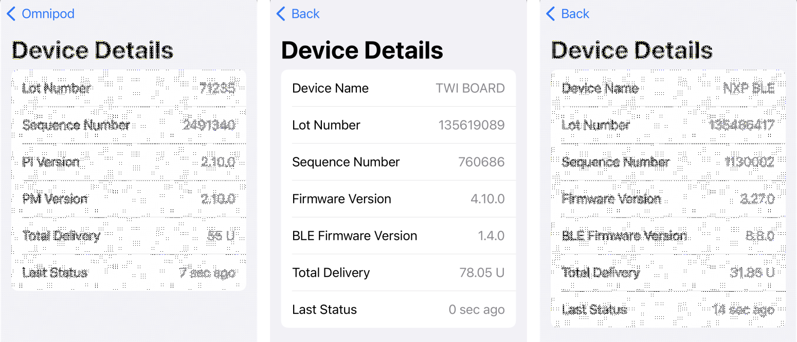
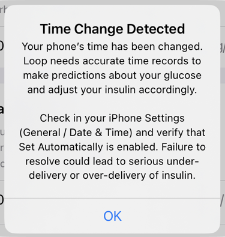
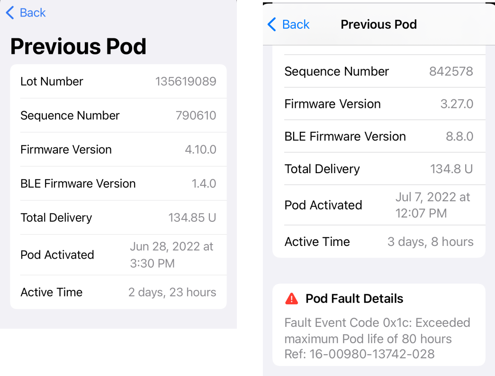

## Omnipod and Omnipod DASH Pump

The information and user interface for Omnipod (Eros) and DASH pods is the same, except Omnipod DASH pods do not require a RileyLink compatible device. They communicate directly with the phone through Bluetooth.

## Pair Pod

!!! danger "Max Fill is 200 Units"
    When you fill the Pod do not exceed 200 units.

    If you overfill the pods, you may get a pod fault right after priming.

!!! info "Pod Filling and Insertion"
    The Pod filling and insertion instructions are the same with the Loop app as they are for the PDM.  These videos: [Filling a Pod with Insulin](https://youtu.be/qJBN6rlvn_Y){: target="_blank" } and [Inserting the Cannula](https://youtu.be/ss1vpsmaLoI){: target="_blank" }, may be useful.

    For DASH Pods:

    * You will use your phone instead of the PDM.  Be sure to keep the phone close to the pod during pairing and insertion because the Pod uses a low-power mode during these activities.

    For Eros Pods:

    * You will use your phone and RileyLink compatible device instead of the PDM.  Be sure to keep the phone and RileyLink close during pairing and insertion because the Pod uses a low-power mode during these activities.

You'll be pairing a pod every 2 or 3 days (max pod life is 80 hours).

You'll see this screen every time you ask Loop to `Pair New Pod`.

The Omnipod Common pairing protocol is the same for all pods. The difference is that Omnipod requires a RileyLink compatible device and Omnipod DASH does not. There are also slight differences in some of the text and graphics, e.g., Omnipod DASH uses a blue needle cap and Omnipod has a clear needle cap.

Graphic below shows the Pair Pod screen for Omnipod (left) and Omnipod DASH (right).

{width="500"}
{align="center"}

!!! abstract ""
    Loop walks you through each step of the filling, pairing, priming, attaching and insertion process.

    It makes sure you are really ready to do the insertion.

    Please watch the [video of the *Loop* app screen when pairing a DASH pod](https://drive.google.com/file/d/1mN5s8-oorvoa-gbjAaYbnUnl_-vvuhNC/view?usp=sharing){: target="_blank" } to see the full process before pairing your first pod. In this video, once the pod starts priming, you may want to skip forward (it takes about a minute to prime).

!!! danger "Keep Gear Close"
    * Make sure the phone (and RileyLink if using one) are close to the pod before you tap Pair Pod
        * Do NOT move devices away from the pod until you see the blue check mark and the `Continue` button on the phone screen
        * You can then move away to attach the pod to your body
    * Make sure the phone (and RileyLink if using one) are close to the pod before you tap `Insert Cannula`
        * Do NOT move devices away from the pod until you see the blue check mark and the `Continue` button on the phone screen

### New Slider

!!! tip "The Insert Cannula and Deactivate Pod now use a Slider instead of a Button"
    For version 3.4.x and later there is a new slider to control insertion of the cannula and deactivation of a pod. 

    The slider looks like the graphic below. (The Deactivate Pod slider is red.) You place your finger on the dark circular icon and, while keeping your finger in contact with the screen, drag all the way to the other side. (The direction depends on the natural direction for your selected language). After the drag operation, as soon as you lift your finger off the phone, the cannula insertion command is sent to the pod.

{width="250"}
{align="center"}

The Screen that says Setup Complete allows you to change the Scheduled Reminder for this pod if you want a different reminder time (including none) from your usual setting.

* This only changes the reminder for this one pod
* If you want to change all future reminders, tap on Notifications to modify the Reminder Default
* In that same location, you can also change notification for the current pod at any time

## Pod Status

The Pod Status screen is shown in the graphic below. The dashed green outline indicates the `Device` portion that is found only for the Omnipod.  All other features of the screen are common for Omnipod and Omnipod DASH.

{width="250"}
{align="center"}

### Play Beeps

If you want to make sure Loop can talk to your pod, click on the sound icon (highlighted by the red box) in the graphic above. If the icon is greyed out - that means Loop is having a communication issue reaching your pod. Follow the usual [Troubleshoot: Pump is Not Responding](../troubleshooting/red-loop.md#pump-is-not-responding) steps to resolve this problem.

!!! tip "Other Uses"
    * Find (or startle) your child
    * Find the pod that fell off overnight and is mixed with the laundry

### Pod Expires

* This line provides a count-down until expiration along with a graphical representation of pod life
    * Once you are on the final day, the time remaining until expiration starts to report in Hours and Minutes
    * The solid bar is proportional to pod hours since activation
        * It is blue for the first 48 hours
        * It is orange for the last 24 hours and also appears in the [HUD Pump Status](displays-v3.md#pump-status-icon) icon
        * After expiration, a full-width red bar is shown here and in the HUD Pump Status icon
* Once the pod officially expires, at 72 hours, there is an 8 hour grace period
    * Insulet does not guarantee the pod will keep working that long, but it often does
    * A note will appear on the [Pod Status](#pod-status) screen with count-down text:
        * Change pod now. Insulin delivery will stop in HH hours, MM minutes or when no more insulin remains

### Basal Report

The next row changes the label depending on the situation. In all cases, the current basal rate is reported.

| 

 Label | Description |
|---|---|
|Scheduled Basal|Pod is running the scheduled basal rate|
|Insulin Delivery|Pod is running an automated or manual temporary basal rate|

### Insulin Remaining

Pods start reporting reservoir values when 50 U are left.

| 

 Value | Meaning |
|---|---|
|50+ U|Pod reservoir is greater than 50 U|
|Value U|Pod reservoir is estimated to be at least as great as the indicated value.|
| 0 U|Pod will attempt to deliver up to 4 U after it reports 0 U.   This is not guaranteed. The pod senses when it is not successful delivering pulses and that can happen before 4 U have been delivered.|

## Activity

### Suspend Delivery

You may want to consider using a [Manual Temp Basal](#manual-temp-basal) of 0 U/hr instead of suspend.

Tapping on `Suspend Delivery` brings up a timed reminder screen. You can choose to be reminded (via a beep on the pod itself) with 4 choices (or you can cancel the request):

* 30 minutes
* 1 hour
* 1 hour 30 minutes
* 2 hours

After you select the reminder time, Loop issues a command to the pod to halt all insulin delivery: basals, temp basals, and boluses in progress. The label on the `Suspend Delivery` row changes to `Suspending` while Loop is communicating with the pump. When the label changes to `Resume Delivery`, all insulin delivery is stopped until the user resumes using the [HUD Status Row](displays-v3.md#hud-status-row) or the [Pod Status](#pod-status) screen.

As long as the spinning icon is spinning, Loop is trying to execute the Suspend or Resume command. If it fails to complete, a modal alert will appear that says "Error Suspending" or "Failed to Resume Insulin Delivery" which you must acknowledge. You must then repeat the command to try again. For Omnipod, make sure your RileyLink device is powered on and close to the phone and pod.

When the phone is in portrait mode, so the HUD is visible:

* The user is alerted that pump is suspended by the HUD [Pump Status Icon](displays-v3.md#pump-status-icon).

{width="150"}
{align="center"}

* The [HUD Status Row](displays-v3.md#hud-status-row) message can be tapped to resume delivery.

{width="300"}
{align="center"}

#### No Manual Bolus While Pod is Suspended

If you request a manual bolus with Loop while a pod is suspended, Loop will send a notification that Bolus Failed with instructions that Pump is Suspended, Resume Delivery.  In other words, you must resume delivery before you will be allowed to bolus with pods.

#### Suspend Timer Reminder

At the end of the reminder time, an alert beep is issued by the pod and a modal alert will be provided on the Loop app. You must acknowledge the modal alert on the phone to silence future pod alerts. 

* If you do not acknowledge the modal alert, the pod will keep beeping
* If you need a silent pod, consider using [Manual Temp Basal](#manual-temp-basal) of 0 U/hr instead of Suspend

{width="300"}
{align="center"}

!!! danger "Manually Resume Insulin Delivery"
    The halt of all insulin delivery continues until you manually resume. There is no automatic resumption of basal insulin from a suspend command.

    If you select a Manual Temp Basal command of 0 U/hr instead of Suspend:

    * Basal Delivery automatically resumes at the end of the selected duration without need for Loop to command it
    * At the end of the duration, Loop will restore Closed Loop, if you were in closed loop when you issued the Manual Temp Basal command
    * There are no beeps on the pod to remind you to resume insulin delivery

### Manual Temp Basal

Tap on the `Set Temporary Basal Rate` to select a Manual Temp Basal.

This brings up the `Temporary Basal` screen shown on the left of the graphic below. 

* You can select any basal rate from 0 U/hr to your maximum basal rate set in [Delivery Limits](therapy-settings.md#maximum-basal-rate)
* You can choose any duration up to 12 hours in half-hour increments
* Once you select rate and duration and tap `Set Temporary Basal`, Loop goes into Open Loop mode and the pod is commanded to that rate and duration. 

In other words, you can leave your phone behind and the selected basal rate continues for the selected basal duration. There will be no automated adjustments of delivery for the temp basal duration.  

{width="600"}
{align="center"}

#### During Manual Temp Basal

!!! warning "This Pod Only"
    The manual temp basal command from Loop tells the pod to initiate a temp basal for the designated rate and duration.

    * The pod itself takes care of the temp basal with no further interaction with Loop
    * Loop will no longer issue commands to the pod without manual intervention from the user until the expected duration ends or user selects `Cancel Manual Basal`
    * Loop continues to request and receive status reports from the pod while the pod is within communication range

    **Deactivating this pod and pairing a new one interrupts the temp basal.**

    **If you still need that basal rate, you must initiate it on the new pod.**

Once the manual temp basal command is sent to the pod, Loop changes to Open Loop mode and updates displays as shown in the graphic above

* [Pod Status](#pod-status) screen:
    * The [Basal Report](#basal-report) updates with the new rate and label indicates `Insulin Delivery`
    * The row label changes to `Cancel Manual Basal` and reports the time remaining until the temp basal expires
* Main screen (refer to red rectangle highlights):
    * The HUD [Loop Status Icon](displays-v3.md#loop-status-icon) changes to an `Open Loop` icon and the HUD [Pump Status Icon](displays-v3.md#pump-status-icon) indicates `Manual Basal`
    * The [Insulin Delivery](displays-v3.md#insulin-delivery-chart) plot indicates the planned duration of the manual temp basal
    * The [Glucose Prediction](displays-v3.md#glucose-chart) updates using that assumed change in insulin delivery

So long as you were in Closed Loop before requesting the Temp Basal, Loop returns to Closed Loop automatically when the duration ends or you cancel the temporary basal.

!!! info "Automatic Resumption of Scheduled Basal"
    The phone does not need to be in contact with the pod for insulin delivery to return to scheduled basal at the end of the selected duration. That duration is commanded along with the temporary rate. Once the pod accepts that command, and you'll get an error message if it does not, the pod will resume scheduled basal rate without further commanding if there is insulin in the reservoir and a pod fault does not occur.

For situations where you need a modification of your insulin needs that is not dependent on a particular pod, review the information on the [Overrides](../operation/features/overrides.md) page.

### Devices

For Omnipod, there is a Devices section used to access the [RileyLink](../loop-3/rileylink.md) status and commands screen.

### Pod Details

The Pod Details table, shown in the graphic below, reports:

* Time at which pod was Activated
* Time at which pod will Expire
* Access to Device Details

{width="300"}
{align="center"}

!!! question "Time Drift"
    The pod will expire when it thinks it has been 80 hours. The pod clock may drift a few seconds with respect to phone time during the pod life. The Expiration time gets updated when the pod reports how long it thinks it has been since it was activated.

#### Device Details

Some additional details from the most recent pod status response message are displayed if you tap the Device Details row, as shown in the graphic below. Most people will not need to view this.

The graphic shows an example for Omnipod on the left, Omnipod DASH (TWI BOARD) in the middle and Omnipod DASH (NXP BLE) on the right. Do not worry about the different board styles (Device Name) for DASH. The developers did that for you. If you are asking for help from a mentor - they may request this information.

{width="600"}
{align="center"}

## Replace Pod

When you tap on the `Replace Pod` row, the `Deactivate Pod` screen, shown below, is displayed. 

* Touch the circular icon and maintain contact while you slide your finger all the way across the phone
    * When you release the slide, the deactivation command is sent to the pod
    * This action stops insulin delivery for this pod and cannot be resumed
* If you have changed your mind, tap Back or Cancel to continue using the pod

{width="300"}
{align="center"}

## Configuration

### Notification Settings

When you tap on the `Notifcation Settings` row, the graphic below is displayed. The notifications are a combination of beeps on the pod with associated modal alerts on the phone app that must be acknowledged to prevent future beeps.

* Expiration Reminder Default: changes the reminder time for any future pod (not the current one)
* Scheduled Reminder: affects the reminder for the current pod (not future pods)
    * If no pod is connected, you will not see the Scheduled Reminder section
* Low Reservoir Reminder: changes the reminder level for the current pod and all future pods
    * If no pod is connected, the app will not allow you to modify this setting
    * Change it after the next pod is paired
* Critical Alerts: Information row about which alerts can be silenced by phone settings

{width="300"}
{align="center"}

### Confidence Reminders

When you tap on the `Confidence Reminder` row, the graphic below is displayed.  You can choose from three levels of audible responses that Loop requests from the pod:

* Disabled: no audible pod alerts to acknowledge commands
* Enabled: each manual command provides an audible sound to acknowledge it:
    * For manual dosage change, the pod beeps at both the beginning and end of the manual command.
    * For automated dosage change, the pod does not beep.
* Extended: Automated dosage change beeps, similar to the manual commands when set to `Enabled`

{width="300"}
{align="center"}

### Insulin Type

You selected [insulin type](add-pump.md#insulin-type) when connecting to this pump.

Tap on this row if you switch to a different type of insulin.

* The model used by Loop for all the rapid insulin brands are the same, but it's a good idea to record if you change brands - some people notice differences
* If you switch between rapid and ultra-rapid insulin, you need to let Loop know so it will use the appropriate model

## Pump Time

Click on [Time Zone](displays-v3.md#time-zone) to understand how Loop treats "pump" time for pods.

When the Pump time zone matches the phone time zone, the Pump Time is displayed with black font. 

When the phone time zone and pump time zone do not match, there is a clock icon on the main screen in the Pump Status Icon of the HUD.

* Tap on the Pump Status Icon in the HUD (top red rectangle in graphic below)
* Information about Time Change is provided on the Omnipod screen
* The Pump Time displays the clock icon and yellow font
    * The `Sync to Current Time` row appears
    * Tap on the `Sync to Current Time` row to choose whether to make Pump Time match Phone Time or not (bottom red rectangle in graphic below)

{width="600"}
{align="center"}

### Other Time Changes

What about other time changes?  Suppose the iOS -> General -> Time & Date is modified to manually change the time, but the time zone is not adjusted. (Sometimes this is done to defeat limits on games. **Do Not** do this on a Looping phone.  If you have an "old" glucose reading in the "future" - Loop will not predict correctly which may have dangerous consequences.) There will not be an obvious display in the HUD or Omnipod screen (which keys off time zone) but you will get regular warnings that phone does not have automatic time set.

Loop 3 will display this warning modal screen if it detects a problem with the Phone time. It leaves it up the user to decide what action should be taken. To make this warning stop, go to iOS -> General -> Time & Date and enable Set Automatically. 

{width="300"}
{align="center"}

## Previous Pod Information

When you tap on the `Previous Pod Information` row, a graphic similar to those shown below is displayed. This provides summary information about the pod before the one currently in use. 

If the previous pod had a fault and you choose to report it to Insulet, this screen reports the PDM reference code that Insulet uses in their tracking system.

{width="600"}
{align="center"}

!!! bug "Do Not Call Insulet about -049 (0x31) Faults"
    If you should happen to get a fault where the last 3 digits of the PDM ref code are "-049" (the Hex Designation is fault code 0x31), do **not** report this to Insulet and do **not** ask for a replacement. This means Loop did not ensure the pod was in the correct state to accept a command. In other words, it was a bug in the Loop code. 
    
    We believe the code has been updated to prevent these faults. There was a brief period during development in which at least one of these happened - this was fixed July 3, 2022. If this happens to you, report it on zulipchat for the developers, save a Loop Report and rebuild if you have an older version of the development code.

### Pod Error Messages

This section presents some of the error message screens you may see specific to pods.

#### Pod Faults

You are likely to hear a pod fault before Loop notices. If your phone is locked, Loop only checks status every 5 minutes for Omnipod or 3 minutes for Omnipod DASH.

Unlock your phone, open Loop, navigate to the Pod Status screen and use the slider to Deactivate Pod to stop the noise. The pod fault - even if it does not show up in the HUD or the Pod Status screen, will be picked up by the process of sliding to Deactivate Pod. You can then view the Fault information in the [Previous Pod Information](#previous-pod-information) screen.
