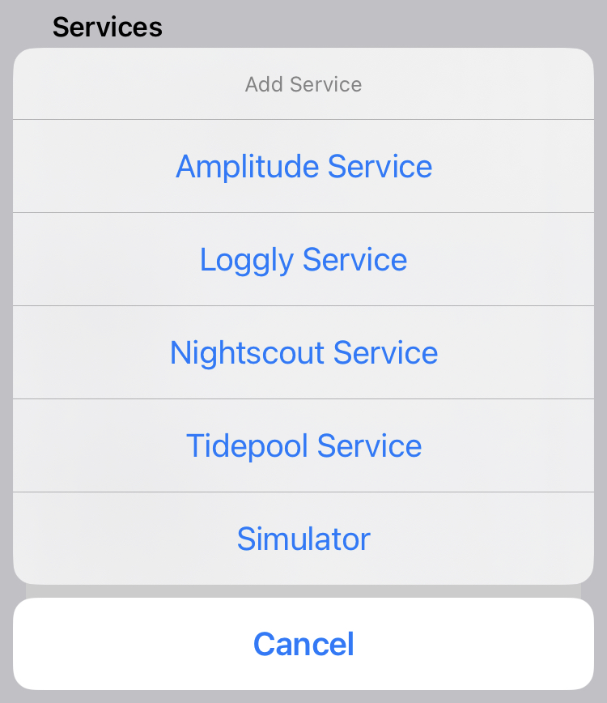
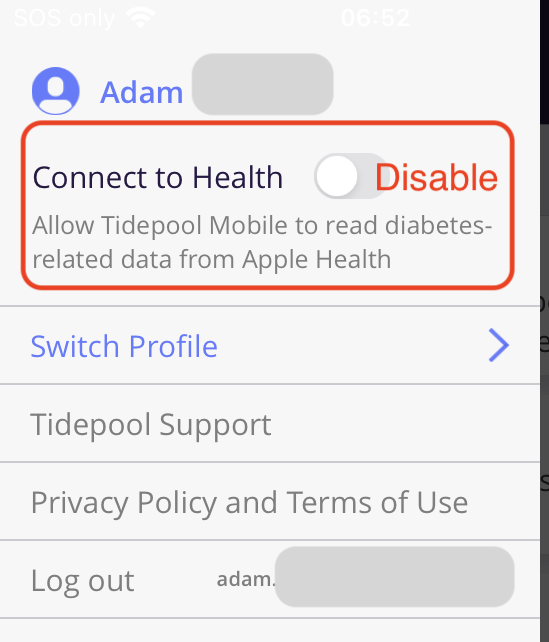
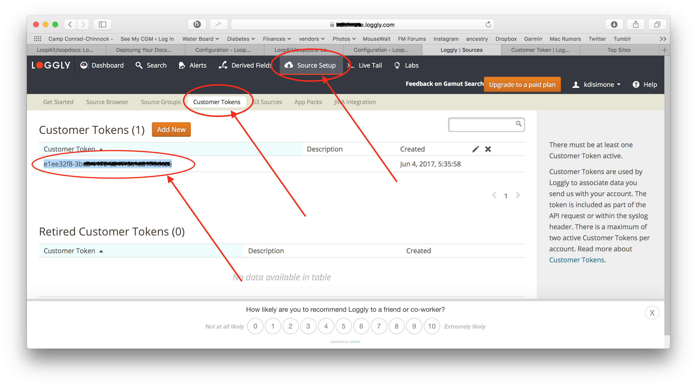
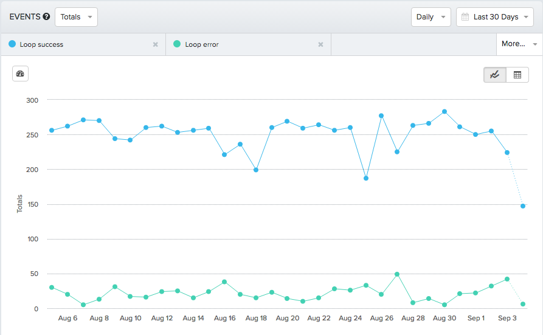

 ## Loop Services

Near the bottom of your Loop settings screen is a section called "Services".

!!! question "Sevices are Optional"
    * Loop will work whether you use these or not.
    * Nightscout is highly recommended by experienced Loopers but can be added later - you don't need it to get started.
    * If you are running Loop 2.2.x, see [Loop 2 Services](../operation/loop-settings/services-v2.md)

The services are added by tapping on the &plus; sign and choosing the service from the list. Services are shown alphabetically. The most common services are [Nightscout](#nightscout) and [Tidepool](#tidepool).

{width="350"}
{align="center"}

## Nightscout

There is a whole section in LoopDocs about Nightscout. Please follow this link to the [Using Nightscout with Loop](../nightscout/overview.md) section of LoopDocs. That also has the links you might need to the official [Nightscout Documentation](https://nightscout.github.io/){: target="_blank" } (different website).

If you have an existing Nightscout site, it's still a good idea to review that section, but here's the quick summary of how to add your Site URL and API_SECRET to have your Loop data transmitted to your Nightscout site. If you can’t remember your API_SECRET, it can be found under Settings, Reveal Config Vars for Heroku sites (or Application Settings, Connection Strings for Azure sites).

The two most common errors in filling out this section are:

1. Failure to use `https://`  in the site URL.  If you use `http://` (see how that doesn't have the "s" at the end?), you will get an error message about an App Transport Security policy.
2. Having a trailing slash on the end of the URL (or an embedded space). If you copy and paste from a web browser, make sure to delete the trailing slash on the URL entry.

!!! tip "More Tips about Nightscout"
    * One family had an app configured to block some websites for their child's phone and accidentally blocked their Nightscout URL - took them a while to figure out that mistake.

## Tidepool

With Loop 3.2.x and newer versions, data can be directly uploaded from Loop to Tidepool.

!!! warning "User Beware"
    Don't use the Loop Tidepool uploader yet unless you want to help the developers work through some known issues. The Tidepool Mobile app still works to upload some of your Loop data from Health.

    * There is a new authentication framework in Tidepool
        * Loop developers are working on handling this new authentication protocol
    * One other problem is that data uploaded with the Tidepool Mobile uploader from Apple Health shows up as duplicate data
        * Even if you turn off access of the Tidepool Mobile uploader to Apple Health, there will still be 7-days of overlap with Loop that will display as duplicated data (think 2x carbs, insulin etc in your Tidepool Web display) when you enable Loop Tidepool service as the uploader

Please refer to the [LoopTips: Data: Tidepool](https://loopkit.github.io/looptips/data/tidepool/){: target="_blank" } page for more information about Tidepool. The Tidepool display browser is undergoing some updates; the information on these pages will be updated after changes happen.

The Tidepool Mobile app serves 2 purposes:

1.  Allow notes to be recorded with associated glucose, carbs, and insulin record for a snap shot in time
1.  Upload Loop data stored in Health to the Tidepool database for display in their browser tool; when the Connect to Health feature is enabled

With the new Loop Service to upload to Tidepool, additional information that is not stored in Health can be made available to Tidepool. However, this is a work in progress.

At the current time:

* If you have Tidepool Mobile installed on your phone, with the Connect to Health feature enabled, while also using the Tidepool Service in Loop, all of your carb and insulin records will be doubled on the Tidepool Web browser display
    * In other words, your data is uploaded by the Tidepool Mobile app and by the Loop app and duplicates are not filtered (at the current time)
* Short Term: There is a filter button at the bottom right of the browser display where you turn off the Loop portion for days when you have both Tidepool Mobile uploader and Loop uploader turned on

When you add the Tidepool Service to Loop, be sure to disable Tidepool Mobile ability to read from Apple Health.

{width="350"}
{align="center"}

* Warning: Even when you turn off the access to Health on the Tidepool Mobile app on the day that you turn on Loop Tidepool service, you will still get 7 days of overlap because Loop stores 7 days of data.

You can still use the note taking feature with Tidepool Mobile when Health is not connected, although you must have internet connectivity for this to work.

Tidepool Support is available to help troubleshoot issues or answer questions about using Tidepool. Contact them via email at support@tidepool.org.

## Loggly

[Loggly](https://loggly.com){: target="_blank" } is a free logging service. If you sign up for an account, you'll need to go under Source Setup and then Customer Tokens. Copy and paste your customer token into your Loop App settings for Loggly.

{width="500"}
{align="center"}

## Amplitude

[Amplitude](https://amplitude.com){: target="_blank" } is a remote event monitoring service and can be used to quickly identify errors and events with Loop. Amplitude stores the events and allows you to view those events as points in time. To retrieve the details of the events you will need to look at corresponding mLab data entries to get a complete picture of the issues. If you sign up for a free account with Amplitude, you will be given an API Key that you can enter here to have Loop integration setup.

{width="500"}
{align="center"}

## Next Step: Loop Displays

Great job, almost finished! Now that you have completed your services, let's move onto understanding your [Loop Displays](displays-v3.md). 

Loop displays is a valuable tool for understanding your Loop and a great page to review when troubleshooting.
