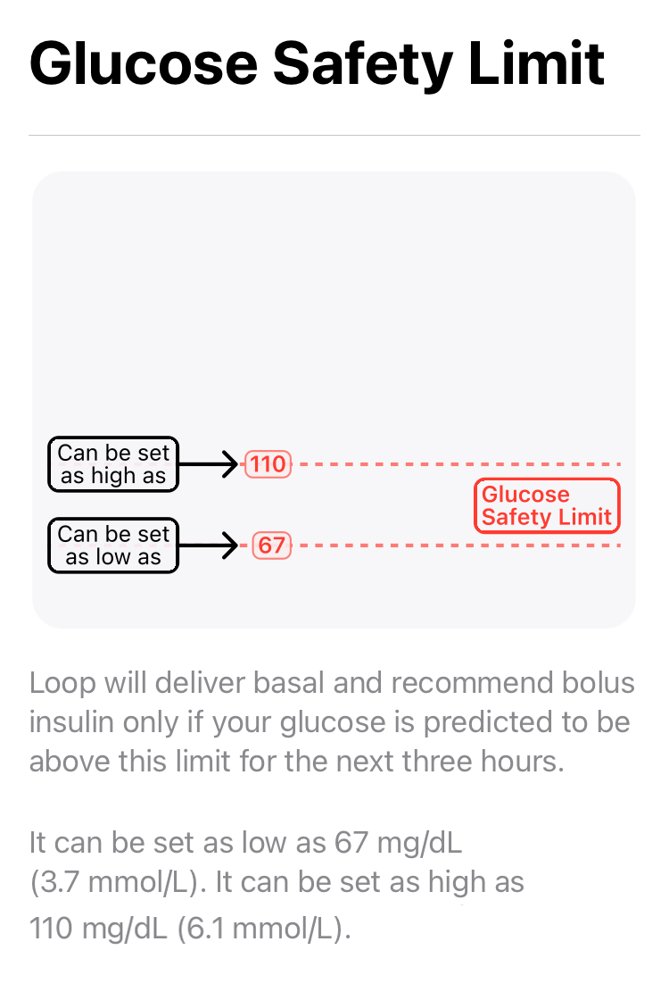
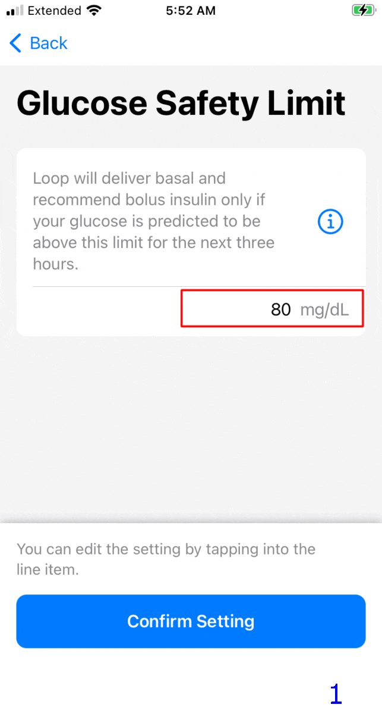
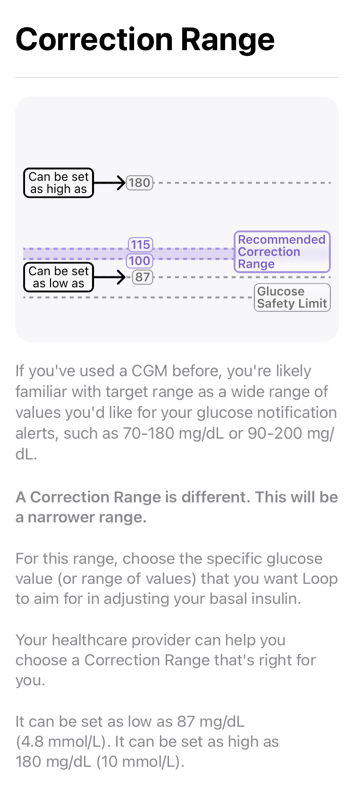
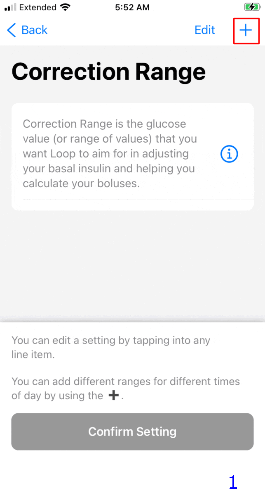
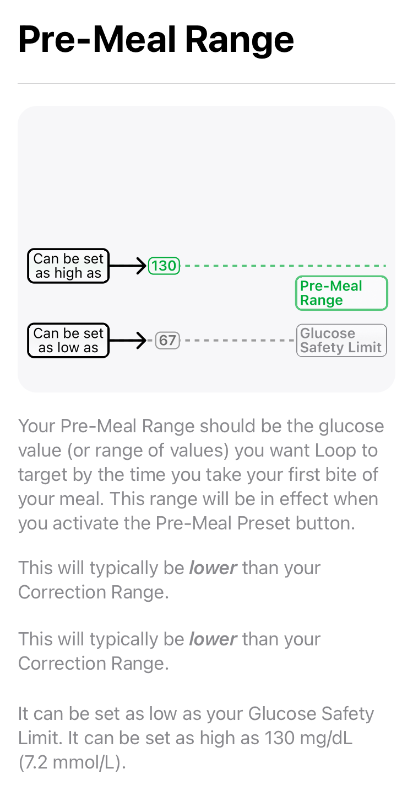

## Loop Therapy Settings

During [Onboarding](onboarding.md#therapy-settings-onboarding), all of your therapy settings were entered.

After onboarding, the Therapy Settings screen is reached by going through the Loop Settings screen **after** a [pump](settings.md#add-pump-for-therapy-settings) has been added.

When building Loop 3 over Loop 2.2.x, the existing values from Loop 2.2.x are kept where possible and presented to the user as the "default" value when moving through each screen.

This page provides more details about each of your Therapy Settings.

## Authorization Required

All the settings configured under Therapy Settings are protected by the same authorization method (FaceID, Fingerprint or Passcode) used to enable the app to issue a manual bolus.

## Details for Therapy Settings

Loop 3 has Guardrails for some Therapy Settings. These are grouped in the [Guardrails for Settings](#guardrails-for-settings) section of this page.

!!! tip "New Loopers"
    New Loopers may prefer settings that show up outside the "typical" range.

    * These show yellow font on the picker dial and you must acknowledge a warning message that the selected value is lower, higher or outside "typical"
    * It is always fine to pick a yellow or even red value when being cautious

    For example, choosing a Correction Range that is higher than "typical" when starting to learn Loop is fine. Once you are comfortable with how the system works, the range can be adjusted if desired - entirely up to you in consulatation with your health care professional.

**Therapy Settings are used for automated insulin delivery when Loop is in Closed-Loop mode.**

* If your Therapy Settings are not "dialed-in" before you enable closed loop, you may experience too much or too little automated insulin delivery
* Please spend the time to thoroughly understand the effect of each therapy setting

#### Screens Displayed

!!! abstract ""
    Some screens displayed on this page were acquired during [Onboarding](onboarding.md#therapy-settings-onboarding).
    
    * When saving a Therapy Setting
        * During Onboarding, the button is labeled "Confirm Setting"
        * Otherwise, the button is labeled "Save"

### Glucose Safety Limit

Loop will deliver basal and recommend bolus insulin only if your glucose is predicted to be above the Glucose Safety Limit for the next three hours.

The graphic below shows the information screen presented during onboarding or when user taps the information icon, &#9432;.

{width="300"}
{align="center"}

The GIF below shows two screens for Glucose Safety Limit.

* Frame 1: During onboarding, user can accept the default limit by tapping "Confirm Setting" or tap the row to configure the range (see Frame 2)
* Frame 2: The user adjusts the picker wheel to select desired value and then taps on the "Confirm Setting" or "Save" button

{width="300"}
{align="center"}

If you feel more comfortable with a higher limit, do not let the yellow font influence you. Once you've used Loop for a while, you can revisit this setting.

!!! note "Note"
    The value you select for Glucose Safety Limit will dictate the lowest value on the glucose picker that is available for Correction Range and Pre-Meal Range. Those cannot be lower than the Glucose Safety Limit.

[Guardrails for Glucose Safety Limit](#guardrails-for-glucose-safety-limit)

### Correction Range

Your Correction Range is the glucose value (or range of values) that you want Loop to aim for in adjusting your basal insulin and helping you calculate your boluses.

The graphic below shows the information screen presented during onboarding or when user taps the information icon, &#9432;.

{width="300"}
{align="center"}

The GIF below shows four screens when first adding and selecting a correction range. The red box indicates where the user taps.

* Frame 1: Tap the &plus; sign
* Frame 2: Use the picker wheels to select desired values
    * This is the first entry so must start at midnight - additional rows can be added for other times
    * When happy with the picker values, user must tap add
* Frame 3: This screen is shown only if a value is outside "typical"
* Frame 4: Tap on the "Confirm Setting" or "Save" button to accept the values

{width="300"}
{align="center"}

Do not let the yellow font discourage you if you want to have a "higher than typical" range to start with. Once you've used Loop for a while, you can revisit this setting.

[Guardrails for Correction Range](#guardrails-for-correction-range)

#### Manual vs Automated Dosing

Loop estimates future glucose over the next 6 hours (DIA) and, when in closed loop, adjusts insulin dosing. Loop uses or recommends the _smallest_ amount of insulin that will bring you to your target (Correction Range midpoint) over the whole forecast.

If you ask Loop for a manual [Bolus](../operation/features/bolus.md) recommendation while your current glucose is below the bottom of the correction range and above the glucose safety limit, Loop will recommend a value that should keep your glucose above the safety limit.

* This is only if you manually request a bolus recommendation.
* Loop will **not** automatically provide extra insulin, via high temp basal or automatic bolus, until your current glucose is higher than the bottom of your correction range.

### Pre-Meal Range

Your Pre-Meal Range is used to temporarily lower your glucose target before a meal to impact post-meal glucose spikes.

The graphic below shows the information screen presented during onboarding or when user taps the information icon, &#9432;.

{width="300"}
{align="center"}

The GIF below shows three screens from various scenarios. The red box indicates where the user taps. If the user chooses to leave Pre-Meal not set, the Pre-Meal icon in the tool bar is disabled. Some users prefer this.

* Frame 1: During onboarding, user can choose not to add a pre-meal range by tapping "Confirm Setting" or tap the Pre-Meal row to configure the range (see Frame 2)
* Frame 2: User adjusts the Pre-Meal range using the picker and then "Save"
* Frame 3: If a pre-meal range was added, user can remove it by tapping "Delete" and then "Save"

{width="300"}
{align="center"}

!!! note "Note"
    * If you do not add an entry, the pre-meal icon on the toolbar is disabled
    * If you add an entry, the pre-meal icon is activated for 1 hour or until carbs are entered or until the user cancels it

[Guardrails for Pre-Meal Range](#guardrails-for-pre-meal-range)

### Basal Rates

Your Basal Rate of insulin is the number of units per hour that you want to use to cover your background insulin needs.

* Loop supports 1 to 48 rates per day
* The schedule starts at midnight and cannot contain a rate of 0 U/hr (as the only entry)

[Guardrails for Basal Rates](#guardrails-for-basal-rates)

### Delivery Limits

Delivery Limits are safety guardrails for your insulin delivery.

* Click on one of the limits on this screen, Maximum Basal Rate or Maximum Bolus, to display the picker wheel for that limit
* You must first move the picker off the current value before saving
    * When onboarding, you can restore the picker to the original level once it has been moved
    * When adjusting settings later, one of the two limits must be changed to make the `Save` button active
* You may need to put your finger on part of the screen away from the picker wheel and scroll up and down to see the other setting
* Make sure both Maximum Basal Rate and Maximum Bolus have the desired value before hitting `Save`

### Maximum Basal Rate

Maximum Basal Rate is the maximum automatically adjusted basal rate that Loop is allowed to enact to help reach your correction range. Some users choose a value 2, 3, or 4 times their highest scheduled basal rate. Work with your healthcare provider to choose a value that is higher than your highest scheduled basal rate, but as conservative or aggressive as is comfortable.

If the Dosing Strategy is configured to Temp Basal Only, then the maximum basal rate can be used to limit how much extra insulin can be supplied automatically.

[Guardrails for Maximum Basal Rate](#guardrails-for-maximum-basal-rate)

### Maximum Bolus

Maximum Bolus is the highest bolus amount that you will allow Loop to recommend at one time to cover carbs or bring down high glucose.

If you manually enter a value in the Bolus screen that is greater than the Maximum Bolus setting, Loop will show a warning message and refuse to bolus that amount.

For safety, don't set a maximum bolus limit any higher than your typical large meal bolus. Many people like to set a value less than 10 U, for example, 9 or 9.9 U, to avoid accidentally typing in a bolus of 10 instead of 1.0 U.

If the Dosing Strategy is configured to Automatic Bolus, then the maximum bolus that is automatically supplied is 40% of the maximum bolus, but this can be applied at 5-minute intervals.

[Guardrails for Maximum Bolus](#guardrails-for-maximum-bolus)

### Carb Ratios

Your Carb Ratio is the number of grams of carbohydrates covered by one unit of insulin.

* At least one carb ratio must be entered
    * Use the &plus; sign, picker wheels and then tap "Add"
    * The method was described in the [Correction Range](#correction-range) section
* Loop supports 1 to 48 carb ratios per day

[Guardrails for Carb Ratios](#guardrails-for-carb-ratios)

### Insulin Sensitivities

Your Insulin Sensitivities refer to the drop in glucose expected from one unit of insulin over the full duration of the insulin action time. You may have also seen the term Correction Factor or Insulin Sensitivity Factor (ISF). These are all referring to the same setting.

* At least one insulin sensitivity must be entered
    * Use the &plus; sign, picker wheels and then tap "Add"
    * The method was described in the [Correction Range](#correction-range) section
* Loop supports 1 to 48 insulin sensitivities per day

[Guardrails for Insulin Sensitivities](#guardrails-for-insulin-sensitivities)

## Guardrails for Settings

Loop has guardrails for Therapy Settings.

* The limits in the code are provided for reference below
    * The tables list from left to right: the lower limit, min recommended, max recommended and upper limit values for that guardrail
* The limits for some settings can be altered by other therapy settings you have selected

!!! tip "Experienced Loopers"
    The guardrails for each therapy setting used by Loop can be modified with [Code Customization](../build/code_customization.md).

!!! danger "mmol/L"
    People using mmol/L should avoid the red (the min or max end points) glucose values for their settings. They sometimes cause a crash.

The font color in the value picker has the following meaning:

* **black**: value is within the range "recommended by Loop"
* **yellow**: value is outside the range "typical" for Loopers
    * It is fine to choose yellow values - sometimes that's a good choice for a new Looper
* **red**: value is minimum or maximum limit of the range "allowed by Loop"

!!! question "Mobile Device"
    * On a mobile device, you may need to scroll the table left to right to see all four values
    * Try landscape mode to see the entire table width without scrolling

#### Guardrails for Glucose Safety Limit

|  Units |  limit | min |  max | limit |
|--|--:|--:|--:|--:|
| mg/dL | 67 | 74 | 80 | 110 |
| mmol/L | 3.7 | 4.2 | 4.4 | 6.0 |

!!! info "Glucose Safety Limit Info"
    Top value available on the picker limited by lowest of:

    * code constraint
    * your Correction Range
    * your Pre-Meal Range

#### Guardrails for Correction Range

|  Units |  limit | min |  max | limit |
|--|--:|--:|--:|--:|
| mg/dL | 87 | 100 | 115 | 180 |
| mmol/L | 4.8 | 5.6 | 6.3 | 10.0 |

!!! info "Correction Range Info"
    Bottom value available on the picker limited by highest of:

    * code constraint
    * your Glucose Safety Limit

#### Guardrails for Pre-Meal Range

|  Units |  limit | min |  max | limit |
|--|--:|--:|--:|--:|
| mg/dL | n/a | safety | 106 | 130 |
| mmol/L | n/a | safety | 5.9 | 7.2 |

!!! info "Pre-Meal Range Info"
    Bottom value available on the picker limited by highest of:

    * code constraint
    * your Glucose Safety Limit

#### Guardrails for Basal Rates

* Limited by your selected pump (or if no pump selected, then generic pump limits apply)
    * Generic Pump rates from 0.05 U/hr to 30 U/hr in steps of 0.05
* Top value available on the picker is your Maximum Basal Rate (once that is set)

#### Guardrails for Maximum Basal Rate

* Recommended maximum value available on the picker is 6.4 times the highest basal rate in your scheduled basal rates
    * Values higher than this, if available, are shown in yellow
* Absolute maximum value is 70 divided by the smallest carb ratio (CR) in your schedule or the maximum allowed rate by your pump, whichever is higher
    * Depending on your basal rate and CR schedules, the maximum value available on the picker might be more that 6.4 times the highest basal rate

#### Guardrails for Maximum Bolus

The maximum bolus is limited by your pump, but it is a good idea to limit it to the maximum you use for a common "big" meal. This only limits the bolus for a single dose.

#### Guardrails for Carb Ratios

Remember, CR goes in the denominator when calculating insulin dose for carbs. So the min - max values in the table below correspond to stronger - weaker values for CR.

|  Units |  limit | min |  max | limit |
|--|--:|--:|--:|--:|
| g/U | 2.0 | 4.0 | 28.0 | 150.0 |

#### Guardrails for Insulin Sensitivities

Remember, ISF goes in the denominator when calculating insulin dose for a correction. So the min - max values in the table below correspond to stronger - weaker values for ISF.

|  Units |  limit | min |  max | limit |
|--|--:|--:|--:|--:|
| mg/dL/U | 10 | 16 | 399 | 500 |
| mmol/L/U | 0.6 | 0.9 | 22.1 | 27.8 |

