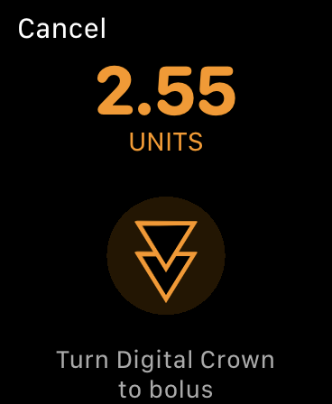
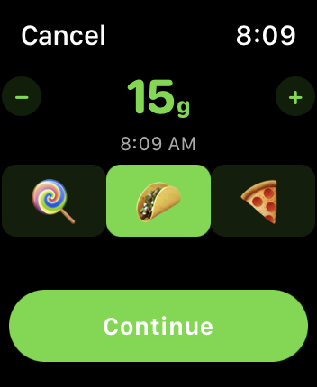
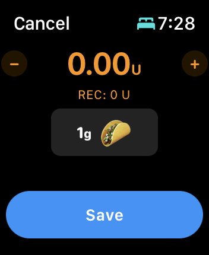

## Loop with Apple Watch

The Loop user can directly enter carbs and boluses and turn on or off premeal or override settings from the watch, without needing to pull their iPhone out. There are some caveats when iPhone is not within Bluetooth range - the action requested by the watch will not be enacted until iPhone reconnects.

{width="300"}
{align="center"}

There are two screens in the Loop watch app, shown in the bottom half of the graphic above. By swiping left or right, the other screen is displayed. The eventual (predicted) glucose feature, shown on both screens in the graphic can be turned off as a feature in Loop 3, but requires the user to rebuild. It is on by default.

The screen on the left side of the graphic shows Loop status, current glucose, trend arrow and eventual glucose with icons to enable carb entry, bolus entry, pre-meal and override selection. If necessary, use the crown (or swipe up and down) to see the full display.

### Watch Carb / Bolus Overview

After tapping on the carb or bolus icons, you can adjust the entries using the crown to dial in more/less. See [Meal Entry on Watch](#meal-entry-on-watch) for more details.

* The watch carb entry screen allows you to choose the amount and absorption time, using the standard icons, and adjust the time the carbs were or are planned to be consumed. After tapping continue on the carb screen, the meal bolus screen is displayed - carbs are only saved after selecting Save or Save & Bolus on the meal bolus screen.
* The watch bolus screen displays the recommended bolus. If you want to decrease/increase from the recommended amount, use the digital crown or tap on +/- icons to modify.
* Once the bolus button is tapped, the bolus command is only delivered after using the digital crown to [Spin for Watch Bolus](#spin-for-watch-bolus) to align the two triangles.
* If you tap Save & Bolus on the bolus screen when entered from the carb screen AND then fail to turn the digital crown to confirm the bolus or hit Cancel, that means the bolus was not delivered and the carbs might not saved - but check to be sure.

### Watch Graph and Status

If you swipe the Apple Watch Loop screen from right-to-left, a second screen, as displayed on the right side of the graphic above, is available.  This second screen displays a graph of recent glucose and predicted glucose data.  The display can be scrolled with a finger swipe or turn of the crown to display Active Insulin, Active Carbs, Net Basal Rate (with respect to scheduled rate) and in some cases Reservoir Units.  (A recently changed pod may show the reservoir level from the prior pod - just ignore that. It goes away within 24 hours.)

* Check the [Recent Carbs List on Watch](#recent-carbs-list-on-watch) by tapping the Active Carbs row:
    * If a desired carb entry added by the watch is not present on the watch display, you are safe to try again
    * If the carb entry is present on the watch display, do **not** enter it again
    * If your phone is not in range of your watch, carbs entered on the watch will be added to the phone carb storage when you reconnect

### Watch Graph Windows

The windows for history and prediction available on the watch can be modified to suit your preference. The windows can be modified from 2 hours to 12 hours.

* Double tap on the graph to increase the windows
* Single tap on the graph to decrease the windows

The selection for the window remains as selected until you change it.

### Loop Complication

A loop complication exists to show glucose on the watch face but the update rate is limited by Apple. If you have a Loop complication installed in the watch face, you can simply tap the complication to open the Loop watch app.

In some positions and with some watch faces, the complication includes a graph.

* The windows for the Loop Complication history and prediction are fixed (not modified when you change the [Watch Graph Windows](#watch-graph-windows))

## Loop Watch Features

### Spin for Watch Bolus

To prevent an accidental bolus from your Watch app, don't let your kids hold your watch. Just kidding, we've added an even better solution. After requesting a bolus or accepting a meal entry recommended bolus, the watch face displays a graphic like the one below. As you spin the digital crown, the two triangles will begin to merge. Once they merge, the bolus is confirmed through a little haptic and a white checkmark will appear on the watch screen.

{width="200"}
{align="center"}

### Bolus Cancel or Spin Fail

At this point if you hit cancel, or fail to merge the two triangles, the bolus will not be delivered. You will feel a haptic and may hear a notification when Loop stops waiting. The watch display restores to the nominal screen.

### Meal Entry on Watch

Tap on the Meal entry icon on the watch to view the watch carb entry screen as show in the graphic below.

{width="200"}
{align="center"}

The watch carb entry screen allows you to choose the amount and absorption time, using the standard icons, and adjust the time the carbs were or are planned to be consumed.

* While the Amount is highlighted, the + and - buttons add or subtract 5 g of carbs from the amount, or you can use the digital crown to adjust the amount
* Tap on the time and the + and - buttons add or subtract 15 minutes from the time when the meal was or will be consumed, or you can use the digital crown to adjust the time
* The default absorption time is 3 hours (taco), but the fast (30 minute, lollipop) or slow (5 hour, pizza) can be selected

After tapping the Continue button on the carb screen, the meal bolus screen is displayed - carbs are only saved after selecting Save or Save & Bolus on the meal bolus screen.

#### Carb Entry, No Bolus

If you enter carbs from the watch and no bolus is recommended or selected, you will see a screen like the graphic below where the Save button is offered. You can choose to Save the carbs, or cancel the entry.

If you choose to modify the zero bolus recommendation, the display changes to the option shown in the graphic in the following section.

{width="200"}
{align="center"}

If your phone is in communication with your watch, then when you hit the Save button, the carbs will be immediately saved to your phone record as well as your watch.

If your phone is not in range of your watch, then when they are brought into communication later, the carbs will appear on the phone.

#### Carb Entry, With Bolus

If you enter carbs from the watch and a bolus is recommended or selected, you will see a screen like the graphic below where the Save & Bolus button is offered.

{width="200"}
{align="center"}

You may choose to leave that bolus at the recommended level, tap on the + or - buttons to add or subtract 0.5 U per tap or use the digital crown to adjust the value. Should the value go to zero, then the Save button appears as shown in the graphic in the previous section; but remember, Loop will begin adjusting automatic insulin delivery based on those newly entered carbs, even if you choose not to bolus.

* If your phone is in communication with your watch
    * When you hit the Save & Bolus button, the carbs will be immediately saved to your phone record as well as your watch
    * Your pump will be commanded to deliver the indicated dose (from your phone)
        * If the pump communication succeeds, the delivery begins
        * If the pump communication fails, the bolus not delivered message will apear on the phone
        * You might want to have confirmation beeps enabled so you can hear if the pump bolus starts

* If your phone is not in range of your watch
    * The carbs are saved in the watch carb storage
    * When the watch reconnects with the phone, the carbs are added to the phone carb storage
    * The bolus not delivered message will appear on the phone

### Recent Carbs List on Watch

You can review the recent carb entries on the Apple Watch. Simply swipe left to see the blood glucose graph screen on the watch. Scroll down with your finger or the digital crown to the Active Carbs row beneath the graph, and tap that row. You can see the list of recent carb entries.

If you enter carbs on your watch while not connected to the phone, they will appear on this display and, when the phone reconnects, will be transferred to the phone.

!!! warning "Be Cautious - Avoid Double Entry"
    If the phone and watch are **not** connected, someone could add entries to the phone manually or via remote commanding and the watch will not know about them. So be careful and check the phone carb record when the phone and watch reconnect. This is especially important if more than one caregiver is involved.

### Eventual Glucose on Watch

One feature on the Watch app that can be turned on and off with Loop 3 is the eventual glucose display on the watch. That display is shown on the graphic above with current glucose on left, trend arrow beside it and eventual (from prediction) glucose on the right.

If this is a feature you want turned off, please follow the directions on the Code Customization page (found under the Version tab): [Build Time Features](../../build/code_customization.md#build-time-features).

## Adding a Watch to Existing Loop

If you add an Apple Watch after building Loop using Xcode on a computer, you will need to pair your watch to your iPhone and then rebuild Loop to enable the Loop watch app to show up as an available watch app.

If you use the new, Loop 3 only, [Build Loop using GitHub Actions](../../gh-actions/gh-overview.md) process that enables building without needing a Mac, the watch app should work so long as you have the watch paired to your phone when you install from TestFlight.

## Watch Hardware and OS Requirements

Loop 2.2.9 and FreeAPS is currently supported with all released versions of the Apple Watch and Apple watchOS 4.1 and newer.

Loop 3 requires newer versions of the watch and requires watchOS 8 as a minimum.

The compatibility list below is copied from Apple.

### watchOS 8 Compatibility:

watchOS 8 requires iPhone 6s or later with iOS 15 or later and one of the following Apple Watch models:

* Apple Watch Series 3.
* Apple Watch Series 4.
* Apple Watch Series 5.
* Apple Watch SE.
* Apple Watch Series 6.
* Apple Watch Series 7.
* Not all features are available on all devices.

### watchOS 9 Compatibility:

watchOS 9 requires iPhone 8 or later with iOS 16 or later and one of the following Apple Watch models:

* Apple Watch Series 5.
* Apple Watch SE.
* Apple Watch Series 6.
* Apple Watch Series 7.
* Apple Watch Series 8.
* Apple Watch Ultra.
