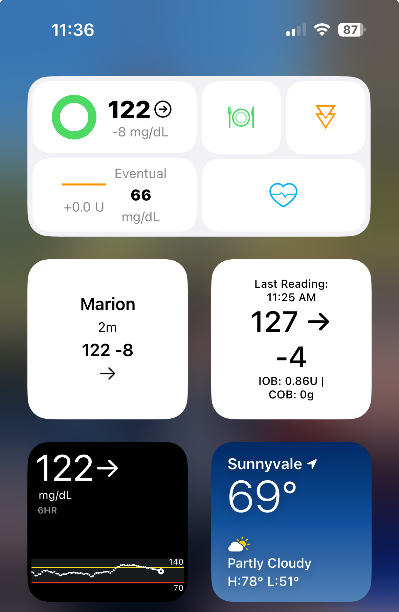

## Widgets

The *Loop* app uses the new-style widgets. With the advent of iOS 16 and 17, you can add widgets that show up on the lock screen without need to swipe to view. But only some widgets can do this and there is very limited space for those lock screen widgets. You can add more widgets to the Today View, where you do need to swipe right from the Home View or Lock Screen.

> The released code, `main` branch, version 3.2.x does not work with these widgets. The fix is in the `dev` branch and will be part of the version 3.4 release.

The example graphic below shows the *Loop* widget using the `dev` branch on the top row, with the *LoopCaregiver* widget next to a [Scriptable widget](https://niepi.org/2020/10/25/ios-14-nightscout-widget/){: target="_blank" } that is fed from my Nightscout site on the middle row. Below that is the Dexcom G7 widget next to a weather widget. This Today View requires a swipe right from the Lock Screen or the Home screen. The scriptable widget is also on my lock screen. The update rate for these widgets is similar to watch complications, some will grey out when stale. If they are greyed out, tap on them to go to the app directly.

The Scriptable widget includes the time of the last update, 11:25 am, so is 11 minutes old at the current time of 11:36 am.

{width="300"}
{align="center"}

!!! info "New to Loop or never added a widget before"

    * There is a difference in behavior between "new-style" Widgets and "old-style" Widgets
        * New-Style Widgets: always appear at the top of your Today View, can be changed by long-pressing on one and then dragging around, or can be added with the &plus; button in edit mode
        * Old-Style Widgets used a different method to install and should be removed from your screen
    * Make sure your phone is unlocked, then swipe from the Home Screen to get to Today View
        * You can't edit the screen if you start from a locked phone
    * Start the Edit mode (where all of the icons are shaking), either by long-pressing on one of the new-style widgets, or by scrolling all the way to the bottom of Today View and pressing Edit.
    * Scroll all the way to the bottom again to find and select the button labeled "Customize"
    * Now you can configure (add, remove, rearrange) the "old-style" widgets for your screen.
    * The Loop widget should appear in the list available there.

## Old-Style Loop Widget

Leave this here so you can see if you have an old-style widget.

With newer versions of iOS, the old-style widgets cannot be moved to the top of the screen. Please convert to the new-style widgets.

With older versions of iOS, the widget is available in the Today view of your iPhone.  Swipe right on your iPhone home screen and your widgets will be available.  The Loop widget may be at the bottom of your widget list.  Scroll down to the bottom of the screen and press the `edit` button.  That opens an "Add Widgets" screen.  If you hold and drag the three horizontal lines on the Loop widget row, you can drag it up to the order you'd like it to appear on your widget list.

{width="600"}
{align="center"}

{width="300"}
{align="center"}
