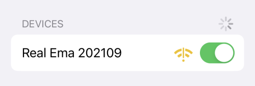
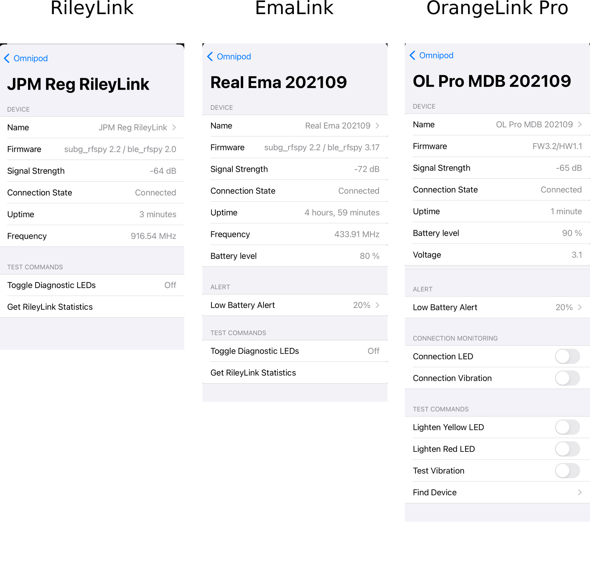

## RileyLink

The RileyLink (or compatible device) screen is accessed by clicking on the image of your connected pump in Loop settings or the pump icon in the Heads Up Display to bring up the associated pump screen. From that screen, scroll down to the section labeled `DEVICES` to view the list of connected RileyLink compatible device(s) and tap on the name with a green slider that you want to display. An example is shown in the graphic below.

{width="300"}
{align="center"}

## Signal Loss

If there is a problem communicating with that RileyLink compatible device, tapping on the line will show out-of-date or missing information. Go to [Troubleshoot: Red Loop: Reset Loop-to-Pump Communications](../../troubleshooting/red-loop.md#reset-loop-to-pump-communications) for suggestions.

With Loop 3

* The Pump Devices display will show the signal loss icon instead of reporting dB as shown in the graphic below. 
* If the problem persists, the [Pump Status Icon](../../loop-3/displays-v3.md#pump-status-icon) on the main *Loop* screen will also show Signal Loss.

{width="300"}
{align="center"}

## RileyLink Status and Commands

Tapping on a name with a green slider takes you to the RileyLink Status and Commands screen for that device.

The name at the top center is whatever you [named your RileyLink compatible device](#personalize-device). The RileyLink screen is the same regardless of the pump you are using.

* The three graphics below match the display for Loop 3. 
* For Loop 2.2.x - the displays are almost identical when the patch mentioned below the graphic is applied.
* The [firmware](../../faqs/rileylink-faqs.md#firmware-version) displayed is specific to each device. 

{width="600"}
{align="center"}

!!! warning "Patch Required for Loop 2.2.x"

    Some devices have features not available with other devices.  With Loop 2.2.6 some features were added to the OrangeLink, but there is a mismatch of reported hardware for some versions of OrangeLink firmware which prevents the Find Device row from showing up for OL Pro. The EmaLink extra features did not make it into the Loop v2.2.6 release.

    * With Loop 2.2.x, to see the displays shown in the graphics below, please follow instructions in the [EmaLink and OrangeLink Feature and Patch sections](../../faqs/rileylink-faqs.md#emalink-and-orangelink-features).

## Device

The lines under the Device section provide information on the device. The two most important lines are the Connection Status and Signal Strength.

* The Connections Status should say `connected` if the device is connected to the iPhone's Bluetooth. If the status says `connecting` or `disconnected` then you should toggle the iPhone's BT and/or power cycle the device to help reconnect.

* The Signal Strength is the strength of the Bluetooth signal between the iPhone and the device.  It is **not** the signal strength of the radio communications with the pump/pod.  

* The phone to device Signal Strenth is reported as a negative number so a -50&nbsp;dB signal is stronger than -80&nbsp;dB. As you move the device and iPhone closer/farther apart, you will be able to see the signal strength change. In a pinch, this can be used to help locate a lost device in the house or at the park after dark.

{width="350"}
{align="center"}

## Personalize Device

As soon as you connect the RileyLink compatible device initially - it is strongly encouraged that you rename it from the default name for that device, e.g., RileyLink or OrangeLink or EmaLink.

Once you display the [RileyLink Status and Commands](#rileylink-status-and-commands) screen:

* Tap on the Name line
* Enter your desired name
* Wait a few seconds before doing anything
    * The new name needs to be transferred and saved in the device
    * If you return to the Pump screen too soon, it might not happen - just repeat the process
    * The device must be connected and on to change its name
