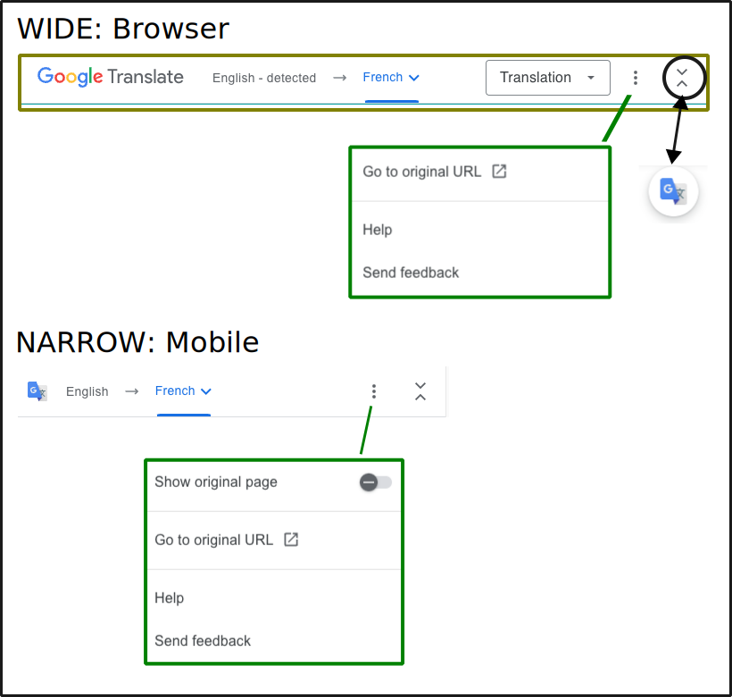

## Language List

[عربي](https://loopkit-github-io.translate.goog/loopdocs/?_x_tr_sl=auto&_x_tr_tl=ar)

[Български](https://loopkit-github-io.translate.goog/loopdocs/?_x_tr_sl=auto&_x_tr_tl=bg)

[Čeština](https://loopkit-github-io.translate.goog/loopdocs/?_x_tr_sl=auto&_x_tr_tl=cs)

[Deutsch](https://loopkit-github-io.translate.goog/loopdocs/?_x_tr_sl=auto&_x_tr_tl=de)

[Dansk](https://loopkit-github-io.translate.goog/loopdocs/?_x_tr_sl=auto&_x_tr_tl=da)

[Ελληνικά](https://loopkit-github-io.translate.goog/loopdocs/?_x_tr_sl=auto&_x_tr_tl=el)

[Español](https://loopkit-github-io.translate.goog/loopdocs/?_x_tr_sl=auto&_x_tr_tl=es)

[日本](https://loopkit-github-io.translate.goog/loopdocs/?_x_tr_sl=auto&_x_tr_tl=ja)

[Suomi](https://loopkit-github-io.translate.goog/loopdocs/?_x_tr_sl=auto&_x_tr_tl=fi)

[Français](https://loopkit-github-io.translate.goog/loopdocs/?_x_tr_sl=auto&_x_tr_tl=fr)

[עברית](https://loopkit-github-io.translate.goog/loopdocs/?_x_tr_sl=auto&_x_tr_tl=iw)

[Hrvatski](https://loopkit-github-io.translate.goog/loopdocs/?_x_tr_sl=auto&_x_tr_tl=hr)

[हिंदी](https://loopkit-github-io.translate.goog/loopdocs/?_x_tr_sl=auto&_x_tr_tl=hi)

[Italiano](https://loopkit-github-io.translate.goog/loopdocs/?_x_tr_sl=auto&_x_tr_tl=it)

[한국어](https://loopkit-github-io.translate.goog/loopdocs/?_x_tr_sl=auto&_x_tr_tl=ko)

[Norsk](https://loopkit-github-io.translate.goog/loopdocs/?_x_tr_sl=auto&_x_tr_tl=no)

[Nederlands](https://loopkit-github-io.translate.goog/loopdocs/?_x_tr_sl=auto&_x_tr_tl=nl)

[Polski](https://loopkit-github-io.translate.goog/loopdocs/?_x_tr_sl=auto&_x_tr_tl=pl)

[Português](https://loopkit-github-io.translate.goog/loopdocs/?_x_tr_sl=auto&_x_tr_tl=pt)

[Română](https://loopkit-github-io.translate.goog/loopdocs/?_x_tr_sl=auto&_x_tr_tl=ro)

[Русский](https://loopkit-github-io.translate.goog/loopdocs/?_x_tr_sl=auto&_x_tr_tl=ru)

[Slovenčina](https://loopkit-github-io.translate.goog/loopdocs/?_x_tr_sl=auto&_x_tr_tl=sk)

[Svenska](https://loopkit-github-io.translate.goog/loopdocs/?_x_tr_sl=auto&_x_tr_tl=sv)

[Turkish](https://loopkit-github-io.translate.goog/loopdocs/?_x_tr_sl=auto&_x_tr_tl=tr)

中文（[简体](https://loopkit-github-io.translate.goog/loopdocs/?_x_tr_sl=auto&_x_tr_tl=zh-CN))

中文（[繁體](https://loopkit-github-io.translate.goog/loopdocs/?_x_tr_sl=auto&_x_tr_tl=zh-TW))

## Google Translate Links

Click on a language on the list of links above to turn on Google's automatic translation.

## Change Language

To modify the language choice for the whole site, copy the line below and paste it into the URL and then choose the desired language from the list above

``` { .bash .copy title="Copy and Paste in Browser URL to return to original version" }
https://loopkit.github.io/loopdocs/translate
```

OR

Use the Google Translation three-dot menu and select `Go to Original URL` while on the Translation page.

## More Information

* Every website page gets automatically translated to the selected language as do links to other websites

* The Google Translate Tool will appear at the top of each page
    * LoopDocs how-to: [Google Translate Tool Instructions](#google-translate-tool-instructions)
    * Google how-to: [Google Translate Help Link](https://support.google.com/translate/answer/2534559?hl=en&co=GENIE.Platform%3DDesktop)

!!! danger "Automatic Translation"
    These links connect this site to the Google Translation service.

    * No human has reviewed the translated information for accuracy
    * Please use the translation with care
    * Not available in all regions
    * Some links may not work as expected
    * Any "code" not protected by blocks may not appear correctly - be sure to click on Original to make sure you a viewing code properly

## Google Translate Tool Instructions

Once Google Translate has been turned on, clicking on a language link above shows a "Google Translate: Can't translate this page error".

* To modify the language for a single page, use the Google Translate tool
* To modify the language for the entire site, see [Change Language](#change-language)

The graphic below shows the Google Translate Tool when maximized (default) for a browser and mobile display. The tool can be minimized by tapping on the up/down carets at the right of the tool. This is very useful if the tool obstructs part of the original screen. Additional options can be selected with the three-dot menu as shown in the graphic.

{width="600"}
{align="center"}
