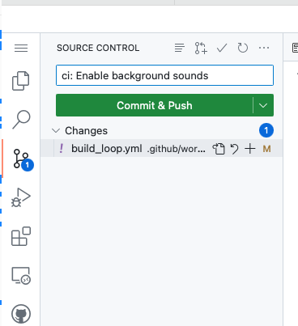
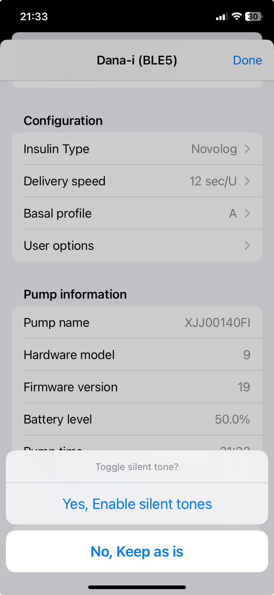
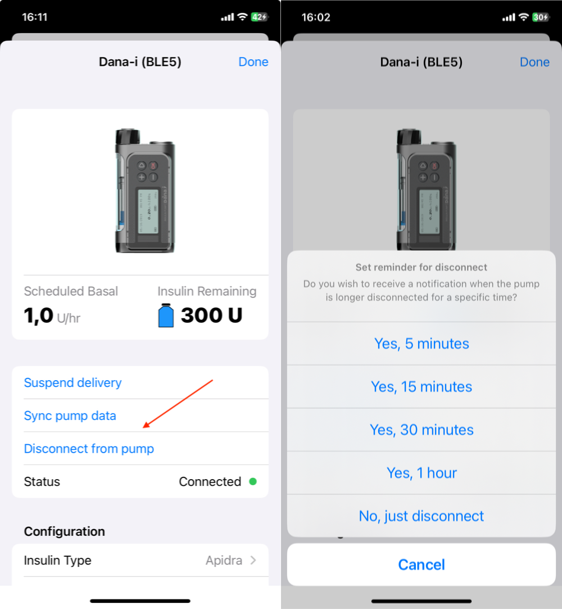
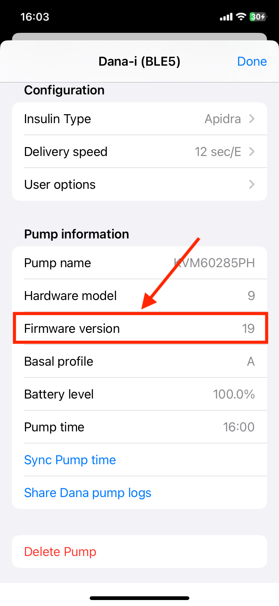

## Dana(RS-v3 / -i) heartbeat modes

!!! warning "Please read the full page and only activate this if truly needed"
    Enabling this feature will put a big load on your iPhone's battery or your pump's battery.
    Therefore, only use it if your sensor doesn't provide a heartbeat, i.e. the NightScout remote CGM, Dexcom Share, etc

Danakit provides two ways to enable a heartbeat:

- Background sound
- Continuous Bluetooth mode

### Which mode to choose?

You should choose *Background sound* when:

- You prefer a higher phone battery drain over a higher pump battery drain
- You are able to change the permission of the *Loop* app in Xcode or change the Github action build step

You should choose *Continuous Bluetooth mode* when:

- You prefer a higher pump battery drain over a higher phone battery drain
- You are aware that the pump's UI will be blocked 24/7 unless you: disconnect in the *Loop* app, kill the *Loop* app, or disable bluetooth on your phone

## Background sound

An extra feature available for the Dana pumps is the background sound.
This feature was developed in order to keep the *Loop* app running in the background.

Normally, your CGM will have an active Bluetooth connection, which prevent the *Loop* app from being put into a suspended state.
But when you are planning on using a CGM, like [NightScout remote CGM](../loop-3/add-cgm.md#nightscout-remote-cgm), [Dexcom Share](../loop-3/add-cgm.md#dexcom-share-as-a-cgm), etc, you rely on a active internet connection, and not on an active Bluetooth connection.

In order to activate, follow these steps:

1. Activate the [UIBackgroundMode - audio](https://developer.apple.com/documentation/bundleresources/information_property_list/uibackgroundmodes):
    * When [building with Mac](../build/overview.md), go to the LoopWorkspace Xcode project and select the Loop project.
    Go to "Targets" -> "Loop" -> "Signing & Capabilities" and scroll down to "Background modes".
    Enable the checkbox for "Audio, AirPlay, and Picture in Picture".
    Then rebuild the app and go to step 2.
    

    * When [building with Browser](../gh-actions/gh-overview.md), you will need to make a change to the GitHub Actions workflow.
    Go to your LoopWorkspace fork on GitHub and press `.` on your keyboard.
    You will be redirected to a `github.dev` page with the code of your LoopWorkspace.
    Now go to ".github" -> "workflows" -> "build_loop.yml".
    Scroll down till you see the `- name: Fastlane Build & Archive` command.
    Just before this command, add the following to this script ([example](https://github.com/bastiaanv/LoopWorkspace/commit/67a1e42b9b771550afc14adf914ff98c37d96e67)):

    ```
    - name: Update entitlement background sound
      run: sed -i -e 's/<string>bluetooth-central<\/string>/<string>bluetooth-central<\/string><string>audio<\/string>/g' Loop/Loop/Info.plist
    ```

    * To save your changes to the "build_loop.yml", go to the Source Control tab on the left (should show up with a blue 1, see image below).
    Enter a message and press the green "Commit & Push"-button.
    By pressing this button, GitHub will automatically make a new browser build for you and push it to TestFlight
    

2. After you have done the onboarding of the pump (see steps above), go to the pump settings.
    Scroll down the "Pump name" and long-press this row.
    A modal should pop-up with the question, whether you want to toggle Silent tones.
    
    In order to activate this feature, the modal should say something like: `Yes, Enable silent tones`.
    When it says: `Yes, Disable silent tones`, it will disable the background sounds.
    {width="250"}
    {align="center"}

3. Done!
    Every time you put the *Loop* app in the background, it will play a toneless sound, which prevents it from suspending the *Loop* app
        
## Continuous bluetooth mode

This mode replicates how a CGM works: it keeps the bluetooth connection open even though no command's are being executed.
Like stated before, this will drain your pump's battery more than usual.

### How to unblock the pump's UI
If you want to replace the reservoir or want to interact with the pump's UI, you have three options to temporary disable *Continuous bluetooth mode*:

- Disable bluetooth on your phone (not recommended)
- Kill the *Loop* app (not recommended)
- Using the disconnect feature (recommended)

To use the disconnect feature, go to the Dana pump settings and use the *Disconnect from pump* button.
You will get prompt to set a notification reminder.
This reminder will be sent to you if you haven't reconnected the pump within the given time.
This feature is fully optional, but is recommended.

{width="400"}
{align="center"}

### How to enable Continuous bluetooth mode
Now that you know what the risks are of this feature and how to unblock the pump's UI, can we talk about enabling the feature.
Go to the Dana settings and long press the Firmware version row.
You will be prompted to enable or disable the feature, choose `Yes, Switch to continuous mode` and the feature has been enabled!

{width="250"}
{align="center"}