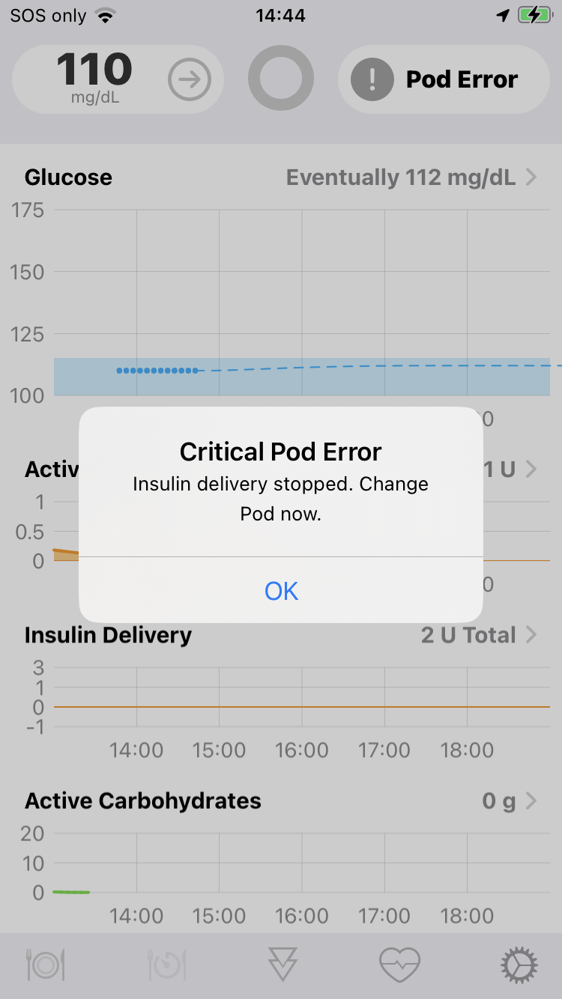

# Omnipod Faults

Pod faults are shown in the HUD:

{width="250"}
{align="center"}

Loop will put a higher battery load on a pod than the PDM due to its regular and repeated communications. A pod with lower battery level appears to be more likely to fault for conditions like static electricity and occlusions/pump issues that Loop is not directly causing, like internal fault codes 052, 061, 064 and 066. Pods always perform safety checks and if a potential problem is found, the pod will end itself by screaming and stop with the insulin delivery.

!!! note "Note"
    During extensive tests after getting all commands working properly, many failures due to one specific safety check were still encountered. This check needed to recover its counter within 30 minutes after a temp basal returning to a normal basal schedule, or else the pod would scream. Eventually, this was resolved by disabling _only_ this particular check. Therefore the 096-106 faults are always ignored in the current configuration of Loop.

## Known internal pod fault codes

The currently known pod faults are listed here on the openomni wiki page: [Pod Fault codes](https://github.com/openaps/openomni/wiki/Fault-event-codes)

## Ways to reduce the possibility of a fault

None of the ways listed here are guaranteed to reduce the possibility of a screaming pod, but they could be worth considering.

* Keep the Loop app up to date; newer versions might include improvements to reduce pod battery load
* Use a 433 Mhz RileyLink for Eros Pods
* Maintain a wider correction range (10 to 20 mg/dL; 0.5 to 1.1 mmol/L) instead of a single number

## Not "replacement pod" situations

Normal pod use will still give these two reasons for a screaming pod. These are not eligible for a replacement:

* 028, Pod expired, (HEX code: 0x1C)
* 024, Empty reservoir, (HEX code: 0x18)

In the unlikely event that Loop issues a command to the pod when the pod is not in the correct state to receive it, the pod will scream and the reported fault is:

* 049, Incorrect pod state for command, (HEX code: 0x31)
* This is not the type of fault to report to Insulet or ask for a replacement pod
* Instead, capture a [Loop Report](../loop-3/settings.md#issue-report) and report it to the developers as soon as possible

## Replacement pod situations

You can always call Insulet tech support if a pod has a clear failure on the pod, such as:

* A cannula was sticking out when the end cap was removed.
* Visual inspection of the pod's cannula window indicating the cannula insertion was not successful.
* Leaking or kinked cannula was causing insulin delivery issues.
* The adhesive was not working properly when trying to place it on your body.
* The pod begins to scream during pairing or priming or insertion

If the pod fails during use with Loop, a replacement might still be possible. The software which communicates with the pod isn't developed or supported by Insulet. Generally speaking, calling in failed pods for reasons not in the list above, on the third day of pod life, maybe a bit of a reach for the DIY community. There is a grey area here that we should be careful of and acknowledge that Looping may be a contributor in certain faults.

Insulet is aware that pods are used by the DIY community. You can be honest about your use and might recieve replacement pods. If your pod fails early, it's worth informing Insulet for their troubleshooting records even if you do not get a replacement.
