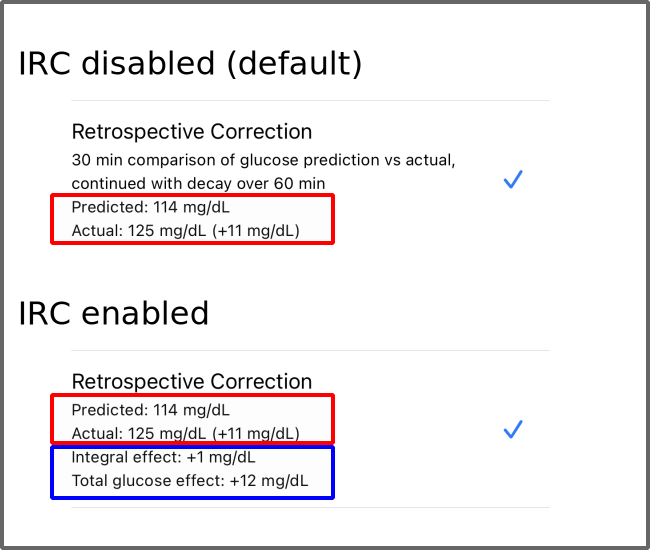
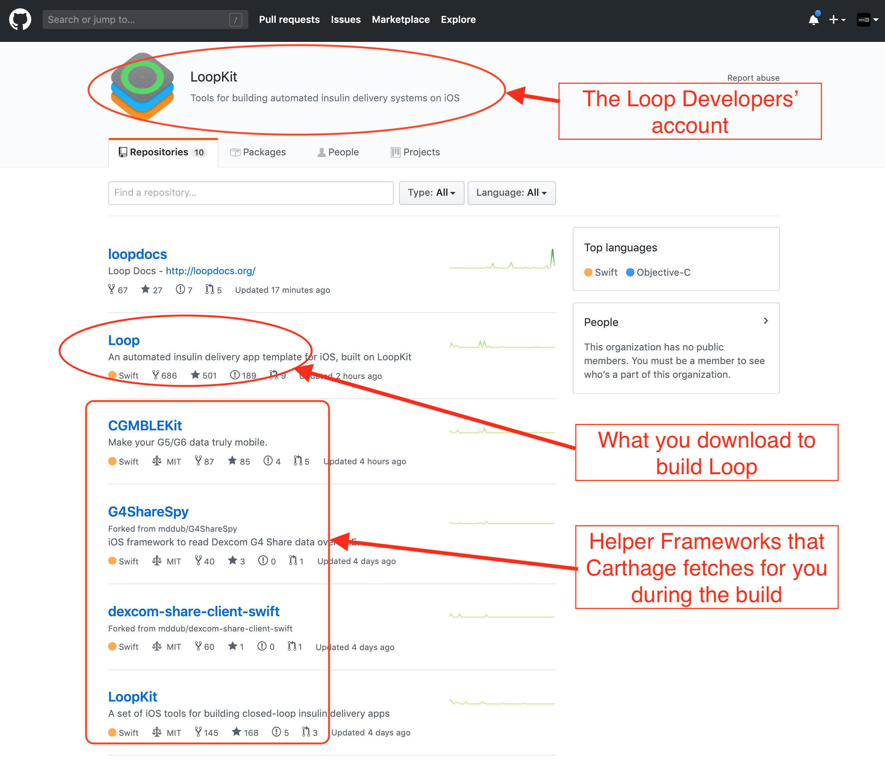
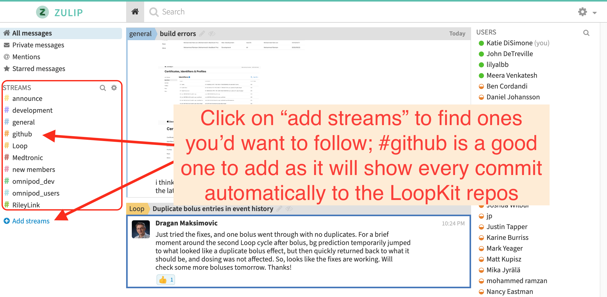
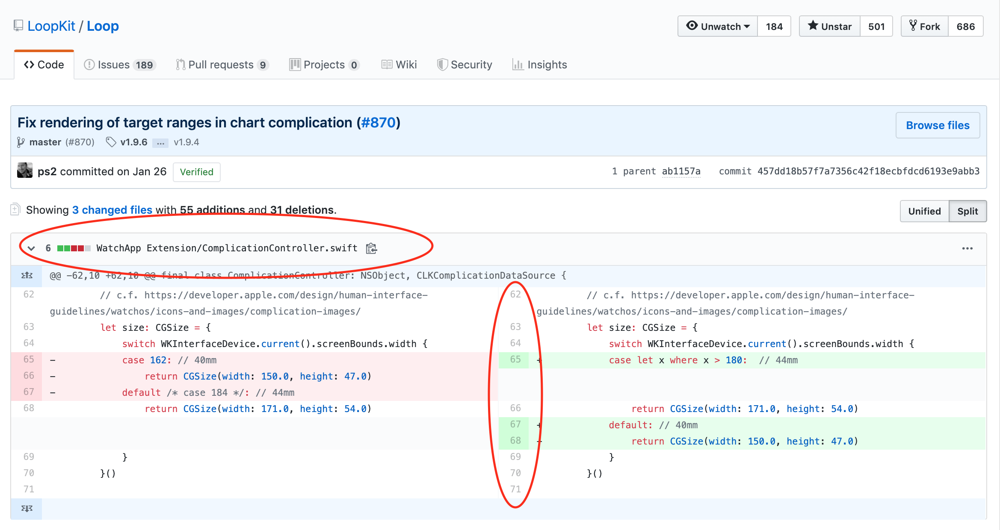
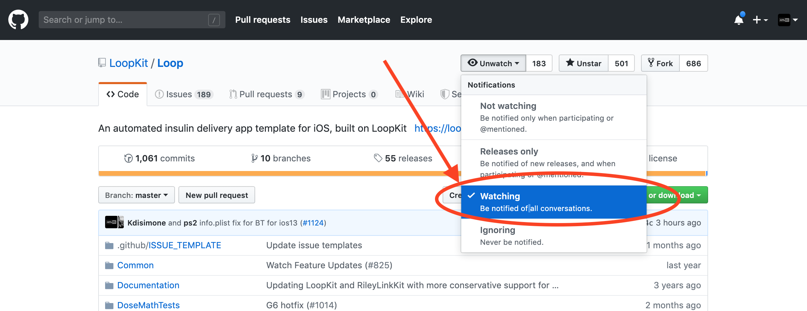

## Loop Development

The early history of Loop was touched on in the introductory [LoopDocs Overview: Development History](../intro/overview-intro.md#development-history) section.

The [Loop Releases](../version/releases.md) page lists releases since version 2.0 in reverse chronological order.

The next version of Loop is developed using branch(es), independent of the released Loop version, which is found in the main branch. The dev branch is used by the developers to push out changes for users to test. You should only test a development branch if you are willing to be both an active participant with the developers to monitor annoucements and provide feedback, and to build frequently to obtain the latest feature or bug-fix that is being tested. If you are willing to help out - this is the way the next release of Loop is improved.

If you choose to use dev, you accept that this code is not released.

Please read this entire page before using any version of Loop other than the released code.

## Updates in dev

This section is an early look at what has been added to dev since Loop 3.2.2 was released and will probably be in the next release. After the release, some of the content and graphics in this section will move to the [Releases](releases.md) page or the appropriate documentation section.

* [Support for Libre Sensors](#support-for-libre-sensors)
* [Modified Simulator Interface](#modified-simulator-interface)
* [Algorithm Experiments](#algorithm-experiments)
    * [Glucose Based Partial Application&nbsp; Factor](#glucose-based-partial-application-gbpa)
    * [Integral Retrospective Correction](#integral-retrospective-correction-irc)
* [Favorite Foods](#favorite-foods)
* [TestFlight Expiration Warning](#testflight-expiration-warning)
* [GitHub Browser Build&nbsp; Updates](#github-browser-build-updates)
* [Miscellaneous Code Fixes](#miscellaneous-code-fixes)

### Support for Libre Sensors

[LibreTransmitter](https://github.com/dabear/LibreTransmitter#libretransmitter-for-loop) support was merged into dev in July 2023.

If you are using the &nbsp;GitHub Browser Build, please review: 

* [Browser Build: One-Time Changes](../gh-actions/gh-update.md#one-time-changes): New steps and dates at which the new steps were added

### Modified Simulator Interface

The simulators for the Pump and CGM for dev show a new format when first selected. The initial view is a demonstration screen showing a typical CGM or Pump display. In order to view behind the scenes, to modify settings and to delete the simulator, you must press and hold (long-press) on the top of the display. Any where in the top third works for the long-press, but I like to touch the card as shown in the pump example below. If you've counted to 10 and the display has not updated yet, then return to main Loop screen, return to simulator screen and try again.

{width="500"}
{align="center"}

### Algorithm Experiments

Two algorithm experiments have been added to dev. These are &nbsp;Glucose Based Partial Application&nbsp; and &nbsp;Integral Retrospective Correction. They can be viewed on the Loop Settings screen just below Therapy Settings and Usage Data Sharing as shown in the graphic below:

{width="650"}
{align="center"}

### Glucose Based Partial Application&nbsp; (<code>GBPA</code>):

* Originally proposed as [Loop PR 1988](https://github.com/LoopKit/Loop/pull/1988)
* It is only used when <code>Automatic Bolus</code> (AB) is selected for <code>Dosing Strategy</code>
* This modification **does not affect the recommended dose**, only how quickly the recommended dose is automatically delivered

When AB is selected and <code>GBPA</code> is enabled, the percentage of the recommended dose delivered per Loop cycle ranges from 20% to 80% based on glucose level and user selected correction range. (Without <code>GBPA</code> enabled, AB uses a fixed 40% percentage regardless of glucose level.)

* Partial Application = 20% when glucose is at or below the users correction range lower value (including overrides) plus 10 mg/dL (0.6 mmol/L)
* Partial Application increases linearly from 20% to 80% up to a glucose level of 200 mg/dL (11.1 mmol/L)
* Partial Application is 80% when glucose level is above 200 mg/dL (11.1 mmol/L)

#### Insulin Delivery Using <code>GBPA</code>

Loop makes a prediction and recommends an insulin dose based on your settings and your glucose, insulin and carb history. The selected <code>Dosing Strategy</code> (<code>Automatic Bolus</code> with or without <code>GBPA</code> or <code>Temp Basal Only</code>) only changes how quickly that recommended dose is delivered.

This example assumes Loop recommends 1 U (at time 0) and future glucose values match Loop's prediction for each successive 5-minute update. In other words, over half an hour, Loop provides about 1 U of insulin above that delivered by the scheduled basal rate.

The tables below show Automatic Bolus patterns, using a pump minimum bolus increment of 0.05 U, for several application factors. When using <code>GBPA</code>, the application factor can vary with glucose, but that is ignored for this **simplified example**.

The first table shows the bolus delivered each Loop cycle for several application factors. Higher application factors start with higher boluses, but go to zero (indicated by a dash) more quickly.

_Incremental Dose for several application factors when initial recommendation is 1 U_

| Minutes | 20% | 40% | 60% | 80% |
|--:|--:|--:|--:|--:|
|0|0.20|0.40|0.60|0.80|
|5|0.15|0.25|0.25|0.15|
|10|0.15|0.15|0.10|0.05|
|15|0.10|0.10|0.05|  - |
|20|0.10|0.05|  - |  - |
|25|0.05|  - |  - |  - |
|30|0.05|  - |  - |  - |

The second table shows the cumulative delivery. A dash shows recommended dose was delivered. Remember, **this is a simplified example**.

_Cumulative Dose for several application factors when initial recommendation is 1 U_

| Minutes | 20% | 40% | 60% | 80% |
|--:|--:|--:|--:|--:|
|0|0.20|0.40|0.60|0.80|
|5|0.35|0.65|0.85|0.95|
|10|0.50|0.80|0.95|1.00|
|15|0.60|0.90|1.00|  - |
|20|0.70|0.95|  - |  - |
|25|0.75|0.95|  - |  - |
|30|0.80|0.95|  - |  - |

The 20% and 40% application factor columns did not reach 1 U in 30 minutes because the requested dose is smaller than this pump will deliver. The 60% application factor only reached 1 U because tiny doses down to 0.03 U were rounded up to 0.05 U.

The <code>Temp Basal Only</code> <code>Dosing Strategy</code> provides about 17% of the recommended bolus each 5-minute interval. The minimum <code>GBPA</code> application factor of 20% was selected to be similar to that rate for lower glucose values. Initially, an application factor of 20% delivers insulin more quickly than <code>Temp Basal Only</code>, but by the end of 30 minutes, the basal program inside the pump keeps track of how much is delivered to reach the **rate** requested, achieving the full 1 U (**for this example**).

### Integral Retrospective Correction&nbsp; (<code>IRC</code>):

* Originally proposed in [Loop Issue 695](https://github.com/LoopKit/Loop/issues/695)
    * This was tested in a few forks but not included into dev until recently
    * Initial merge into dev: [Loop PR 2008](https://github.com/LoopKit/Loop/pull/2008)
* Updated with a modification to limit stacking of <code>IRC</code> with Glucose Momentum: [Loop PR 2028](https://github.com/LoopKit/Loop/pull/2028)
* Integral Retrospective Correction, when enabled:
    * changes the Loop prediction model and thus can affect the recommended dose
    * applies to both Dosing Strategies: <code>Temp Basal</code> or Automatic Bolus

Refering to the [Algorithm: Prediction](../operation/algorithm/prediction.md) page:

* When <code>IRC</code> is disabled (default), the equation used to predict glucose continues to be:

$$ BG[t] = Insulin[t] + Carb[t] + RetrospectiveCorrection[t] + Momentum[t] $$

* When <code>IRC</code> is enabled that equation changes to:

$$ BG[t] = Insulin[t] + Carb[t] + IntegralRetrospectiveCorrection[t] + Momentum[t] $$

Note that the Momemtum term does not just add to the other effects; it is actually more complicated (and also more challenging to describe in simple math terms).

The Retrospective Correction section of the [Predicted Glucose Chart](../loop-3/displays-v3.md#predicted-glucose-chart) is updated when <code>IRC</code> is enabled, as shown in the graphic below. The `Integral effect`, inside lower blue rectangle, is the difference between the <code>IRC</code> and <code>RC</code> calculations.

{width="400"}
{align="center"}

The <code>IRC</code> term is described in this (updated) [comment](https://github.com/LoopKit/Loop/issues/695#issue-310265141) including plots and equations. Some of the information in that comment is repeated below: [Important points about <code>IRC</code>](#important-points-about-irc).

If you want to look at the code, the version (as of 14-Aug-2023) is found in LoopKit/LoopKit:

* RetrospectiveCorrection code: [StandardRetrospectiveCorrection.swift](https://github.com/LoopKit/LoopKit/blob/675655b833bcd5aef2391c47562b57a213bfffb4/LoopKit/RetrospectiveCorrection/StandardRetrospectiveCorrection.swift)
* IntegralRetrospectiveCorrection code: [IntegralRetrospectiveCorrection.swift](https://github.com/LoopKit/LoopKit/blob/675655b833bcd5aef2391c47562b57a213bfffb4/LoopKit/RetrospectiveCorrection/IntegralRetrospectiveCorrection.swift)

#### Important points about <code>IRC</code>:

1. Known risk factors compared to standard Loop: 
    * With <code>IRC</code> turned on, Loop will likely increase insulin corrections in response to persistent discrepancies between observed and predicted glucose motion, which may increase the risks of hypoglycemia
    * <code>IRC</code> may also lead to increased oscillations ("roller-coaster") in glucose responses
    * Both of these risk factors are higher if the user's setting value for Insulin Sensitivity (ISF) is too low
    * Increasing ISF setting value tends to mitigate these risks but it is impossible to offer any guarantees for anything around T1D

2. Compared to standard <code>RC</code>, <code>IRC</code> is more likely to improve glucose control in the following scenarios:
    * Glucose remaining high or decreasing slower than expected due to temporarily reduced insulin sensitivity or due to poor site absorption
    * Glucose trending low faster than expected due to temporarily higher insulin sensitivity
    * Glucose spikes due to unannounced meals
    * Glucose remaining high (or trending low) on tail ends of meals where carbs entered were underestimated (or overestimated)
    * Glucose remaining elevated due to unannounced protein+fat effects
    * Glucose staying above (or below) the correction range due to too low (or too high) basal rate settings

3. In some scenarios <code>IRC</code> does not differ from standard Loop <code>RC</code>

    * Regardless of the current glucose level, neither <code>RC</code> nor <code>IRC</code> is adding to the glucose forecast during the times when the absorption rate of announced carbs is greater than the minimum absorption rate.
    * Neither <code>RC</code> nor <code>IRC</code> effects depend on glucose level; both depend on discrepancies between predicted and actual glucose responses.

4. Please do not expect immediate or very substantial improvements in blood glucose control. A one-time success after turning <code>IRC</code> on does not really mean that <code>IRC</code> "works" - this could just as well be a temporal coincidence. Some ways to decide if <code>IRC</code> could be safe and effective for you include:
    * Responses to unannounced meals - spikes should in general be somewhat lower than with standard Loop, but there should also be no follow-up lows
    * Nighttime responses over a few weeks - highs or lows should be less frequent compared to standard Loop; at the wake-up time blood glucose should in general be closer to the correction range.

### Favorite Foods

This feature allows you to save Favorite Foods.

A new row on the *Loop* app Settings screen, see graphic below, provides access to create and edit your &nbsp;Favorite Foods.

{width="300"}
{align="center"}

In the example meal entry shown below:

1. The Favorite Food row (at the bottom) is tapped
1. The desired Favorite Food is selected

At this point the meal can be saved by tapping the Continue button, or the user can modify the time (typical) or any other of the carb entry rows before tapping Continue.

{width="500"}
{align="center"}

### *TestFlight*  Expiration Warning

The *Loop* app has been updated to detect whether the build was uploaded through  *TestFlight*, which implies a 90-day limit until the app expires.

The usual &nbsp;[*Loop* expiration notification system](../operation/features/notifications.md#loop-app-expiration-notification) alerts the user when within 20 days of expiration. In addition to that modal alert, the user can examine the bottom of the Settings screen at any time to see the expected expiration date and time.

{width="300"}
{align="center"}

### GitHub Browser Build&nbsp; Updates

The dev branch has several updates merged that make it easier to find errors in configuration and that make the &nbsp;GitHub Browser Build&nbsp; automatic.

Note that the automatic build feature is opt-out. In other words, unless you take specific steps, the &nbsp;GitHub Browser Build&nbsp; for *Loop* will:

* Automatically build a new version once a month, with automatic update included
* Automatically update your fork of LoopWorkspace once a week if updates are available

It is strongly recommended that all users of the released code (main branch), maintain this automatic schedule so they are never without a valid and up-to-date *Loop* in their  *TestFlight*  app.

For users of the dev branch, it is not uncommon to disable the automatic update portion so they can choose when to update their development version, but should probably keep the monthly build portion of the process.

* [Configure GH_PAT](https://github.com/LoopKit/LoopWorkspace/blob/dev/fastlane/testflight.md#gh_pat-workflow-permission)
* [Modify Scheduled Building and Synchronization](https://github.com/LoopKit/LoopWorkspace/blob/dev/fastlane/testflight.md#modify-scheduled-building-and-synchronization)

In addition to the easier to read error messages found with these updates, these additional simplification include:

* Actions are broken into logical components, each of which provides an easy to understand error message if it fails which includes a suggested fix
* A new builder no longer needs to create the &nbsp;Match-Secrets repository
    * If it does not exist, one is created for you
    * Only the App Group ID must be added to the Identifiers; all other App services are    automatically added
* For new builders and current 3.2.2 users updating to the next release
    * The &nbsp;alive&nbsp; branch needed to enable automatic building is created automatically
    * If their GH_PAT does not have `repo, workflow` permission, a prominent message is displayed with each Action completed

These sections are still useful for version 3.3.0 dev users:

* [Browser Build for dev](../gh-actions/gh-update.md#github-build-for-dev): How to use &nbsp;GitHub Browser Build&nbsp; for dev branch
* [Browser Build: One-Time Changes](../gh-actions/gh-update.md#one-time-changes): New steps and dates at which the new steps were added

### Miscellaneous Code Fixes

#### G7 Sensors: Duplicate CGM Values

Fixed with [PR 16: Fix parsing of age field of message](https://github.com/LoopKit/G7SensorKit/pull/16)

* Most sensors report the time with very little offset between time of arrival and time of sensing
* If the time discrepancy is large, the error (using one byte instead of two for age of the reading) could cause CGM values to appear as duplicate readings in Loop

#### Remote Services Update

The code that feeds Loop data to remote services like Tidepool and Nightscout have been improved to be more robust.

## What are branches?

There is a lot of discussion about "branches" with Loop but the concept is simple. Basically, they are all slightly different versions of Loop...kind of like different edits of the same book.

To really understand what branches are, we should probably explain a little more about Loop's code and how development works.  You can watch a 30-minute long, classic Katie DiSimone [video explanation about branches](https://www.youtube.com/watch?v=cWqvYs4Azt0&t=4s) created when Loop Version 2.0 was newly released. Keep in mind while watching the video that "master" was the old name for the main branch. The information in this video is still generally useful with the last-half focused on automatic-bolus - the automatic-bolus dosing strategy has now been incorporated into Loop main branch. Loop has moved on to using only one stable branch (main), with dev recommended for developer/testers.

### Loop GitHub Information

Loop developers own an account in GitHub called [LoopKit](https://github.com/LoopKit).  Within that account, the developers have several "repositories" that support Loop in particular. A repository is like a book...let's think of it like a cookbook for now. Within the LoopKit account, there are repositories for Loop itself, LoopDocs, and various other supporting "frameworks" that are helper repositories for Loop to build correctly. For example, Loop's repo has a lot of the info about the app itself; the outward facing things that you interact with. How information is put to you and taken in from you...that's in Loop repository code. But, there's more than just a user interface for Loop. Loop has to do a lot of complex work like Bluetooth communications, algorithm math, pump communications, etc. The Loop app has help from frameworks to do those other parts. CGMBLEkit for some of the transmitter parts of Loop, RileyLink_ios for the pump managers (talking to the pumps and decoding their information), LoopKit for the algorithm about carbs and insulin curves, etc.

When you build Loop, in the background, Loop pulls those other frameworks (7 in total) into the build process using "Carthage".  Carthage is like a personal shopper. You give it a shopping list (the cartfile in Loop code is that shopping list) and it goes and fetches that for you during the build process. Sometimes your computer has an old shopping list...and that can cause build errors. Hence the "carthage update" fix in the Build Errors page...that command updates the shopping list to get the right versions of those frameworks.

{width="650"}
{align="center"}

Anyways...so now you know about the general structure of Loop and LoopKit in GitHub. Now we can discuss Loop itself a little deeper.

So let's imagine Loop as a cookbook. The developers are the authors/chefs of the recipes (code) in the cookbook. The authors spend countless hours testing new recipes, taste testing, documenting improvements. They send the drafts to the editor, who makes suggestions and eventually the cookbook is finalized. There are no grammar issues, no typos, the photos are beautiful and the recipes are yummy. They publish the book and you see a gorgeous final product on the shelves. That is called a "release" and it is the main branch. This book has been well-tested and is super stable. Every time you cook with those recipes, you know exactly what you're getting and lots of people have had a chance before you to make sure that it all tastes good. Main branch is stable and tested.

But then...the chefs/developers go on a trip. They are inspired by new cuisine and want to add new recipes to the old cookbook. (Things like omnipod support and overrides are new "recipes" that were developed since the last main release, for example.) But, the process for developing a recipe is arduous. Lots of trial and error involved. Lots of tweaking ingredients (code). The editors try out the new recipes and offer feedback (similar to the [Issues List in GitHub](https://github.com/LoopKit/Loop/issues)). While the recipes are being developed, they have a version of the old cookbook that gets marked up...edited in pencil a lot. Scribbles and notes in the side. Revisions happen frequently, because that's what testing new recipes is all about. These marked-up versions of the cookbook are called "dev" branch. Short for "development" branch. Like the name sounds...this is where new developments are happening, new recipes and tweaks.

After much testing and tweaking, eventually the recipes get the flavors right (bugs in code are squashed) and enough people have provided feedback and careful observations of results...that the book goes to the publishing house for the next printing. The cookbook is republished with an updated edition number and new recipes are highlighted. When this happens in Loop, Loop's main branch is updated with the new features coming from dev (aka, "dev branch is merged into main branch"). When that happens, main branch gets another "release" version. For that moment, dev and main are exactly the same. They stay the same until the Loop developers start working on the next batch of improvements, could be the next hour even or days later, but the process begins again. The developers will start editing the code again and dropping those edits in dev branch for further development.

## What's going on in the dev branch?

The dev branch, currently v3.3.0, is where the next version of Loop is being developed and tested.

If you choose to come into a dev branch build, you need to be aware that dev may update code frequently and unannounced in the traditional sense that most users in Looped group or Instagram would see. Developers are not helped by people being in a dev branch if those users are mistakenly thinking of it as a stable main branch with lots of detailed docs to go with it. People should only use a dev branch build if they EDUCATE themselves on the expectations and how to properly manage dev information and updates. People using dev branch should also have regular access to a computer to be able to rebuild quickly if a new bug/fix is identified.

If you choose to use a dev build, you can stay abreast of developments in a number of ways...but they will all require you to do some legwork and keep yourself informed. This is not a situation where you should expect a fancy Loopdocs page updated regularly with current "dev updates"...that's just not the way dev branch works (at least normally).

### Subscribe to the Zulipchat channels

Use [Zulipchat](https://loop.zulipchat.com) forums for Loop. This forum has several "streams" of conversations depending on interest. I highly recommend following all the streams so you do not miss conversations.  You can select by stream and by topic within a stream to focus on a given conversation. If you are using dev branch, you must be in the #development stream.  If you want to know when LoopDocs gets updated, follow the #documentation stream. Code changes are called "commits" in GitHub. The #github stream will have an automated post whenever a new commit is made and it will give a brief line description of the commit.

{width="650"}
{align="center"}

You can also go directly to the commit history for each of the branches if you'd like.

[Loop main branch commit history](https://github.com/LoopKit/Loop/commits/main)

[Loop dev branch commit history](https://github.com/LoopKit/Loop/commits/dev)

If you click on the commit, you can see exactly what changes to the code were made. It's an interesting learning experience. In red are the code that is old, in green is the updated code. The line numbers and file names of the edited code are also there to help.

{width="550"}
{align="center"}

I don't expect many of you would understand exactly what the edits mean, or how the new code might function...but I bring up the topic of commit history so that you can use that to realize just how often dev is updated. Go ahead and look at the number and frequency of commits in that dev branch...that is why there is no way someone is going to keep a "loopdocs" of dev changes. It's just too much a moving target.

### Watch the Loop Repo and Issues list

Subscribe to the Loop repo's Issues list by "watching" the [Loop repo](https://github.com/LoopKit/Loop). You can choose to watch the repo so that you get emails when new Issues are reported. This is a good way to find out if there's other people reporting odd behavior that you are wondering about. If you use dev and wonder about something you are seeing in Loop, you can check [Issues list](https://github.com/LoopKit/Loop/issues) to see if others are noticing the same. If so, you can help by capturing information and reporting it. Not super helpful to just say "yeah, me too..." but better if you can attach screenshots, Issue Reports from Loop settings, and a thorough description of the problem you are seeing. Be a part of the solution by thoughtfully providing information to help debug.

{width="650"}
{align="center"}

### Keep checking Looped group

Keep watching [The Looped Facebook Group](https://www.facebook.com/groups/TheLoopedGroup). Major concerns/issues are brought up there...so no harm in scrolling through and seeing what's going on there.

### Become familiar with your data sources

Another useful thing if you'll be on dev branches undergoing a lot of active change...know how Loop works and where to look for additional information about what you are seeing. For example, if you see an IOB value that looks odd, you should know to look at the insulin deliveries are stored in Health app.

### Generate an Issue Report

Know how to generate an Issue Report when you see a problem so you can provide that if asked. An Issue Report is a log file generated by the Loop app that has a lot of information the developers can parse to figure out what Loop was doing when you were having a problem.

* Loop v2.2.9 and earlier: Loop Settings -> Issue Report
* Loop 3 and later: Loop Settings -> Support -> Issue Report

Do not confuse this with reporting an issue with Loop.  That is done by logging into GitHub and going to the [Issue page](https://github.com/LoopKit/Loop/issues) to report a new issue.  You can read about existing issues without logging in, but to report a new one, you must log in to GitHub.

### Create a Debug Report

This 6-minute long, classic Katie DiSimone video shows how to [capture debugging logs](https://youtu.be/Ac4MguvUO7M). If you are testing a new branch, this is a valuable skill to assist developers in identifying problems. In addition to showing you how to generate and save the debug text information, the video explains a method in which you create a gist of the debug information using your GitHub account and file an official Issue on the Loop GitHub repository. This may be required in some cases.  But start by chatting directly on [zulipchat](https://loop.zulipchat.com) with the developer. What you are experiencing may already be known. If the developers need a new Issue opened, they will say so on zulipchat.

## Repositories and Code

If you're a developer looking for direct links to the code and documentation in GitHub:

* [Loop](https://github.com/LoopKit/Loop)
* [LoopDocs](https://github.com/LoopKit/Loopdocs)

For more information on how to contribute code to the project, please review:

  * [How to Contribute to Open Source](https://opensource.guide/how-to-contribute/)
  * Review the Loop [LICENSE](https://github.com/LoopKit/Loop/blob/main/LICENSE.md)
  * Review the Loop [CODE_OF_CONDUCT](https://github.com/LoopKit/Loop/blob/main/CODE_OF_CONDUCT.md)

If you want to contribute code improvements, please join [Loop Zulipchat](https://loop.zulipchat.com) and be sure to subscribe to all the channels. Meet the developers and testers who make this app, and learn about what is coming next.
