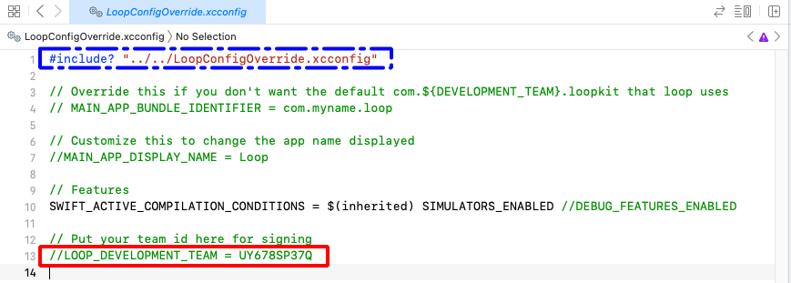
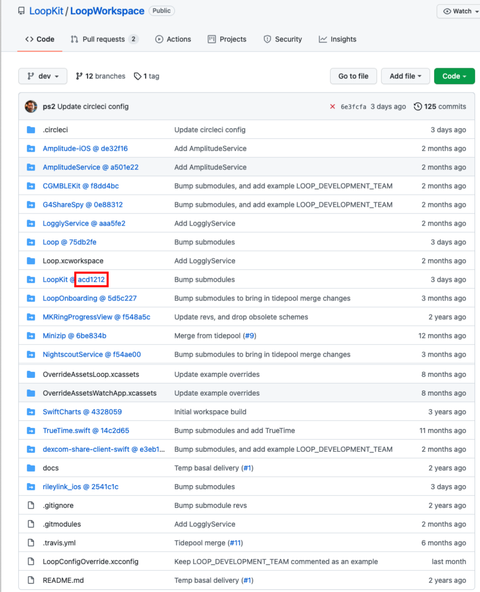
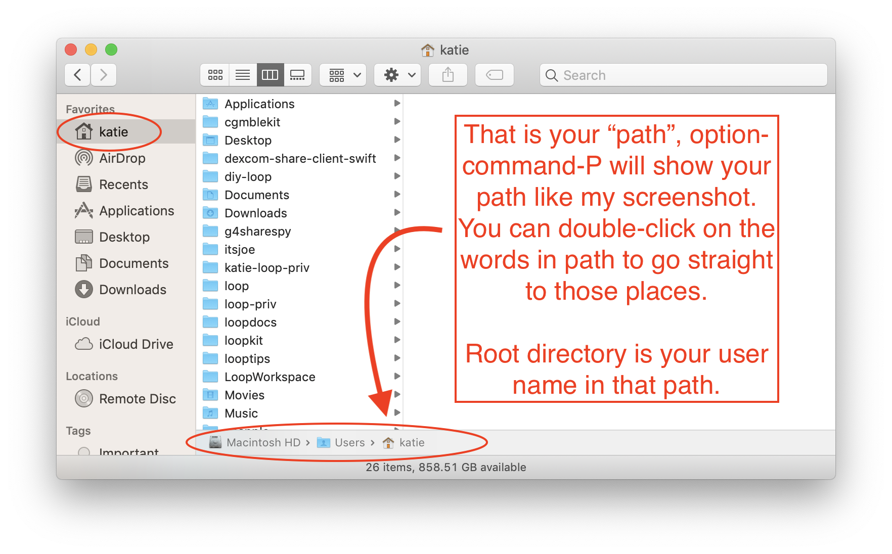
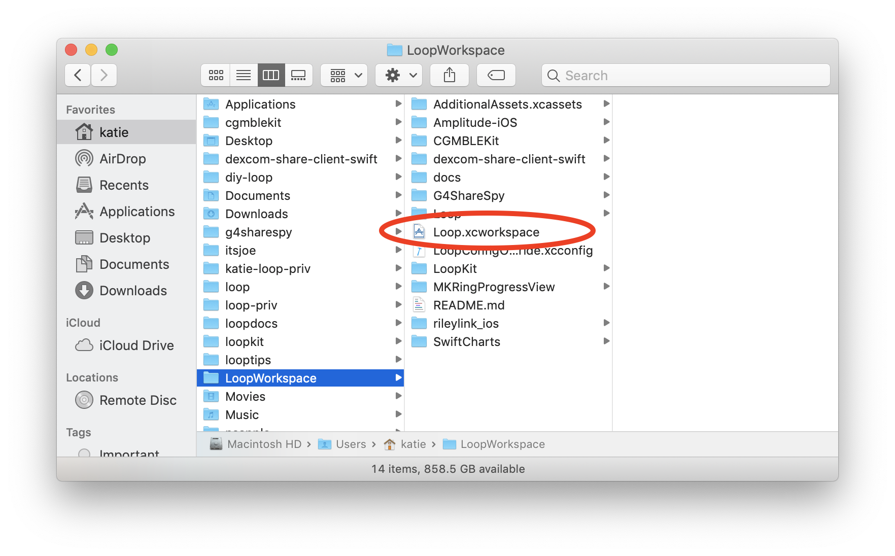
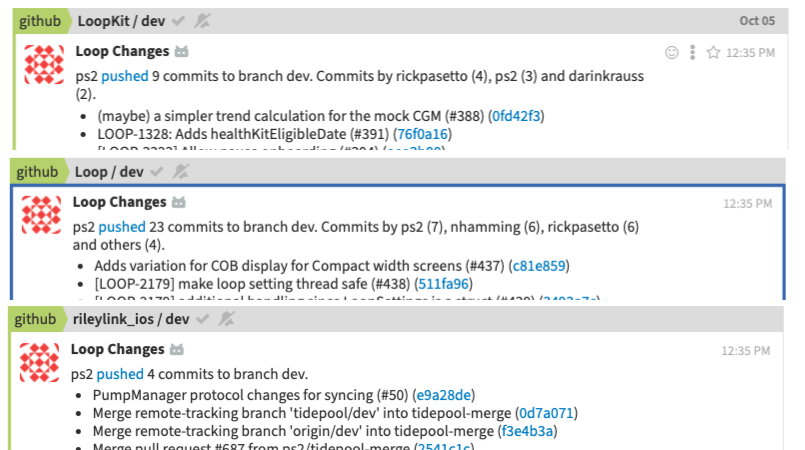
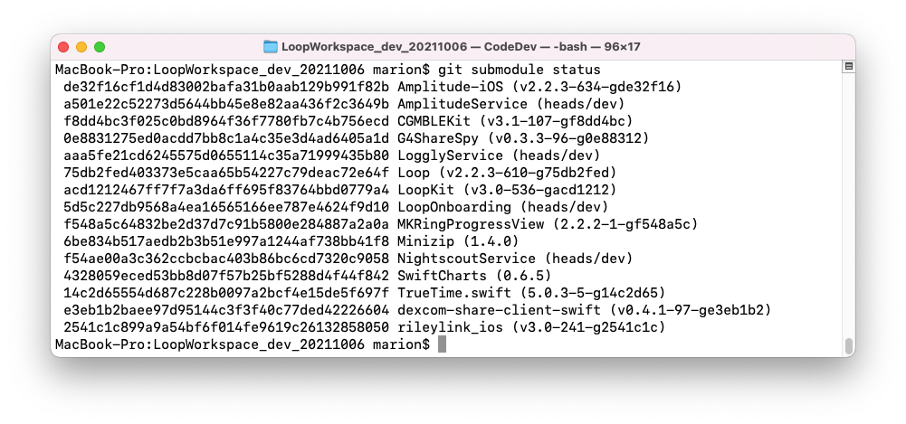
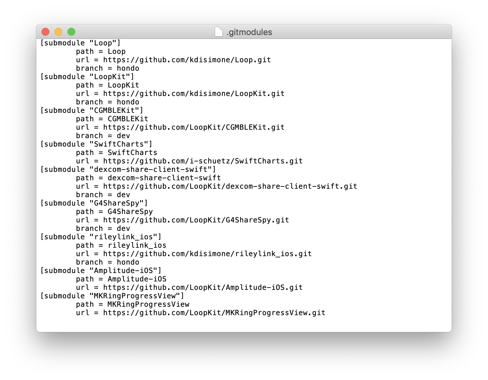

## Loop Workspace

This page is for the advanced user. It is a short introduction for folks interested in testing code before it is released, or contributing to that code.

If you wandered over here meaning to build the latest Loop release, the rest of this page might be interesting but you should not follow any of the steps. Head back over to [Build Loop App](../build/build-app.md) when you are ready to build the app.

!!! info "LoopWorkspace is now used for all Loop Builds"

    * With the release of Xcode 13, Loop builds require LoopWorkspace
    * Loop old-timers may remember the zip-download method - it is no longer available
    * For all Loopers who want the latest
        * [Loop Release](../version/releases.md#loop-releases)
        * Follow the step-by-step instructions found at [Build Loop App](../build/build-app.md)

The typical user who wants to build Loop does not need to know the level of detail on the rest of this page.

## New Way to Sign

One of the recent changes to LoopWorkspace is the addition of the file: `LoopConfigOverride.xcconfig` to the LoopWorkspace folder. The contents of this file are shown in the graphic below.

{width="750"}
{align="center"}

There are several ways to use this to sign the targets automatically.

1. Edit the line highlighted by the red rectangle to remove the comment marks (`//`) from the beginning of the line and replace the indicated TeamID (UY678SP37Q) with your own [Team ID](#team-id)
2. For developers who may have more than one clone for various testing, note the first line of that file, highlighted by the blue-dashed rectangle
    * If a `LoopConfigOverride.xcconfig` exists up two levels from the current LoopWorkspace folder, it will be included
    * Use a directory structure for clones similar to the example shown in the graphic below where clones were created under ~/Downloads/ManualClones.
    * Make a copy of the `LoopConfigOverride.xcconfig` in the ~/Downloads/ManualClones folder (from any LoopWorkspace folder) and edit that version with your TeamID
    * All future clones created in this directory grouping are then automatically signed
3. For users of the [Build Select Script](../build/build-app.md#build-select-script), the script automatically generates the copy of  `LoopConfigOverride.xcconfig` in the ~/Downloads/BuildLoop folder the first time the script is run, guides the user into adding their TeamID and then, in subsequent downloads, uses that previously created file


{width="750"}
{align="center"}


#### Team ID

Your Apple Developer ID is the 10-character Team ID
  found on the Membership page after logging into your account at:
   [https://developer.apple.com/account/#!/membership](https://developer.apple.com/account/#!/membership){: target="_blank" }.


### What is git?

Git is a system of "distributed version control" that allows remotely (as in not located in the same place) collaborating people to work on one project and still track their changes to the same place. For example, if I sent 5 people one document to proof-read at the same time...it is quite possible that the edits I will get back from those 5 people would conflict with each other. Bob may have entirely deleted a sentence while Mary would have added words to that sentence. Git lets these remotely collaborating people deal with "resolving conflict" between versions more easily and merging suggestions (pull requests) into a coordinated space.

So, in using git, we can do things with "git commands". Like "Hey git...make me an exact copy of that guy's work over there." or "Hey git, I'd like to compare my version of this page with Joe's version of the same page." Or using my old cookbook analogy..."Hey git, I'd like to start a new cookbook called Italian Desserts."

But yes, git commands take awhile to properly use. And they are not plain English-friendly.

## What is LoopWorkspace?

There is more information in [Loop Development](../version/development.md#what-are-git-branches) that is not repeated here.

The important fact for this discussion on *LoopWorkspace* is that Loop developers own an account in *GitHub* called [`LoopKit`](https://github.com/LoopKit){: target="_blank" }.  Within that account, the developers have several `repositories` that support *Loop* in particular. A `repository` is like a book...let's think of it like a cookbook for now. Within the `LoopKit` account, there are repositories for *Loop* itself, *LoopDocs*, and various other supporting "frameworks" that are helper repositories for Loop to build correctly. For example, Loop&#39;s repo has a lot of info about the app itself; and the outward-facing things that you interact with. How information is put to you and taken in from you...that's in *Loop* `repository` code. But, there's more than just a user interface for *Loop*. Loop has to do a lot of complex work like Bluetooth communications, algorithm math, pump communications, etc. The *Loop* app has help from frameworks to do those other parts. `CGMBLEkit` for some of the transmitter parts of *Loop*, `RileyLink_ios` for the pump managers (talking to the pumps and decoding their information), *LoopKit* for the algorithm about carbs and insulin curves, etc.

When you build *Loop* from `LoopWorkspace`, each of those repositories is downloaded to your computer.  This is slower than the old zip-download as far as downloading *Loop* - but it is much faster when you build Loop because all the files are already on your computer.

`LoopWorkspace` uses submodules to define how the frameworks are coordinated for building. The graphic below shows the dev branch at a particular point in time.  The precise version, or commit, of each submodule is defined by 7-character hexadecimal codes (look up SHA-1) with the repository for each submodule defined in a text file called `.gitmodules`.

!!! info ""
    * Several key `git` and other operating system commands will be provided later to assist you
    * These commands will not be explained in detail
    * If you want to know more, search the internet for documentation
    * Often a series of commands is shown on one line, separated by semicolons

The commit identifier for each submodule is important because that repository can be modified after things are set up and working with Loop.  When you download the code from that repository you want the exact version that was tested.

!!! info ""
    * Later on there will be information about determining your `git branch` for a given submodule
    * You'll see language: `(HEAD detached at #)`
    * That `#` is the `commit` identifier for the submodule

The `commit` for the `LoopKit` submodule is highlighted by the red rectangle in the graphic below. Advanced users testing the dev branch (or other branches or forks) need to know how to tell if their current download is up-to-date.

{width="750"}
{align="center"}

## Clone LoopWorkspace

To get that `LoopWorkspace` code to your computer, first open a terminal. Make sure your current path name does not have any embedded spaces.  If it does, you will get errors on your build.

If you don't know how to open a terminal and navigate to a directory, reconsider whether you are ready for this page.

You need to use a `git clone` command LIKE THIS (but not exactly the same...you're going to edit the `branch-name` part in there):

`git clone --branch=branch-name --recurse-submodules https://github.com/LoopKit/LoopWorkspace`

Now...look carefully and notice two things...that command (1) is getting the version of `LoopWorkspace` found in the `LoopKit` repository and (2) selects the branch you want to start working with when the clone is done.

So, you will need to edit that `branch-name` before using the command so that you are getting started with the branch you want. If you want to clone from a different `fork`, the `LoopKit` will be replaced with the name of the GitHub site for the `fork`. For example, to test the `dev` branch (which is under development and has some cool new architecture and features), you would copy/paste:

``` { .bash .copy }
git clone --branch=dev --recurse-submodules https://github.com/LoopKit/LoopWorkspace
```


### Start Xcode using command line

If you want to start the build from the command line, enter the following 2 lines into the terminal.

``` { .bash .copy }
cd LoopWorkspace
xed .
```

Remember the warning - if you build the `dev` branch on your phone from `Loop main`, it should work fine. Going backward, please delete the app from your phone and enter all your settings again to return to `main`.


### Start Xcode using Finder

The cloned version of the `LoopWorkspace` will go into the current directory in the *Terminal* app when you execute the command. *Terminal* app opens in your User account home directory by default when you first open it. Unless you changed to a different directory, check your home directory for the `LoopWorkspace` folder.

How can you find your home directory?

1. In `Terminal`, if you use `cd` that will take you there automatically.
2. In `Finder`, ++shift+command+h++ will open your home folder.

{width="750"}
{align="center"}

There are a lot of cloned things in this home directory that involve *Loop*. You may have fewer...but be aware, you can always delete and reclone if you are in doubt or confused. You can also set up a special directory to hold the cloned code - just make sure there are no embedded spaces in the full path name.

For this graphic, the cloned `LoopWorkspace` is in the home directory.

!!! success "*Loop* to `LoopWorkspace` in `dev`"
    Note that the directory `Loop.xcworkspace` has been renamed to `LoopWorkspace.xcworkspace` in the `dev` branch. This change makes `LoopWorkspace` the default target to simplify the build process.

    The words will be updated with the next release. It may take more time for the figures to be updated.

1. Open `Finder` and navigate to the location that has `LoopWorkspace`
1. Open the `LoopWorkspace` folder
1. Search for and double-click on the `LoopWorkspace.xcworkspace` folder - this automatically opens the Workspace in `Xcode`

{width="550"}
{align="center"}

* Enter your *Apple Developers ID* in the `LoopConfigOverride.xcconfig` file that now appears in the top of the folder list (not shown in this graphic)
* This automatically signs the 5 targets required for the `dev` branch
* Choose your device
* Tap on the build (play) button to build to your selected device

## Updating Loop using `LoopWorkspace`

When it's time to update the copy of `LoopWorkspace` on your computer - you have choices. You can use the method below or redo the whole cloning process.

Be sure your terminal is in the correct location using [Open a Terminal in `LoopWorkspace` Folder](../version/code-custom-edits.md#open-a-terminal-in-loopworkspace-folder)

1. Make sure you are in the correct branch using this git command:
    ``` { .bash .copy }
    git branch
    ```
1. If you are not in the correct branch, for example, `dev`, then issue this git command (suitably modified for the desired branch)
    ``` { .bash .copy }
    git checkout dev
    ```
1. Use the following git commands in the LoopWorkspace folder of your terminal:
    ``` { .bash .copy }
    git fetch
    git pull --recurse
    ```

If you are testing the LoopKit dev branch, you need to be on [zulipchat](https://loop.zulipchat.com){: target="_blank" } and subscribe to at least the #development and #github streams. (It's a good idea to subscribe to all the streams.) When you see repository updates similar to the graphic below, there may also be an announcement in the #development channel that LoopWorkspace is updated and ready to test. If not you can check the commits in LoopWorkspace and see if they've been updated. It's a good idea to wait 24 hours. My procedure is to build dev to my backup phone and then put it on my "real" phone. Otherwise, wait for someone else to do it and give the all-clear in zulipchat.

{width="600"}
{align="center"}

### Updating Loop to a Specific LoopWorkspace commit

Sometimes, you know a feature you want was added at a specific commit number; however, you know there are other changes later than that commit which you do not want to test. There is a solution.

Be sure your terminal is in the correct location using [Open a Terminal in LoopWorkspace Folder](../version/code-custom-edits.md#open-a-terminal-in-loopworkspace-folder). First you have to bring down all the latest dev commits. Then you will back up to the one you want.

1. Make sure you are in the correct branch using this git command:
    ``` { .bash .copy }
    git branch
    ```
1. If you are not in the correct branch, normally the desired branch is `dev`, then issue this git command (suitably modified for the desired branch)
    ``` { .bash .copy }
    git checkout dev
    ```
1. Use the following git commands to bring down all the newer commits to your copy:
    ``` { .bash .copy }
    git fetch
    git pull --recurse
    ```
1. Now you want to "backup" to the desired commit:

    * You will need to figure out what that commit should be - there is no copy button here - you need to create this line yourself with the correct commit:

    ```
    git checkout <desired commit here>
    ```

    * Once you have checked out the correct commit, assuming there were no errors, you need to update all the submodules to that commit with this command (which you can copy and paste)

    ``` { .bash .copy }
    git submodule update
    ```

1. Assuming there were no errors, see [Local Modifications Conflict](#local-modifications-conflict), in the process above, you can now build that commit.

### Build Following Update

Sometimes there is a change to the Workspace scheme in Xcode that interferes with building following an update to your local clone. In those cases, these steps typically work. Try the first one, and if that doesn't work, try the first two, etc.  Only after trying all three should you post asking for help on zulipchat.

1. In Xcode Menu, select Product->Clean Build Folder
1. In Xcode Menu, select File->Close Workspace and then File->Open Recent and select top line (one you just closed)
1. Quit Xcode and [delete derived data](#delete-derived-data), then reopen Xcode (you may need to [resolve package versions](../build/build-errors.md#couldnt-get-revision-for-package-dependency) again)

#### Delete Derived Data

This command deletes derived data stored across all workspaces and projects by Xcode on your computer. If you have multiple clones locally, it deletes derived data from all of them. The derived data will be regenerated next time you build with Xcode using that clone.

Copy and paste this command into a terminal window.

``` { .bash .copy title="Copy and Paste to Delete Derived Data" }
rm -rf ~/Library/Developer/Xcode/DerivedData
```

### Compare your local clone to LoopWorkspace

In an ideal world, LoopWorkspace has the most recent compatible submodule identifiers revised at the same time the submodules are updated.  You will notice the commit identifiers for the updated submodules are different from the ones you have locally.

You can check your current submodules with the `git submodule status` command in the LoopWorkspace folder of your terminal:


{width="600"}
{align="center"}

What are those super-long numbers?  Those are the actual SHA-1 (remember - look it up) for the commits.  But the first 7 characters are sufficient to uniquely identify the commit you need for the repository and branch identified in `.gitmodules`.  So compare the first 7 characters to the LoopKit / LoopWorkspace number and you know whether you need to update or not.

To determine the commit for a single submodule on your computer, use the following commands in the LoopWorkspace folder:

```
  cd <submodule-name>; git branch; cd ..
```

The response will be similar to this exchange:

```
  cd rileylink_ios; git branch; cd ..
```

```
  * (HEAD detached at 2541c1c)
    dev
```

The asterick indicates the branch that is currently checked out (active).

The phrase `* (HEAD detached at #)` allows you to compare your local version with the commit identifier on github.


### LoopWorkspace Unchanged

What happens if you update (`git pull --recurse`) and there are no changes at the LoopWorkspace repository? There will be no change to your current clone on your computer.

* You'll see a series of responses saying:
    * `Fetching submodule submodule-name` for each submodule-name
    * followed by `Already up to date.`

### LoopWorkspace Updated

What happens if you update (`git pull --recurse`) and there are changes at the LoopWorkspace repository? The changes will be brought down to your clone on your computer.

**You'll need to build Loop again to get these changes incorporated in the app on your phone.**

* You'll see a series of responses saying:
    * `Fetching submodule submodule-name` for each submodule-name
    * One or more will show changes and specify which submodules were changed
        * followed by `Submodule path submodule-name: checked out ` new SHA-1

### Update Locally

It has happened that you notice changes in one or more repository (in the #github stream) followed by an announcement in the #development stream that changes have been committed and please test.  But you get the response shown in the [LoopWorkspace Unchanged](#loopworkspace-unchanged) scenario. You can make a comment in zulipchat, saying please update LoopWorkspace and then wait, or you can download the appropriate commit. If you are a new tester - you probably want to wait.

If you want to go on and test, you can update to the correct commit without waiting for LoopWorkspace to get updated.

First, in zulipchat, in the #github stream of the commit, click on the word `pushed` and that will take you to the commit. For example, clicking on pushed in zulipchat from the graphic shown above, goes to this website:

`https://github.com/ps2/rileylink_ios/compare/8ff4bca2bc5f...2541c1c899a9`

This indicates the final commit of that push for rileylink_ios is identified as `2541c1c`.

At this point, the commands to get that commit locally on your computer are as follows, starting from the LoopWorkspace folder:

`cd rileylink_ios; git fetch; git checkout 2541c1c; cd ..`

If you got an error message the # you requested `did not match any file(s) known to git`, you either typed it incorrectly or you forgot the `git fetch` command. The fetch command brings down information from github to your computer but doesn't make changes to what you have checked out.

### Local Modifications Conflict

If you have modified anything in a submodule folder on your computer, it might be in conflict with the latest commit.

If you get a message such as this:

```
  error: Your local changes to the following files would be overwritten by checkout:
    Loop/Models/LoopConstants.swift
  Please commit your changes or stash them before you switch branches.
  Aborting
```

The easiest fix is to type commands similar to the following, where you modify Loop to be whichever folder(s) had the conflict. If more than one folder had a conflict, then issue the stash for each folder. The submodule update command will continue to show errors until you stash all local changes that interfere with the new code:

``` { .bash .copy }
  cd Loop; git stash; cd ..
  git submodule update
```

After stashing and updating with no errors, you can try to restore your changes:
```  { .bash .copy }
  cd Loop; git stash pop; cd ..
```

If you see errors indicating you cannot use `pop`, that means you need to manually add your customizations back.

You will need to repeat this for each submodule that has a conflict. Use the lines above (for Loop submodule) as a template to resolve conflict(s) other submodule(s).


## Checking out different branches within a LoopWorkspace

More advanced users...I'm not going to explain this in quite so much detail, but yes, you can individually change the branches in a LoopWorkspace.

There are 2 main ways to do this.

1. If you're already familiar with git, the easiest way is to `cd` into the appropriate repository (like `cd rileylink_ios`) and `checkout` the desired branch.

2. If you're not as familiar with git, if you edit your .gitmodules directory in LoopWorkspace, you can specify other repos to use (and add a line to specify branches, too). Then if you do a `git submodule sync` the workspace will sync to new submodules. Then `git submodule update --init --recursive --remote` will update all the submodules to the right branches and get HEADs detached correctly, etc. Note that the HEADs will be detached at the top of the branch (most recent commit) based off of `.gitmodules`.

{width="750"}
{align="center"}

### Branch Tutorial

This tutorial is pretty nice.

!!! tip "Git Tutorial"
    When I first started using git, my adult son answered all my questions very politely and then started sending me links to this tutorial instead.

    * [Learn Git Branching](https://learngitbranching.js.org/){: target="_blank" }

    There's a section called `Main` that goes over commands in your local copy (clone) of the code. There's a section called `Remote` that goes over fetching, pulling, and pushing to remote copies.

    For Open Source Software, you might fetch and pull from the LoopKit repositories, but you will only push to your fork.

    * You may need to add `git remote add <name> <your-fork-repo>` and `git push --set-upstream <name> <branch>` to your vocabulary.

## Non-LoopKit clones

!!! info "Average Loopers can skip this whole section...it's for Developers mostly"

    This whole section about non-LoopKit workspace clones is something almost every Looper can totally skip over. I'm only writing up this section for people who are interested in dabbling in code collaborations/customizations that they would want to maintain separately from LoopKit proper.

Scenario: You have a friend named DeveloperBob who has his own version of LoopWorkspace that he's customized. DeveloperBob wants you to look at his code customizations and collaborate with him. You need to change the "git clone" command to get DeveloperBob's version, not LoopKit's version. And, you'd want to make sure you specify the branch that the new feature is on, too. DeveloperBob should usually include the branch name when he posts/shares. So, the command line might be edited to something like:

`git clone --branch=new-features --recurse-submodules https://github.com/DeveloperBob/LoopWorkspace`

So...if you are trying to grab someone's LoopWorkspace to use it, you'll need to make sure you get the command correct if they don't specify it for you.
You can't clone multiple "LoopWorkspaces" into the exact same home directory (because they will have the same name), so you may want to create a subdirectory to put them in. Like you could make a folder called "DeveloperBob" and then move into that directory in Terminal before you clone DeveloperBob's LoopWorkspace.

How would you do that? Simple `cd && mkdir DeveloperBob` would make the new folder in your home directory. And then `cd DeveloperBob` would move your Terminal app to be working inside the new DeveloperBob folder. So if you wanted to clone DeveloperBob's LoopWorkspace, that would be a good way to keep track of where the code came from.

If you ever get in doubt and can't remember where your code was cloned from, you can `cd LoopWorkspace` to get into the directory and then use `git remote -v` to tell you where it came from.

## Pushing commits from LoopWorkspace

So you've got a great idea for a new feature, made those changes to your LoopWorkspace, and want to get them into GitHub. Awesome!

To understand how to do this, we'll need to understand a bit more about how git keeps track of changes. In git, developers can have different "branches" (see [What are Git Branches?](../version/development.md#what-are-git-branches) on the Loop Development page for more details about what a branch is). There are two different types of branches: remote and local. If you were to fork Loop on GitHub, then the branches that you can see on GitHub are "remote" branches - they're hosted on the GitHub server. On the other hand, you can also create "local" branches that are stored directly on your computer by "checking out" the remote branch. You'll need to "commit" your changes to the local branch, and then "push" those changes to the remote branch in order to be able to see them in GitHub. There are specific commands that you can type into the command line to do all of these actions, but I'm not going to go into detail because there are different ways and everyone has their own preference.

It's a little easier to think about this with an analogy. Let's say you're working at a company that's creating a cookbook. There's a centralized, production-ready version of the cookbook on their website that all the employees can view. Think of the website version of this cookbook as being like the remote branch. You're assigned to change the pancake recipe in the cookbook. Since the company doesn't want employees to make changes directly to the version of the cookbook that the customers see, you need to make a copy of it on your computer so you can make your changes to the pancake recipe. When you make the personal copy on your computer, it's like "checking out" the remote branch. Your copy is like the local branch - you can make whatever changes you want without having to worry about customers accidentally seeing them. When you make an important change to the recipe (like adding a photo or changing the ingredients), you might want to make a note in the edit history so that you can go back to that version of the recipe in case you accidentally make unintended changes - those notes you make would be "commits". Once you're happy with the recipe, you'll add it back into the production version of the cookbook on the website, which is similar to what you're doing when you "push" your changes.

Where do the submodules fit in? Each submodule is actually a branch, so when you make changes to multiple submodules, you'll need to commit those changes to their respective branches. Let's say you've made changes to Loop and LoopKit. You'll need to go into Loop and commit and push the changes, then go into LoopKit and commit and push the changes.

There are a few different ways to keep track of all these different branches. Some people like using the command line (which is what you're using when you do commands like `git clone`) because it's very customizable and has the largest variety of commands. Others like to use graphical Git editors, which make it easier to see changes and be able to do a variety of common actions (like cloning, committing, and pushing) with the push of a button. Everyone has their own preferences, but some methods that Loop contributors have used in the past include the command line, [Gitkraken](https://www.gitkraken.com/){: target="_blank" }, and [SourceTree](https://www.sourcetreeapp.com/){: target="_blank" }.
